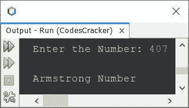
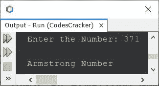

# Java 程序：检查阿姆斯特朗数

> 原文：<https://codescracker.com/java/program/java-program-find-armstrong-number.htm>

本文介绍了 Java 中的多个程序，这些程序检查用户在程序运行时输入的数字是否是 Armstrong 数字。

阿姆斯壮数是一个等于其自身数字的<u>之和的数，其中<u>的每一个数字都是其数字</u>的 的幂。例如，153 是一个阿姆斯特朗数，因为:</u>

```
153 = 13 + 53 + 33
    = 1 + 125 + 27
    = 153
```

其他一些阿姆斯特朗号码是 1，2，3，4，5，6，7，8，9，370，371，407，1634 等。

## 使用 while 循环在 Java 中检查 Armstrong 数

问题是，*写一个 Java 程序，检查一个数是不是阿姆斯特朗数。该号码必须在运行时由用户接收 。*下面给出的程序是它的答案:

```
import java.util.Scanner;

public class CodesCracker
{
   public static void main(String[] args)
   {
      int num, temp, totalDigit=0, res=0, rem, pow, i;
      Scanner scan = new Scanner(System.in);

      System.out.print("Enter the Number: ");
      num = scan.nextInt();

      temp = num;
      while(num>0)
      {
         num = num/10;
         totalDigit++;
      }

      num = temp;
      while(num>0)
      {
         rem = num%10;
         pow = 1;
         i = 0;
         while(i<totalDigit)
         {
            pow = pow*rem;
            i++;
         }
         res = res + pow;
         num = num/10;
      }

      if(res==temp)
         System.out.println("\nArmstrong Number");
      else
         System.out.println("\nNot an Armstrong Number.");
   }
}
```

下面给出的快照显示了上述程序的示例运行，使用用户输入的 **407** 作为编号，以检查 是否为阿姆斯壮编号:



上面的程序也可以写成。这个程序使用 **Math.pow()** 方法直接计算一个 数的另一个数的幂的值:

```
import java.util.Scanner;
import java.lang.Math;

public class CodesCracker
{
   public static void main(String[] args)
   {
      int num, temp, totalDigit=0, res=0, rem;
      Scanner scan = new Scanner(System.in);

      System.out.print("Enter the Number: ");
      num = scan.nextInt();

      temp = num;
      while(num>0)
      {
         num /= 10;
         totalDigit++;
      }

      num = temp;
      while(num>0)
      {
         rem = num%10;
         res = res + (int) Math.pow(rem, totalDigit);
         num /= 10;
      }

      if(res==temp)
         System.out.println("\nArmstrong Number");
      else
         System.out.println("\nNot an Armstrong Number.");
   }
}
```

具有用户输入 **371** 的上述程序的示例运行显示在下面给出的快照中:



## 使用 for 循环在 Java 中检查 Armstrong 数

前面的程序是使用 **while** 循环创建的，也可以使用 **for** 循环创建，如下所示:

```
import java.util.Scanner;

public class CodesCracker
{
   public static void main(String[] args)
   {
      int num, temp, totalDigit=0, res=0, rem;
      Scanner scan = new Scanner(System.in);

      System.out.print("Enter the Number: ");
      num = scan.nextInt();

      for(temp=num; num>0; num /= 10)
         totalDigit++;

      for(num=temp; num>0; num /= 10)
      {
         rem = num%10;
         res = res + (int) Math.pow(rem, totalDigit);
      }

      if(res==temp)
         System.out.println("\nArmstrong Number");
      else
         System.out.println("\nNot an Armstrong Number.");
   }
}
```

### 在 Java 中检查 Armstrong 号码-仅检查 3 位数

这是另一种方法，我们可以创建相同的程序。但是<u>这个程序仅限于 3 位数的数字</u>:

```
import java.util.Scanner;

public class CodesCracker
{
   public static void main(String[] args)
   {
      int num, temp, res=0, rem;
      Scanner scan = new Scanner(System.in);

      System.out.print("Enter the Number: ");
      num = scan.nextInt();

      temp = num;
      while(temp!=0)
      {
         rem = temp%10;
         res = res + (rem*rem*rem);
         temp = temp/10;
      }

      if(num==res)
         System.out.println("\nArmstrong Number.");
      else
         System.out.println("\nNot an Armstrong Number.");
   }
}
```

#### 其他语言的相同程序

*   [C 检查阿姆斯特朗编号是否正确](/c/program/c-program-find-armstrong-number.htm)
*   [C++是否检查阿姆斯特朗数](/cpp/program/cpp-program-find-armstrong-number.htm)
*   [Python 检查阿姆斯特朗号与否](/python/program/python-program-check-armstrong.htm)

[Java 在线测试](/exam/showtest.php?subid=1)

* * *

* * *