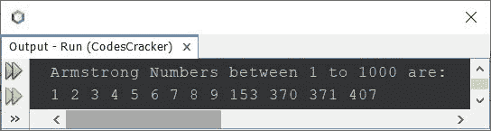
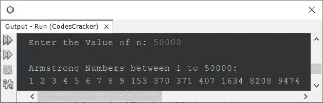
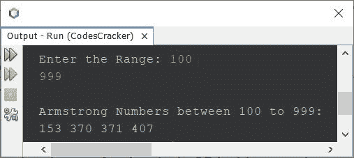

# Java 程序：来查找和打印阿姆斯特朗数字

> 原文：<https://codescracker.com/java/program/java-program-generate-armstrong-number.htm>

创建这篇文章是为了涵盖 Java 中查找和打印 Armstrong 数字的多个程序。下面是本文涉及的程序列表:

*   打印 1 到 1000 之间的阿姆斯特朗数
*   打印 1 到 n 之间的阿姆斯特朗数
*   打印给定范围内的阿姆斯特朗数(m 到 n)

一个数等于其自身数字的<u>之和，其中<u>的每一位的数字</u> 的幂称为阿姆斯壮数。例如，407 是阿姆斯特朗号码，因为:</u>

```
407 = 43 + 03 + 73
    = 64 + 0 + 343
    = 407
```

其他一些阿姆斯特朗号码是 1，2，3，4，5，6，7，8，9，153，370，371，1634 等。

## 用 Java 查找 1 到 1000 之间的阿姆斯特朗数

问题是，*写一个 Java 程序，找出并打印 1 到 1000 之间的所有阿姆斯特朗数。*下面给出的程序 是它的答案:

```
import java.util.Scanner;

public class CodesCracker
{
   public static void main(String[] args)
   {
      int val, i, totalDigit, r, temp, rem, pow, k;

      System.out.println("Armstrong Numbers between 1 to 1000 are:");
      for(i=1; i<=1000; i++)
      {
         totalDigit=0;
         r=0;
         val = i;
         temp = val;
         while(temp>0)
         {
            totalDigit++;
            temp = temp/10;
         }
         temp = val;
         while(temp>0)
         {
            rem = temp%10;
            pow = 1;
            k = 0;
            while(k<totalDigit)
            {
               pow = pow*rem;
               k++;
            }
            r = r+pow;
            temp = temp/10;
         }
         if(r==val)
            System.out.print(r+ " ");
      }
   }
}
```

下面给出的快照显示了上面的 Java 程序产生的示例输出，它打印了 1 到 1000 之间的所有 Armstrong 数字:



上面的程序也可以这样创建。该程序使用**代替**作为**循环，而** 循环。此外，删除了所有多余的语句/代码:

```
import java.util.Scanner;
import java.lang.Math;

public class CodesCracker
{
   public static void main(String[] args)
   {
      int i, totalDigit, r, temp, rem;

      System.out.println("Armstrong Numbers between 1 to 1000 are:");
      for(i=1; i<=1000; i++)
      {
         totalDigit=0;
         r=0;
         for(temp=i; temp>0; temp /= 10)
            totalDigit++;
         for(temp=i; temp>0; temp /= 10)
            r = r + (int) Math.pow((temp%10), totalDigit);
         if(r==i)
            System.out.print(r+ " ");
      }
   }
}
```

这个程序产生与前一个程序相同的输出。

## 用 Java 打印 1 到 n 之间的阿姆斯特朗数

问题是，*用 Java 写一个程序，找出并打印 1 到 **n** 之间的阿姆斯特朗数。 **n** 的值必须是用户在运行时收到的 。*下面给出的程序，是它的答案:

```
import java.util.Scanner;
import java.lang.Math;

public class CodesCracker
{
   public static void main(String[] args)
   {
      int n, i, totalDigit, r, temp, rem;

      Scanner scan = new Scanner(System.in);

      System.out.print("Enter the Value of n: ");
      n = scan.nextInt();

      System.out.println("\nArmstrong Numbers between 1 to " +n+ ":");
      for(i=1; i<=n; i++)
      {
         totalDigit=0;
         r=0;
         for(temp=i; temp>0; temp /= 10)
            totalDigit++;
         for(temp=i; temp>0; temp /= 10)
            r = r + (int) Math.pow((temp%10), totalDigit);
         if(r==i)
            System.out.print(r+ " ");
      }
   }
}
```

用户输入 **50000** 作为 **n** 的值，打印从 1 到 50000 的所有 Armstrong 编号，上面程序的示例运行如下面给出的快照所示:



## 在 Java 中查找某个范围内的阿姆斯特朗数

这是本文的最后一个程序，用来打印特定范围内的 Armstrong 数字。

```
import java.util.Scanner;
import java.lang.Math;

public class CodesCracker
{
   public static void main(String[] args)
   {
      int start, end, i, totalDigit, r, temp, rem;

      Scanner scan = new Scanner(System.in);

      System.out.print("Enter the Range: ");
      start = scan.nextInt();
      end = scan.nextInt();

      System.out.println("\nArmstrong Numbers between " +start+" to " +end+ ":");
      for(i=start; i<=end; i++)
      {
         totalDigit=0;
         r=0;
         for(temp=i; temp>0; temp /= 10)
            totalDigit++;
         for(temp=i; temp>0; temp /= 10)
            r = r + (int) Math.pow((temp%10), totalDigit);
         if(r==i)
            System.out.print(r+ " ");
      }
   }
}
```

下面是它的示例运行，使用用户输入的 **100** 和 **999** 作为范围，查找并打印从 100 到 999 之间的所有 Armstrong 编号:



#### 其他语言的相同程序

*   [C 生成阿姆斯特朗号](/c/program/c-program-generate-armstrong-number.htm)
*   [C++ 生成阿姆斯特朗数](/cpp/program/cpp-program-generate-armstrong-number.htm)
*   [Python 生成阿姆斯特朗号](/python/program/python-program-generate-armstrong-numbers.htm)

[Java 在线测试](/exam/showtest.php?subid=1)

* * *

* * *