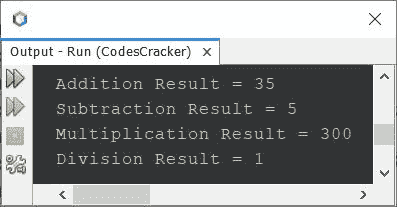
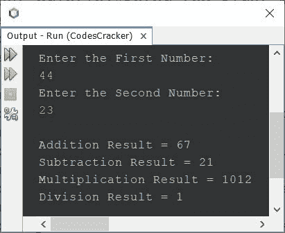
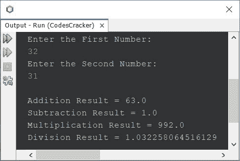
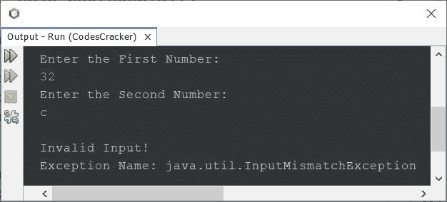
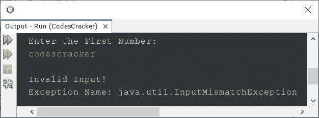
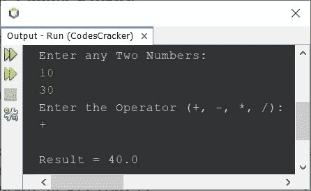

# Java 程序：用于加减乘除

> 原文：<https://codescracker.com/java/program/addition-subtraction-multiplication-division.htm>

在这个例子中，您将学习如何在 Java 中执行任意两个数的加、减、乘、除。在开始实际的程序之前，让我们首先创建一个非常简单的程序，它在没有用户输入的情况下执行四个基本的数学运算。

## 无需用户输入的加法、减法、乘法、除法

问题是，*写一个 Java 程序，执行加、减、乘、 和除四种基本数学运算。*下面是它的回答。我不允许用户为该程序输入，但后来，该程序 被修改为允许用户在程序运行时提供输入，以执行两个所需数字的运算。

```
public class CodesCracker
{
   public static void main(String[] args)
   {
      int num1 = 20, num2 = 15, res;

      res = num1 + num2;
      System.out.println("Addition Result = " + res);
      res = num1 - num2;
      System.out.println("Subtraction Result = " + res);
      res = num1 * num2;
      System.out.println("Multiplication Result = " + res);
      res = num1 / num2;
      System.out.println("Division Result = " + res);
   }
}
```

这个 Java 程序产生的输出将完全是:



## 用户输入的加法、减法、乘法和除法

这个程序基本上是以前程序的修改版本，因为它允许用户输入程序的数字。其余的事情与前面的程序相似。

```
import java.util.Scanner;

public class CodesCracker
{
   public static void main(String[] args)
   {
      Scanner scan = new Scanner(System.in);
      int num1, num2, res;

      System.out.println("Enter the First Number: ");
      num1 = scan.nextInt();
      System.out.println("Enter the Second Number: ");
      num2 = scan.nextInt();

      res = num1 + num2;
      System.out.println("\nAddition Result = " + res);
      res = num1 - num2;
      System.out.println("Subtraction Result = " + res);
      res = num1 * num2;
      System.out.println("Multiplication Result = " + res);
      res = num1 / num2;
      System.out.println("Division Result = " + res);
   }
}
```

以下是用户输入的第一个数字 **44** 和第二个数字 **23** 的运行示例:



## Java 基本数学运算-完整版

这是上述程序的完整版本，因为它也处理错误。因为，有时用户输入错误或无效的输入，如 **c** 或 **#** 来代替数字。因此，程序必须以某种方式创建，以处理那些类型的 错误。

```
import java.util.Scanner;
import java.util.InputMismatchException;

public class CodesCracker
{
   public static void main(String[] args)
   {
      Scanner scan = new Scanner(System.in);
      double num1, num2, res;

      System.out.println("Enter the First Number: ");
      try
      {
         num1 = scan.nextDouble();
      }
      catch(InputMismatchException e)
      {
         System.out.println("\nInvalid Input!");
         System.out.println("Exception Name: " + e);
         return;
      }

      System.out.println("Enter the Second Number: ");
      try
      {
         num2 = scan.nextDouble();
      }
      catch(InputMismatchException e)
      {
         System.out.println("\nInvalid Input!");
         System.out.println("Exception Name: " + e);
         return;
      }

      res = num1 + num2;
      System.out.println("\nAddition Result = " + res);
      res = num1 - num2;
      System.out.println("Subtraction Result = " + res);
      res = num1 * num2;
      System.out.println("Multiplication Result = " + res);
      res = num1 / num2;
      System.out.println("Division Result = " + res);
   }
}
```

以下是用户输入的第一个数字 **32** 和第二个数字 **31** 的运行示例:



下面是另一个运行的例子，一个无效的用户输入作为第二个数字，比如第一个是 **32** ，第二个是 **c** :



如果你输入任何无效的输入作为第一个数字，那么程序打印错误信息说**无效输入！**连同 异常名称。同样，程序也不会从用户那里收到第二个数字，因为当用户输入一个无效输入时，我已经使用了 **return** 关键字 来停止程序剩余的执行。例如，让我们用用户输入的**代码 scracker** 作为第一个数字来进行另一个样本运行 :



## 基于用户选择的加减乘除

这是上述程序的最小版本，因为它根据用户的选择，一次只执行一个期望的操作。

```
import java.util.Scanner;

public class CodesCracker
{
   public static void main(String[] args)
   {
      Scanner scan = new Scanner(System.in);
      float num1, num2, res;
      char ch;

      System.out.println("Enter any Two Numbers: ");
      num1 = scan.nextFloat();
      num2 = scan.nextFloat();
      System.out.println("Enter the Operator (+, -, *, /): ");
      ch = scan.next().charAt(0);
      if(ch == '+') res = num1 + num2;
      else if(ch == '-') res = num1 - num2;
      else if(ch == '*') res = num1 * num2;
      else if(ch == '/') res = num1 / num2;
      else
      {
         System.out.println("\nInvalid Input");
         return;
      }
      System.out.println("\nResult = " + res);
   }
}
```

下面是它的示例运行，用户输入 **10** 和 **30** 作为第一个和第二个数字，而 **+** 作为运算符，只执行这两个数字的加法 :



以上程序使用 **if...否则如果...else** 条件语句，根据用户输入的 运算符检查并执行操作。

#### 其他语言的相同程序

*   [C 加减乘除](/c/program/addition-subtraction-multiplication-division.htm)
*   [C++ 加减乘除](/cpp/program/addition-subtraction-multiplication-division.htm)
*   [Python 加减乘除](/python/program/python-program-addition-subtraction-multiplication-division.htm)

[Java 在线测试](/exam/showtest.php?subid=1)

* * *

* * *