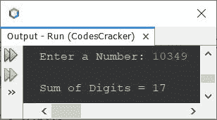
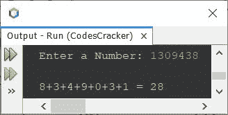

# Java 程序：来寻找一个数字的数字总和

> 原文：<https://codescracker.com/java/program/java-program-add-digits-of-number.htm>

这篇文章介绍了一个用 Java 编写的程序，它可以查找并打印用户输入的数字的总和。例如，如果输入的数字是 **13049** ，那么输出将是 **17** 。17 是给定数字的所有位数之和，即 **1+3+0+4+9** 。

## 使用`while`循环查找 Java 中数字的和

问题是，*写一个 Java 程序，用`while`循环*求一个给定数字的位数之和。下面的节目给出了 的回答:

```
import java.util.Scanner;

public class CodesCracker
{
   public static void main(String[] args)
   {
      int num, digit, sum=0;
      Scanner s = new Scanner(System.in);

      System.out.print("Enter a Number: ");
      num = s.nextInt();

      while(num!=0)
      {
         digit = num%10;
         sum = sum + digit;
         num = num/10;
      }

      System.out.println("\nSum of Digits = " +sum);
   }
}
```

下面给出的快照显示了由上述 Java 程序产生的样本运行，用户输入 **10349** 作为数字以 查找并打印其所有数字的总和:



即 **1+0+3+4+9** 等于 17。同样的程序也可以这样创建:

```
import java.util.Scanner;

public class CodesCracker
{
   public static void main(String[] args)
   {
      int num, digit, sum=0;
      Scanner s = new Scanner(System.in);

      System.out.print("Enter a Number: ");
      num = s.nextInt();

      System.out.print("\n");
      while(num!=0)
      {
         digit = num%10;
         sum = sum + digit;
         num = num/10;
         if(num!=0)
            System.out.print(digit + "+");
         else
            System.out.print(digit+ " = " + sum);
      }
   }
}
```

下面是用户输入的运行示例， **1309438** :



同样， **while** 块也可以这样写:

```
while(true)
{
   digit = num%10;
   sum = sum + digit;
   num = num/10;
   if(num!=0)
      System.out.print(digit + "+");
   else
   {
      System.out.print(digit+ " = " + sum);
      break;
   }
}
```

## 使用`for`循环查找 Java 中的数字总和

让我们看看当使用 **for** 循环创建相同的程序时，它是什么样子的。

```
import java.util.Scanner;

public class CodesCracker
{
   public static void main(String[] args)
   {
      int num, digit, sum;
      Scanner s = new Scanner(System.in);

      System.out.print("Enter a Number: ");
      num = s.nextInt();

      for(sum=0; num!=0; num = num/10)
      {
         digit = num%10;
         sum = sum + digit;
      }

      System.out.println("\nSum of Digits = " +sum);
   }
}
```

## 用函数求数字的和

这个程序是使用函数创建的。在这个程序中，我创建了一个名为 **sumOfDigits()** 的函数，它接受一个 参数并返回该参数的数字总和。

```
import java.util.Scanner;

public class CodesCracker
{
   public static void main(String[] args)
   {
      int num, digit, sum=0;
      Scanner s = new Scanner(System.in);

      System.out.print("Enter a Number: ");
      num = s.nextInt();

      System.out.println("\nSum of Digits = " +sumOfDigits(num));
   }
   public static int sumOfDigits(int n)
   {
      int sum = 0;
      while(n!=0)
      {
         sum = sum + (n%10);
         n /= 10;
      }
      return sum;
   }
}
```

#### 其他语言的相同程序

*   [C 添加数字的位数](/c/program/c-program-add-number-digits.htm)
*   [C++ 添加数字的位数](/cpp/program/cpp-program-add-number-digits.htm)
*   [Python 添加数字的位数](/python/program/python-program-add-digits-of-number.htm)

[Java 在线测试](/exam/showtest.php?subid=1)

* * *

* * *