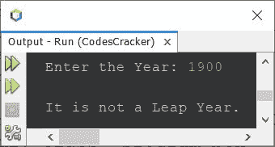
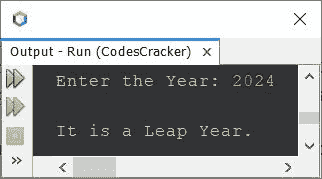
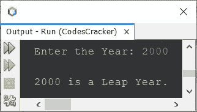

# Java 程序检查闰年与否

> 原文：<https://codescracker.com/java/program/java-program-check-leap-year.htm>

本文介绍了 Java 中的多个程序，这些程序检查用户在程序运行时输入的年份是否是闰年。

闰年是指

*   能被 4 整除，但不能被 100 整除
*   或者能被 400 整除

要理解上述条件背后的逻辑，请参考[闰年逻辑](/nonprog/leap-year.htm)。现在让我们继续移动 ，创建程序。

## Java 中的闰年程序

问题是，*写一个 Java 程序，检查一年是不是闰年。运行时， 用户必须收到年份。*下面给出的程序是它的答案:

```
import java.util.Scanner;

public class CodesCracker
{
   public static void main(String[] args)
   {
      int year;
      Scanner scan = new Scanner(System.in);

      System.out.print("Enter the Year: ");
      year = scan.nextInt();

      if(year%4==0 && year%100!=0)
         System.out.println("\nIt is a Leap Year.");
      else if(year%400==0)
         System.out.println("\nIt is a Leap Year.");
      else
         System.out.println("\nIt is not a Leap Year.");
   }
}
```

下面给出的快照显示了上述程序的示例运行，用户输入 **1900** 作为年份，以检查 是否是闰年:



下面是另一个运行示例，用户输入 **2024** 作为年份:



## 在 Java 中使用条件运算符检查闰年

这个程序做的工作和前一个程序一样。这个程序使用条件或三元(？:)操作员来完成工作。

```
import java.util.Scanner;

public class CodesCracker
{
   public static void main(String[] args)
   {
      Scanner scan = new Scanner(System.in);

      System.out.print("Enter the Year: ");
      int year = scan.nextInt();

      int check = ((year%4==0 && year%100!=0) || (year%400==0)) ? 4 : 0;
      if(check==4)
         System.out.println("\n" +year+ " is a Leap Year.");
      else
         System.out.println("\n" +year+ " is not a Leap Year.");
   }
}
```

下面是它在用户输入 **2000** 下的运行示例:



上面的程序也可以这样创建:

```
import java.util.Scanner;

public class CodesCracker
{
   public static void main(String[] args)
   {
      Scanner scan = new Scanner(System.in);

      System.out.print("Enter the Year: ");
      int year = scan.nextInt();

      String check = ((year%4==0 && year%100!=0) || (year%400==0)) ? "yes" : "no";

      if(check.equals("yes"))
         System.out.println("\n" +year+ " is a Leap Year.");
      else
         System.out.println("\n" +year+ " is not a Leap Year.");
   }
}
```

您将获得与上一个程序相同的输出。

#### 其他语言的相同程序

*   [C 检查闰年与否](/c/program/c-program-check-leap-year.htm)
*   [C++检查闰年与否](/cpp/program/cpp-program-check-leap-year.htm)
*   [Python 检查闰年与否](/python/program/python-program-check-leap-year.htm)

[Java 在线测试](/exam/showtest.php?subid=1)

* * *

* * *