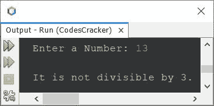

# Java 程序：检查一个数是否能被另一个数整除

> 原文：<https://codescracker.com/java/program/java-check-number-divisible-by-another.htm>

这篇文章介绍了一个用 Java 编写的程序，用来检查用户在运行时输入的数字是否能被 3、5、7、11 等整除。或者不是。我已经就同一个主题创建了多个程序。让我们从一个非常简单的开始。

## 检查一个数是否能被 3 整除

问题是，*写一个 Java 程序，检查一个数是否能被 3 整除。该号码必须在程序运行时收到 。*下面是它的回答。我的意思是，下面给出的程序就是这个问题的答案:

```
import java.util.Scanner;

public class CodesCracker
{
   public static void main(String[] args)
   {
      int num, den=3;
      Scanner s = new Scanner(System.in);

      System.out.print("Enter a Number: ");
      num = s.nextInt();

      if(num%den==0)
         System.out.println("\nIt is divisible by 3.");
      else
         System.out.println("\nIt is not divisible by 3.");
   }
}
```

下面是它的示例运行，使用用户输入的 **12** 作为数字来检查它是否能被 3 整除:


这是另一个运行用户输入 **13** 的示例:



## 检查一个数是否能被 5 整除

要创建一个程序，可以检查用户输入的数字是否能被 5 整除，只需将上面程序中的 3 替换为 5。其余的代码都是一样的。

## 检查一个数是否能被另一个数整除

这是我们需要的主要程序。因为使用这个程序，我们可以测试任意数字组合的整除性。例如，我们可以检查一个数是否能被 11 整除，一个数是否能被 7 整除等等。

```
import java.util.Scanner;

public class CodesCracker
{
   public static void main(String[] args)
   {
      int num, den;
      Scanner s = new Scanner(System.in);

      System.out.print("Enter Numerator: ");
      num = s.nextInt();
      System.out.print("Enter Denominator: ");
      den = s.nextInt();

      if(num%den==0)
         System.out.println("\n" +num+" is divisible by " +den);
      else
         System.out.println("\n" +num+" is not divisible by " +den);
   }
}
```

下面是它的示例运行，使用用户输入 **21** 作为分子，使用 **7** 作为分母，检查数字 21 是否能被 7 整除:


下面是另一个示例运行，用户输入 **41** 作为分子， **4** 作为分母，以检查数字 **41** 是否能被 4 整除:


现在让我们修改上面的程序，为用户提供两个选项。一个检查一个数是否能被另一个数整除，另一个检查一个数是否能被多个数整除:

```
import java.util.Scanner;

public class CodesCracker
{
   public static void main(String[] args)
   {
      int num, choice;
      Scanner s = new Scanner(System.in);

      System.out.println("1\. Divisibility Test with Single Number.");
      System.out.println("2\. Divisibility Test with Multiple Numbers.");
      System.out.print("Enter Your Choice (1 or 2): ");
      choice = s.nextInt();
      if(choice==1)
      {
         int den;
         System.out.print("\nEnter Numerator: ");
         num = s.nextInt();
         System.out.print("Enter Denominator: ");
         den = s.nextInt();
         if(num%den==0)
            System.out.println("\n" +num+" is divisible by " +den);
         else
            System.out.println("\n" +num+" is not divisible by " +den);
      }
      else if(choice==2)
      {
         int total, count=0;
         System.out.println("\nWith How many numbers to apply divisibility test ? ");
         total = s.nextInt();
         int[] den = new int[total];

         System.out.print("\nEnter Numerator: ");
         num = s.nextInt();
         System.out.print("Enter " +total+ " Denominators: ");
         for(int i=0; i<den.length; i++)
         {
            den[i] = s.nextInt();
            if(num%den[i]!=0)
               count=1;
         }

         if(count==0)
            System.out.println("\n" +num+" is divisible by all given numbers");
         else
            System.out.println("\n" +num+" is not divisible by all given numbers");
      }
      else
         System.out.println("\nInvalid Choice!");
   }
}
```

下面是它的示例运行，使用用户输入的 **2** 作为选择， **2** 作为总数， **30** 作为分子， **3** 和 **5** 作为两个数字来检查 30 是否能被 3 和 5 整除:


[Java 在线测试](/exam/showtest.php?subid=1)

* * *

* * *