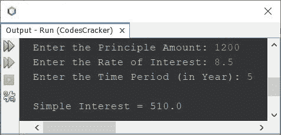

# 计算单利的 Java 程序

> 原文：<https://codescracker.com/java/program/java-calculate-simple-interest.htm>

这个项目包含 Java 程序，在运行时根据用户输入的数据查找并打印简单的利息。但是在创建程序之前，我们先提醒一下计算单利的公式。

计算单利的公式是:

```
SI = (P*R*T)/100
```

其中 **SI** 为单利金额， **P** 为本金金额， **R** 为 利率， **T** 为以年为单位的时间段。

## 计算机对 Java 的简单兴趣

问题是，*编写一个 Java 程序，根据用户 在程序运行时输入的原则、利率和时间段来计算单利。下面给出的程序是这个问题的答案:*

```
import java.util.Scanner;

public class CodesCracker
{
   public static void main(String[] args)
   {
      float p, r, t, si;
      Scanner scan = new Scanner(System.in);

      System.out.print("Enter the Principle Amount: ");
      p = scan.nextFloat();
      System.out.print("Enter the Rate of Interest: ");
      r = scan.nextFloat();
      System.out.print("Enter the Time Period (in Year): ");
      t = scan.nextFloat();

      si = (p*r*t)/100;
      System.out.println("\nSimple Interest = " +si);
   }
}
```

以下是其示例运行，用户输入 **1200** 作为本金金额， **8.5** 作为利率， **5** 作为 年数或时间段(以年为单位):



[Java 在线测试](/exam/showtest.php?subid=1)

* * *

* * *