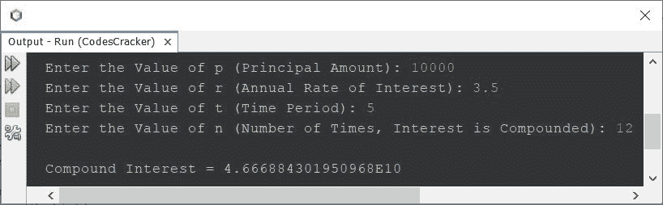
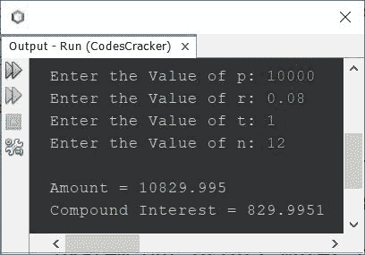

# Java 程序：计算复利

> 原文：<https://codescracker.com/java/program/java-calculate-compound-interest.htm>

本文介绍了一个 Java 程序，它根据用户在程序运行时提供的数据查找并打印复利。

计算复利的公式是:

```
CI = (1 + r/n)(nt) - p
```

其中 **CI** 表示复利， **p** 表示本金， **r** 表示年利率 ， **t** 表示投资或借款的时间周期， **n** 表示每单位 **t** 复利的次数 。

**注-** 如果利息按月复利计算，那么 **n** 的值就是 12。如果利息按季度复利 ，那么 **n** 的值就是 4，依此类推。这发生在 **t** 是年的时候。

问题是，*根据 **p** ， **r** ， **t** ， **n** 值等数据，编写一个 Java 程序，求出并打印复利。用户必须在程序运行时接收数据。*下面给出的程序 就是它的答案:

```
import java.util.Scanner;

public class CodesCracker
{
   public static void main(String[] args)
   {
      double p, r, t, n, ci;
      Scanner s = new Scanner(System.in);

      System.out.print("Enter the Value of p (Principal Amount): ");
      p = s.nextDouble();
      System.out.print("Enter the Value of r (Annual Rate of Interest): ");
      r = s.nextDouble();
      System.out.print("Enter the Value of t (Time Period): ");
      t = s.nextDouble();
      System.out.print("Enter the Value of n (Number of Times, Interest is Compounded): ");
      n = s.nextDouble();

      ci = p * Math.pow(1 + (r/n), (n*t)) - p;

      System.out.println("\nCompound Interest = " +ci);
   }
}
```

下面给出的快照显示了上述 Java 程序的示例运行，用户输入 **10000** 作为本金金额， **3.5** 作为利率， **5** 作为时间段， **12** 作为复利的次数:



上面的程序也可以这样创建。该程序也打印出**金额**的值。

```
import java.util.Scanner;

public class CodesCracker
{
   public static void main(String[] args)
   {
      Scanner s = new Scanner(System.in);

      System.out.print("Enter the Value of p: ");
      float p = s.nextFloat();
      System.out.print("Enter the Value of r: ");
      float r = s.nextFloat();
      System.out.print("Enter the Value of t: ");
      float t = s.nextFloat();
      System.out.print("Enter the Value of n: ");
      float n = s.nextFloat();

      float amount = p * (float)Math.pow(1 + (r/n), (n*t));
      float ci = amount - p;

      System.out.println("\nAmount = " +amount);
      System.out.println("Compound Interest = " +ci);
   }
}
```

下面是它的示例运行，用户输入 **10000** 作为 **p** ， **0.08** 作为 **r** ， **1** 作为 **t** ，以及**12**T16 作为 **n** :



[Java 在线测试](/exam/showtest.php?subid=1)

* * *

* * *