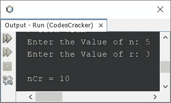
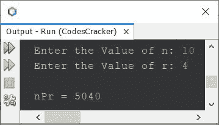
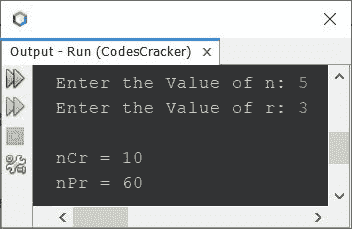

# 查找 nCr 和 nPr 的 Java 程序

> 原文：<https://codescracker.com/java/program/java-program-find-ncr-npr.htm>

本文涵盖了 Java 中的多个程序，这些程序根据用户在程序运行时输入的 **n** 和 **r** 值来查找和打印 nCr(组合)和 nPr(排列)。

求 **nCr** (组合)值的公式为:

```
nCr = n!/r!(n-r)!
```

上式中，**！**是阶乘的符号。[一个数](/java/program/java-program-find-factorial.htm) **n** 的阶乘计算为 **n * (n-1) * (n-2) * (n-3) *...* 1** 。

求 **nPr** (置换)值的公式为:

```
nPr = n!/(n-r)!
```

**注-** **nCr** 值显示的是<u>选择</u> **r** 出 **n** 的方式。

**注-** **nPr** 值显示的是以<u>的方式排列</u> **r** 的东西出 **n** 。

## 在 Java 中查找 nCr(组合)

问题是，*写个 Java 程序找 **nCr** 。用户必须在 运行时接收到 **n** 和 **r** 值。下面给出的程序是它的答案:*

```
import java.util.Scanner;

public class CodesCracker
{
   public static void main(String[] args)
   {
      int n, r, ncr, fact=1, numerator, denominator, i=1, sub;
      Scanner s = new Scanner(System.in);

      System.out.print("Enter the Value of n: ");
      n = s.nextInt();
      System.out.print("Enter the Value of r: ");
      r = s.nextInt();

      while(i<=n)
      {
         fact = fact*i;
         i++;
      }
      numerator = fact;       // n!
      sub = n-r;
      fact = 1;
      i = 1;
      while(i<=sub)
      {
         fact = fact*i;
         i++;
      }
      denominator = fact;     // (n-r)!
      fact = 1;
      i = 1;
      while(i<=r)
      {
         fact = fact*i;
         i++;
      }
      denominator = (fact*denominator);    // r!(n-r)!
      ncr = numerator/denominator;

      System.out.println("\nnCr = " +ncr);
   }
}
```

用户输入 **5** 作为 **n** 的值， **3** 作为 **r** 的值，上面程序的示例运行如下面给出的快照中的 所示:



由于 **nCr** 值为 **10** 如上图输出所示。因此，有 10 种方法可以从 5 种事物中选择 3 种。

### 使用函数在 Java 中查找 nCr

前面的程序提供了 **nCr** 值的逐步计算。现在让我们缩短程序。这个程序 使用用户自定义函数来使程序尽可能的短。

```
import java.util.Scanner;

public class CodesCracker
{
   public static void main(String[] args)
   {
      int n, r, ncr;
      Scanner s = new Scanner(System.in);

      System.out.print("Enter the Value of n: ");
      n = s.nextInt();
      System.out.print("Enter the Value of r: ");
      r = s.nextInt();

      ncr = (fact(n)) / (fact(r)*fact(n-r));

      System.out.println("\nnCr = " +ncr);
   }
   public static int fact(int num)
   {
      int fact=1;
      for(int i=1; i<=num; i++)
         fact *= i;
      return fact;
   }
}
```

那就是函数的使用。使用函数创建时，代码变得太短。因为在第一个程序中，很多时候，相同的寻找阶乘的代码被反复使用。但是现在使用 function，代码只能一次创建，并且可以多次使用。

## 在 Java 中查找 nPr(排列)

这个程序找到并打印出 **nPr** 值。这个程序也使用函数来完成这项工作。

```
import java.util.Scanner;

public class CodesCracker
{
   public static void main(String[] args)
   {
      int n, r, npr;
      Scanner s = new Scanner(System.in);

      System.out.print("Enter the Value of n: ");
      n = s.nextInt();
      System.out.print("Enter the Value of r: ");
      r = s.nextInt();

      npr = (fact(n)) / (fact(n-r));

      System.out.println("\nnPr = " +npr);
   }
   public static int fact(int num)
   {
      int fact=1;
      for(int i=1; i<=num; i++)
         fact *= i;
      return fact;
   }
}
```

下面是它的示例运行，用户输入 **10** 作为 **n** 的值，输入 **4** 作为 **r** 的值:



也就是有 **5040** 种方式来排列 10 个中的 4 个。

## 在 Java 中查找 nCr 和 nPr

这基本上是以前节目的组合版本。因为这个程序找到并打印了 **nCr** 和 **nPr** 两者的值。

```
import java.util.Scanner;

public class CodesCracker
{
   public static void main(String[] args)
   {
      int n, r, ncr, npr;
      Scanner s = new Scanner(System.in);

      System.out.print("Enter the Value of n: ");
      n = s.nextInt();
      System.out.print("Enter the Value of r: ");
      r = s.nextInt();

      npr = (fact(n)) / (fact(n-r));
      ncr = npr/fact(r);

      System.out.println("\nnCr = " +ncr);
      System.out.println("nPr = " +npr);
   }
   public static int fact(int num)
   {
      int fact=1;
      for(int i=1; i<=num; i++)
         fact *= i;
      return fact;
   }
}
```

下面给出的快照显示了用户输入 **5** 和 **3** 作为 **n** 和 **r** 的值的示例运行:



#### 其他语言的相同程序

*   [C 查找 ncR nPr](/c/program/c-program-find-ncr-npr.htm)
*   [C++查找 ncR nPr](/cpp/program/cpp-program-find-ncr-npr.htm)
*   [Python 查找 ncR nPr](/python/program/python-program-find-ncr-npr.htm)

[Java 在线测试](/exam/showtest.php?subid=1)

* * *

* * *