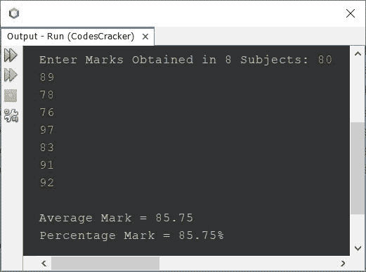
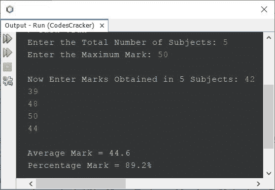

# Java 程序：计算平均分和百分比分数

> 原文：<https://codescracker.com/java/program/java-program-calculate-average-percentage.htm>

本文介绍了一个 Java 程序，它根据用户在程序运行时输入的一些科目的分数，查找并打印平均分和百分比分。

## 在 Java - Basic 版本中查找平均值和百分比标记

问题是，*写一个 Java 程序，根据 8 科收到的分数求平均分和百分比分。* 下面给出的程序是它的答案:

```
import java.util.Scanner;

public class CodesCracker
{
   public static void main(String[] args)
   {
      float[] marks = new float[8];
      float sum=0, avg, perc;
      int i;
      Scanner scan = new Scanner(System.in);

      System.out.print("Enter Marks Obtained in 8 Subjects: ");
      for(i=0; i<8; i++)
         marks[i] = scan.nextFloat();

      for(i=0; i<8; i++)
         sum = sum + marks[i];

      avg = sum/8;
      perc = avg;
      System.out.println("\nAverage Mark = " +avg);
      System.out.println("Percentage Mark = " +perc+ "%");
   }
}
```

下面给出的快照显示了上述 Java 程序的示例运行，其中用户输入 **80、89、78、76、97、83、91、92** 作为在 8 个受试者中获得的 标记:



因为下面给出的程序是基于满分 100 分的。因此，你看到的平均值和百分比的输出是一样的。

## 在 Java 完整版中查找平均值和百分比标记

因为之前的课程仅基于 8 个科目。因此，我修改了程序，允许用户定义科目的数量以及在每个科目中获得的分数。最大标记也允许由用户在程序运行时定义。

```
import java.util.Scanner;

public class CodesCracker
{
   public static void main(String[] args)
   {
      float[] marks = new float[8];
      float sum=0, avg, perc;
      Scanner scan = new Scanner(System.in);

      System.out.print("Enter the Total Number of Subjects: ");
      int tot = scan.nextInt();
      System.out.print("Enter the Maximum Mark: ");
      int max = scan.nextInt();
      System.out.print("\nNow Enter Marks Obtained in " +tot+" Subjects: ");
      for(int i=0; i<tot; i++)
      {
         marks[i] = scan.nextFloat();
         sum += marks[i];
      }

      avg = sum/tot;
      perc = (sum*100)/(tot*max);
      System.out.println("\nAverage Mark = " +avg);
      System.out.println("Percentage Mark = " +perc+ "%");
   }
}
```

以下是用户输入的示例运行，其中 **5** 为主题数量， **50** 为最大分数， **42、39、48、50、44** 为五个主题分数:



现在看看平均值和百分比的输出。就是两者都不一样，因为这一次，最高分是 50。百分比总是显示 100 分中的平均分。其中，平均值只是打印主题总数除以主题总数的总和。

#### 其他语言的相同程序

*   [C 计算平均百分比分数](/c/program/c-program-calculate-average-percentage.htm)
*   [C++计算平均百分分数](/cpp/program/cpp-program-calculate-average-percentage.htm)
*   [Python 计算平均百分比分数](/python/program/python-program-calculate-average-percentage-marks.htm)

[Java 在线测试](/exam/showtest.php?subid=1)

* * *

* * *