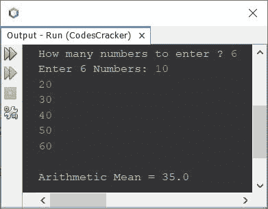

# Java 程序：计算算术平均值

> 原文：<https://codescracker.com/java/program/java-program-calculate-arithmetic-mean.htm>

这篇文章介绍了一个 Java 程序，它查找并打印用户输入的 n 个数字的算术平均值。 n 个数字的算术平均值可以计算为:

```
Arithmetic Mean = (Sum of All Numbers)/(n)
```

## 用 Java 计算算术平均值或平均数

问题是，*编写一个 Java 程序，查找并打印 **n 个**数字的算术平均值，这些数字是由 用户在程序运行时输入的。*下面给出的程序是它的答案:

```
import java.util.Scanner;

public class CodesCracker
{
   public static void main(String[] args)
   {
      int n, i, sum=0;
      float armean;
      Scanner scan = new Scanner(System.in);

      System.out.print("How many numbers to enter ? ");
      n = scan.nextInt();
      int[] arr = new int[n];

      System.out.print("Enter " +n+ " Numbers: ");
      for(i=0; i<n; i++)
      {
         arr[i] = scan.nextInt();
         sum = sum + arr[i];
      }

      armean = sum/n;
      System.out.println("\nArithmetic Mean = " +armean);
   }
}
```

下面给出的快照显示了上述程序的示例运行，其中用户输入的 **6** 为大小， **10、20、30、40、50、60** 为 六个数字，以查找并打印这六个数字的算术平均值:



#### 其他语言的相同程序

*   [C 计算算术平均值](/c/program/c-program-calculate-arithmetic-mean.htm)
*   [C++ 计算算术平均值](/cpp/program/cpp-program-calculate-arithmetic-mean.htm)
*   [Python 计算算术平均值](/python/program/python-program-calculate-average-of-numbers.htm)

[Java 在线测试](/exam/showtest.php?subid=1)

* * *

* * *