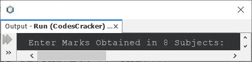
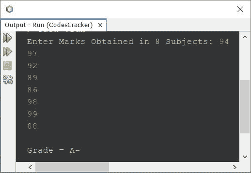
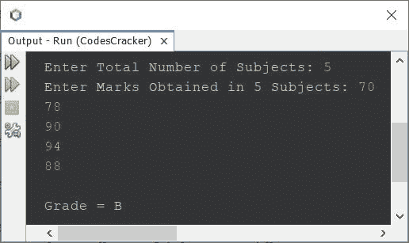

# 计算学生成绩的 Java 程序

> 原文：<https://codescracker.com/java/program/java-program-calculate-student-grade.htm>

这篇文章讲述了一个 Java 程序，它根据用户在程序运行时输入的分数查找并打印学生的成绩。

学生的成绩必须按照下表计算:

| 平均标记范围 | 级别 |
| >= 94 | A |
| > = 90°且< 94° | 表示“不” |
| > = 87 且< 90 | B+ |
| > = 83 且< 87 | B |
| > = 80 且< 83 | B- |
| > = 77 且< 80 | C+ |
| > = 73 且< 77 | C |
| > = 70 且< 73 | C- |
| > = 67 且< 70 | D+ |
| > = 63 且< 67 | D |
| > = 60 且< 63 | D- |
| < 60 | F |

**注** -上表中， **> = 90、< 94** 的范围是指，如果平均分大于等于 90 且小于 94，则等级应为 **A-** 。在此范围内，可能存在的标记有 **90、90.23、92、93.89**T13】等。也就是说，在这里的 **90-94** 的范围内，包括 90，而不包括 94。

## 在 Java 基础版中查找学生成绩

问题是，*用 Java 写一个程序，用 **if** - **else** 找出学生的成绩。*下面给出的程序 就是它的答案:

```
import java.util.Scanner;

public class CodesCracker
{
   public static void main(String[] args)
   {
      float[] marks = new float[8];
      float sum=0, avg;
      int i;
      Scanner scan = new Scanner(System.in);

      System.out.print("Enter Marks Obtained in 8 Subjects: ");
      for(i=0; i<8; i++)
         marks[i] = scan.nextFloat();

      for(i=0; i<8; i++)
         sum = sum + marks[i];
      avg = sum/8;

      System.out.print("\nGrade = ");

      if(avg>=94)
         System.out.println("A");
      else if(avg>=90 && avg<94)
         System.out.println("A-");
      else if(avg>=87 && avg<90)
         System.out.println("B+");
      else if(avg>=83 && avg<87)
         System.out.println("B");
      else if(avg>=80 && avg<83)
         System.out.println("B-");
      else if(avg>=77 && avg<80)
         System.out.println("C+");
      else if(avg>=73 && avg<77)
         System.out.println("C");
      else if(avg>=70 && avg<73)
         System.out.println("C-");
      else if(avg>=67 && avg<70)
         System.out.println("D+");
      else if(avg>=63 && avg<67)
         System.out.println("D");
      else if(avg>=60 && avg<63)
         System.out.println("D-");
      else
         System.out.println("F");
   }
}
```

下面给出的快照显示了上述 Java 程序产生的初始输出:



现在请提供 8 个科目的分数。下面是它的运行示例，在提供标记后，比如说 94，97，92，89，86，98，99，88 作为八个主题标记:



上面的程序也可以这样创建:

```
import java.util.Scanner;

public class CodesCracker
{
   public static void main(String[] args)
   {
      float[] marks = new float[8];
      float sum=0;
      Scanner scan = new Scanner(System.in);

      System.out.print("Enter Marks Obtained in 8 Subjects: ");
      for(int i=0; i<8; i++)
      {
         marks[i] = scan.nextFloat();
         sum += marks[i];
      }

      float avg = sum/8;
      String grade = "";

      if(avg>=94)
         grade = "A";
      else if(avg>=90 && avg<94)
         grade = "A-";
      else if(avg>=87 && avg<90)
         grade = "B+";
      else if(avg>=83 && avg<87)
         grade = "B";
      else if(avg>=80 && avg<83)
         grade = "B-";
      else if(avg>=77 && avg<80)
         grade = "C+";
      else if(avg>=73 && avg<77)
         grade = "C";
      else if(avg>=70 && avg<73)
         grade = "C-";
      else if(avg>=67 && avg<70)
         grade = "D+";
      else if(avg>=63 && avg<67)
         grade = "D";
      else if(avg>=60 && avg<63)
         grade = "D-";
      else
         grade = "F";

      System.out.println("\nGrade = " +grade);
   }
}
```

## 在 Java 中查找学生成绩-完整版

因为上面给出的程序有一些限制，比如如果用户输入一个大于 100 的分数呢？
这个程序也只对 8 个科目有效？因此记住这些类型的限制，我修改了程序并创建了一个新的如下所示。

```
import java.util.Scanner;

public class CodesCracker
{
   public static void main(String[] args)
   {
      float[] marks = new float[8];
      float sum=0;
      Scanner scan = new Scanner(System.in);

      System.out.print("Enter Total Number of Subjects: ");
      int tot = scan.nextInt();
      System.out.print("Enter Marks Obtained in " +tot+ " Subjects: ");
      for(int i=0; i<tot; i++)
      {
         marks[i] = scan.nextFloat();
         sum += marks[i];
      }

      float avg = sum/tot;
      String grade = "";

      if(avg>=94 && avg<=100)
         grade = "A";
      else if(avg>=90 && avg<94)
         grade = "A-";
      else if(avg>=87 && avg<90)
         grade = "B+";
      else if(avg>=83 && avg<87)
         grade = "B";
      else if(avg>=80 && avg<83)
         grade = "B-";
      else if(avg>=77 && avg<80)
         grade = "C+";
      else if(avg>=73 && avg<77)
         grade = "C";
      else if(avg>=70 && avg<73)
         grade = "C-";
      else if(avg>=67 && avg<70)
         grade = "D+";
      else if(avg>=63 && avg<67)
         grade = "D";
      else if(avg>=60 && avg<63)
         grade = "D-";
      else if(avg>=0 && avg<60)
         grade = "F";
      else
         grade = "Invalid Input!";

      if(grade.equals("Invalid Input!"))
         System.out.println("\nInvalid Input!");
      else
         System.out.println("\nGrade = " +grade);
   }
}
```

下面是它的示例运行，用户输入 **5** 作为主题数量， **70、78、90、94、88** 作为五个主题标记:



#### 其他语言的相同程序

*   [C 计算学生成绩](/c/program/c-program-calculate-student-grade.htm)
*   [C++计算学生成绩](/cpp/program/cpp-program-calculate-student-grade.htm)
*   [Python 计算学生成绩](/python/program/python-program-calculate-student-grade.htm)

[Java 在线测试](/exam/showtest.php?subid=1)

* * *

* * *