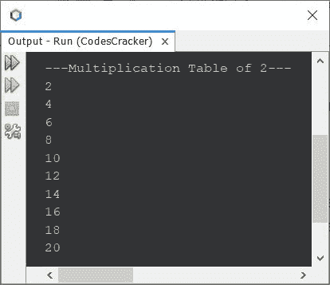

# Java 程序打印一个数字表

> 原文：<https://codescracker.com/java/program/java-program-print-table-of-number.htm>

本文介绍了用 Java 编写的多个程序，这些程序可以查找并打印一个数字的乘法表。本文涵盖的程序列表包括:

*   打印 2 的乘法表
*   在循环时使用**打印乘法表**
*   打印任意给定数字的乘法表

## 用 Java 打印 2 的乘法表

问题是，*写一个 Java 程序打印 2 的乘法表*。下面给出的程序是它的答案:

```
public class CodesCracker
{
   public static void main(String[] args)
   {
      int num=2, i;
      System.out.println("\n---Multiplication Table of 2---");

      for(i=1; i<=10; i++)
         System.out.println(num*i);
   }
}
```

下面给出的快照显示了上面的程序在打印乘法表 2 时产生的示例输出



上面的程序也可以用这种方式编写，以产生交互式输出，比前一个:

```
public class CodesCracker
{
   public static void main(String[] args)
   {
      int num=2, i;
      System.out.println("\n---Multiplication Table of 2---");
      for(i=1; i<=10; i++)
         System.out.println(num+ " * " +i+ " = " +(num*i));
   }
}
```

现在输出将是:

```
---Multiplication Table of 2---
2 * 1 = 2
2 * 2 = 4
2 * 3 = 6
2 * 4 = 8
2 * 5 = 10
2 * 6 = 12
2 * 7 = 14
2 * 8 = 16
2 * 9 = 18
2 * 10 = 20
```

## 用 Java 中的 while 循环打印乘法表

前一个程序也可以使用 **while** 循环创建，如下面给出的程序所示:

```
public class CodesCracker
{
   public static void main(String[] args)
   {
      int num=2, i=1;
      System.out.println("\n---Multiplication Table of 2---");
      while(i<=10)
      {
         System.out.println(num+ " * " +i+ " = " +(num*i));
         i++;
      }
   }
}
```

这个程序产生与前一个相同的输出。

## 用 Java 打印任意给定数字的乘法表

这个程序允许用户输入他/她想要打印乘法表的数字。

```
import java.util.Scanner;

public class CodesCracker
{
   public static void main(String[] args)
   {
      Scanner scan = new Scanner(System.in);

      System.out.print("Enter the Number: ");
      int num = scan.nextInt();

      System.out.println("\n---Multiplication Table of " +num+ "---");
      for(int i=1; i<=10; i++)
         System.out.println(num+ " * " +i+ " = " +(num*i));
   }
}
```

用户输入 **5** 作为数字，打印 **5** 的乘法表，上面程序的示例运行如下面的快照 所示:


#### 其他语言的相同程序

*   [C 打印号码表](/c/program/c-program-print-table-of-number.htm)
*   [C++打印数字表](/cpp/program/cpp-program-print-table-of-number.htm)
*   [Python 打印的数字表](/python/program/python-program-print-multiplication-table.htm)

[Java 在线测试](/exam/showtest.php?subid=1)

* * *

* * *