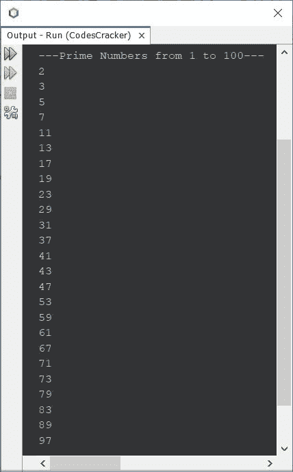
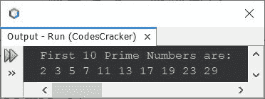
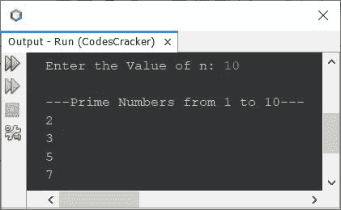
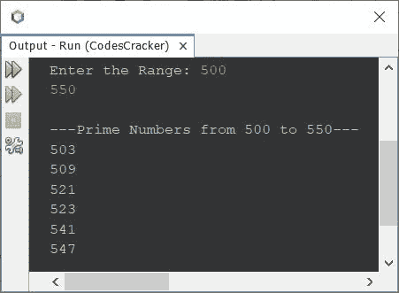

# Java 程序：打印质数

> 原文：<https://codescracker.com/java/program/java-program-print-prime-numbers.htm>

本文介绍了用 Java 打印质数的多个程序。下面是本文涉及的程序列表:

*   打印从 1 到 100 的质数
*   打印前 10 个质数
*   打印从 1 到 **n** 的质数
*   打印给定范围内的质数
*   在循环时使用**打印质数**

**注-** 只能被 1 整除的数和这个数本身叫做素数。 例如:2、3、5、7、11、13、17 等。，都是质数。

## 用 Java 打印 1 到 100 的质数

问题是，*写一个 Java 程序，打印 1 到 100 的质数。*下面给出的程序是它的答案:

```
public class CodesCracker
{
   public static void main(String[] args)
   {
      int i, j, chk;

      System.out.println("---Prime Numbers from 1 to 100---");
      for(i=2; i<=100; i++)
      {
         chk = 0;
         for(j=2; j<i; j++)
         {
            if(i%j==0)
            {
               chk++;
               break;
            }
         }
         if(chk==0)
            System.out.println(i);
      }
   }
}
```

下面给出的快照显示了上述程序在打印从 1 到 100 的所有质数时产生的示例输出:



## 用 Java 打印前 10 个质数

这个程序几乎使用与前一个程序相同的概念，打印前 10 个质数。在这个程序中，我使用了一个名为 **count** 的变量，它的初始值是 0。在 打印出一个质数后，它的值每次增加 1。

并且循环继续执行，以打印素数，直到计数的值**变为等于 10，或者直到条件**计数< 10** 评估为**假**为止。**

```
public class CodesCracker
{
   public static void main(String[] args)
   {
      int i, j, chk, count=0;

      System.out.println("First 10 Prime Numbers are:");
      for(i=2; count<10; i++)
      {
         chk = 0;
         for(j=2; j<i; j++)
         {
            if(i%j==0)
            {
               chk++;
               break;
            }
         }
         if(chk==0)
         {
            System.out.print(i+ " ");
            count++;
         }
      }
   }
}
```

上述程序在打印前 10 个质数时产生的输出显示在下面给出的快照中:



## 用 Java 打印从 1 到 n 的质数

现在这个程序打印从 1 到 **n** 的质数。当然， **n** 的值将由用户在程序运行时接收 。

```
import java.util.Scanner;

public class CodesCracker
{
   public static void main(String[] args)
   {
      Scanner scan = new Scanner(System.in);

      System.out.print("Enter the Value of n: ");
      int n = scan.nextInt();

      System.out.println("\n---Prime Numbers from 1 to " +n+ "---");
      for(int i=2; i<=n; i++)
      {
         int chk = 0;
         for(int j=2; j<i; j++)
         {
            if(i%j==0)
            {
               chk++;
               break;
            }
         }
         if(chk==0)
            System.out.println(i);
      }
   }
}
```

下面是它的示例运行，使用用户输入的 **10** 作为 **n** 的值来打印从 1 到 10 的质数



## 用 Java 打印给定范围内的质数

现在这个程序允许用户定义范围，开始和结束值，打印给定范围内的所有素数。

```
import java.util.Scanner;

public class CodesCracker
{
   public static void main(String[] args)
   {
      Scanner scan = new Scanner(System.in);

      System.out.print("Enter the Range: ");
      int start = scan.nextInt();
      int end = scan.nextInt();

      System.out.println("\n---Prime Numbers from " +start+" to " +end+ "---");
      for(int i=start; i<=end; i++)
      {
         int chk = 0;
         for(int j=2; j<i; j++)
         {
            if(i%j==0)
            {
               chk++;
               break;
            }
         }
         if(chk==0)
            System.out.println(i);
      }
   }
}
```

以用户输入 **500** 和 **550** 为范围的示例运行显示在下面给出的快照中:



## 使用`while`循环在 Java 中打印质数

之前的程序也可以用 **while** 循环编写，而不是用**代替**。为此，只需将 **替换为**循环的代码块，代码块如下:

```
int i=start;
while(i<=end)
{
   int chk = 0;
   int j=2;
   while(j<i)
   {
      if(i%j==0)
      {
         chk++;
         break;
      }
      j++;
   }
   if(chk==0)
      System.out.println(i);
   i++;
}
```

#### 其他语言的相同程序

*   [C 打印质数](/c/program/c-program-print-prime-numbers.htm)
*   [C++ 打印质数](/cpp/program/cpp-program-print-prime-numbers.htm)
*   [Python 打印质数](/python/program/python-program-print-prime-numbers.htm)

[Java 在线测试](/exam/showtest.php?subid=1)

* * *

* * *