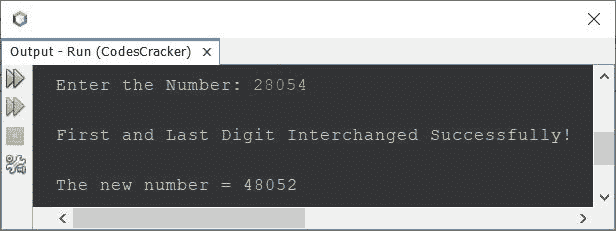
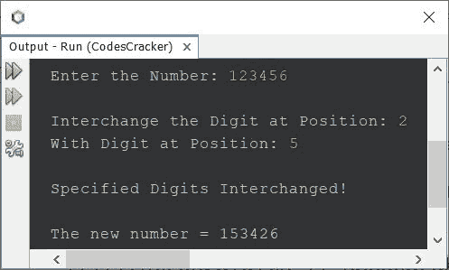

# Java 程序：交换数字

> 原文：<https://codescracker.com/java/program/java-program-interchange-numbers.htm>

本文涵盖了 Java 中的多个程序，这些程序交换或交换用户在程序运行时输入的数字。下面是本文涉及的程序列表:

*   当循环时，使用**交换数字的第一个和最后一个数字**
*   使用**替换**循环，交换数字的第一个和最后一个数字
*   交换一个数的任意两个指定数字(按位置)

## 在 Java 中交换数字的第一位和最后一位

问题是，*写一个 Java 程序，交换或互换一个数的第一位和最后一位。该号码必须是用户在运行时收到的 。*下面给出的程序就是它的答案。该程序是使用 **while** 循环创建的:

```
import java.util.Scanner;

public class CodesCracker
{
   public static void main(String[] args)
   {
      int num, temp, digits=0, rem, remTemp, rev=0, r, revTemp, digitsTemp;
      Scanner scan = new Scanner(System.in);

      System.out.print("Enter the Number: ");
      num = scan.nextInt();

      temp = num;
      while(temp>0)
      {
         digits++;
         temp = temp/10;
      }
      if(digits<2)
      {
         System.out.println("\nInterchange not possible.");
      }
      else if(digits==2)
      {
         temp = num;
         while(temp>0)
         {
            rem = temp%10;
            rev = (rev*10) + rem;
            temp = temp/10;
         }
         System.out.println("\nFirst and Last Digit Interchanged Successfully!");
         System.out.println("\nThe New Number = " +rev);
      }
      else
      {
         temp = num;
         while(temp>0)
         {
            rem = temp%10;
            rev = (rev*10) + rem;
            temp = temp/10;
         }
         r = rev;
         rev = 0;
         temp = num;
         digitsTemp = digits;
         while(temp>0)
         {
            remTemp = r%10;
            if(digitsTemp==digits || digitsTemp==1)
            {
               rem = temp%10;
               rev = (rev*10) + rem;
            }
            else
            {
               rev = (rev*10) + remTemp;
            }
            r = r/10;
            temp = temp/10;
            digitsTemp--;
         }
         System.out.println("\nFirst and Last Digit Interchanged Successfully!");
         System.out.println("\nThe new number = " +rev);
      }
   }
}
```

下面给出的快照显示了上述程序的示例运行，用户输入 **28054** 作为交换或互换 其第一个和最后一个数字的数字:



### 使用`for`循环交换第一个和最后一个数字

当循环时，也可以使用**代替**来创建前一个程序。我也做了一些其他的修改， 在程序中，以缩短代码。****

```
import java.util.Scanner;

public class CodesCracker
{
   public static void main(String[] args)
   {
      int num, temp, digits=0, rev=0, r, digitsTemp;
      Scanner scan = new Scanner(System.in);

      System.out.print("Enter the Number: ");
      num = scan.nextInt();

      for(temp=num; temp>0; temp /= 10)
         digits++;

      if(digits<2)
         System.out.println("\nInterchange not possible.");
      else if(digits==2)
      {
         for(temp=num; temp>0; temp /= 10)
            rev = (rev*10) + (temp%10);
         System.out.println("\nFirst and Last Digit Interchanged Successfully!");
         System.out.println("\nThe New Number = " +rev);
      }
      else
      {
         for(temp=num; temp>0; temp /= 10)
            rev = (rev*10) + (temp%10);
         r = rev;
         rev = 0;
         digitsTemp = digits;
         for(temp=num; temp>0; temp /= 10)
         {
            if(digitsTemp==digits || digitsTemp==1)
               rev = (rev*10) + (temp%10);
            else
               rev = (rev*10) + (r%10);
            r = r/10;
            digitsTemp--;
         }
         System.out.println("\nFirst and Last Digit Interchanged Successfully!");
         System.out.println("\nThe new number = " +rev);
      }
   }
}
```

以及用户输入的数字是否总是多于 2 位数。或者如果你想要一个程序，只适用于 2 位数以上的数字。然后去掉检查位数的 **if-else** 块，直接互换第一位和最后一位 。下面是程序的完整版本，仅适用于 3 位数或 3 位数以上的数字<u>:</u>

```
import java.util.Scanner;

public class CodesCracker
{
   public static void main(String[] args)
   {
      int num, temp, digits=0, rev=0, r, digitsTemp;
      Scanner scan = new Scanner(System.in);

      System.out.print("Enter the Number: ");
      num = scan.nextInt();

      for(temp=num; temp>0; temp /= 10)
         digits++;

      for(temp=num; temp>0; temp /= 10)
         rev = (rev*10) + (temp%10);
      r = rev;
      rev = 0;
      digitsTemp = digits;
      for(temp=num; temp>0; temp /= 10)
      {
         if(digitsTemp==digits || digitsTemp==1)
            rev = (rev*10) + (temp%10);
         else
            rev = (rev*10) + (r%10);
         r = r/10;
         digitsTemp--;
      }
      System.out.println("\nFirst and Last Digit Interchanged Successfully!");
      System.out.println("\nThe new number = " +rev);
   }
}
```

## 在 Java 中交换任意两位数

这是最后一个程序，用来交换给定数字的任意两个指定数字。因为一个数可能包含两个相同值的数字。因此，这个程序接收数字的位置，而不是数字的值，以便按位置交换一个数的任意两个给定数字:

```
import java.util.Scanner;

public class CodesCracker
{
   public static void main(String[] args)
   {
      int firstPos, secondPos, temp, rev=0, digits=0, i;
      Scanner s = new Scanner(System.in);

      System.out.print("Enter the Number: ");
      int num = s.nextInt();

      for(temp=num; temp>0; temp /= 10)
         digits++;
      int[] arr = new int[digits];

      if(digits==1)
         System.out.println("\nInterchange not possible!");
      else if(digits==2)
         System.out.println("\nInterchange with digit-wise is not possible!");
      else 
      {
         System.out.print("\nInterchange the Digit at Position: ");
         firstPos = s.nextInt();
         System.out.print("With Digit at Position: ");
         secondPos = s.nextInt();

         if(firstPos>digits || secondPos>digits)
            System.out.println("\nInvalid Position!");
         else
         {
            for(temp=num; temp>0; temp /= 10)
               rev = (rev*10) + (temp%10);
            for(i=0; i<digits; i++, rev /= 10)
               arr[i] = rev%10;
            temp = arr[firstPos-1];
            arr[firstPos-1] = arr[secondPos-1];
            arr[secondPos-1] = temp;
            System.out.println("\nSpecified Digits Interchanged!");
            System.out.print("\nThe new number = ");
            for(i=0; i<digits; i++)
               System.out.print(arr[i]);
         }
      }
   }
}
```

用户输入 **123456** 作为数字， **2** 和 **5** 作为数字的位置来交换 位置 2 的数字和位置 5 的数字，上面程序的示例运行如下面给出的快照所示:



#### 其他语言的相同程序

*   [交换 C 语言中一个数字的位数](/c/program/c-program-interchange-numbers.htm)

[Java 在线测试](/exam/showtest.php?subid=1)

* * *

* * *