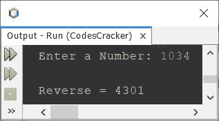
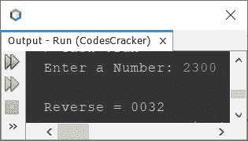
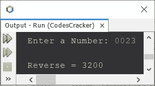

# 反转一个数字的 Java 程序

> 原文：<https://codescracker.com/java/program/java-program-reverse-numbers.htm>

本文介绍了一个用 Java 编写的程序，它可以查找并打印一个数的倒数。例如，如果用户输入一个数字，比如说 **123** ，那么输出将是 **321** 。

## 在 Java 中使用 while 循环反转一个数字

问题是，*写一个 Java 程序求一个数的倒数。要反转的数字，必须由用户在 程序运行时接收。*这个问题的答案，是以下程序:

```
import java.util.Scanner;

public class CodesCracker
{
   public static void main(String[] args)
   {
      int num, rem, rev=0;
      Scanner s = new Scanner(System.in);

      System.out.print("Enter a Number: ");
      num = s.nextInt();

      while(num!=0)
      {
         rem = num%10;
         rev = (rev*10) + rem;
         num = num/10;
      }

      System.out.println("\nReverse = " +rev);
   }
}
```

下面给出的快照显示了上述 Java 程序的示例运行，用户输入 **1034** 作为要反转的数字:



## 在 Java 中使用 for 循环反转一个数字

由于上面的程序使用了 **while** 循环，来反转一个给定的数。因此，我修改了那个程序，创建了一个新的 ，使用**作为**循环:

```
import java.util.Scanner;

public class CodesCracker
{
   public static void main(String[] args)
   {
      int num, rem, rev;
      Scanner s = new Scanner(System.in);

      System.out.print("Enter a Number: ");
      num = s.nextInt();

      for(rev=0; num!=0; num=num/10)
      {
         rem = num%10;
         rev = (rev*10) + rem;
      }

      System.out.println("\nReverse = " +rev);
   }
}
```

这个程序产生与前一个程序完全相同的输出。下面两条语句，来自上面的程序:

```
rem = num%10;
rev = (rev*10) + rem;
```

可以替换为下面给出的一条语句:

```
rev = (rev*10) + (num%10);
```

## 在 Java 中使用数组反转一个数字

这个程序使用数组来做与前一个程序相同的工作。

```
import java.util.Scanner;

public class CodesCracker
{
   public static void main(String[] args)
   {
      int num, len, i;
      Scanner s = new Scanner(System.in);

      System.out.print("Enter a Number: ");
      num = s.nextInt();

      len = String.valueOf(num).length();
      int[] arr = new int[len];
      for(i=0; i<len; i++)
      {
         arr[i] = num%10;
         num = num/10;
      }

      System.out.print("\nReverse = ");
      for(i=0; i<len; i++)
         System.out.print(arr[i]);
   }
}
```

因为上述程序有一个限制。限制是，当用户输入一个数字时，比如说 **1230** 或 **03201** 。也就是说， 0 作为一个数的最后一位或第一位。在这种情况下，0 将被删除。因为 **013** 等于 **13** 。因此，我创建了该程序的另一个版本，以消除这一限制。下面给出了完整的 版本的程序。

## 在 Java 中反转一个数字-完整版

我说这个程序是作为 Java 中反转数字程序的完整版本，因为这个程序也产生以 0 结尾或开始的数字的精确反转。例如， **00134** 的反转将是 **43100** 。类似地 **120** 的反向 将是 **021** 。

```
import java.util.Scanner;

public class CodesCracker
{
   public static void main(String[] args)
   {
      int len, i;
      String num;
      Scanner s = new Scanner(System.in);

      System.out.print("Enter a Number: ");
      num = s.next();

      len = num.length();
      char[] arr = new char[len];
      for(i=0; i<len; i++)
         arr[i] = num.charAt(i);

      System.out.print("\nReverse = ");
      for(i=(len-1); i>=0; i--)
         System.out.print(arr[i]);
   }
}
```

下面是它的示例运行，将用户输入 **2300** 作为要反转的数字:



这是另一个运行用户输入的示例 **0023**



#### 其他语言的相同程序

*   [C 反向数字](/c/program/c-program-reverse-numbers.htm)
*   [C++反向数字](/cpp/program/cpp-program-reverse-numbers.htm)

[Java 在线测试](/exam/showtest.php?subid=1)

* * *

* * *