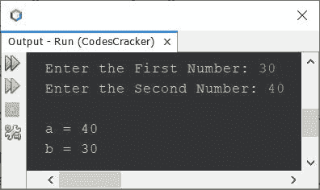
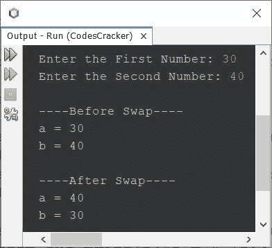

# Java 程序：交换两个数

> 原文：<https://codescracker.com/java/program/java-program-swap-two-numbers.htm>

本文介绍了一个 Java 程序，它交换用户在程序运行时输入的两个数字。

## 在 Java 中用第三个变量交换两个数

问题是，*写一个 Java 程序来交换任意两个给定的数。用户必须在运行时收到该号码。* 下面给出的程序是它的答案:

```
import java.util.Scanner;

public class CodesCracker
{
   public static void main(String[] args)
   {
      int a, b, temp;
      Scanner s = new Scanner(System.in);

      System.out.print("Enter the First Number: ");
      a = s.nextInt();
      System.out.print("Enter the Second Number: ");
      b = s.nextInt();

      temp = a;
      a = b;
      b = temp;

      System.out.println("\na = " +a);
      System.out.println("b = " +b);
   }
}
```

下面给出的快照显示了上述 Java 程序在交换两个给定数字时的示例运行，其中用户输入的 **30** 作为第一个数字，而 **40** 作为第二个数字:



也就是说，第一个数字“T0”30“T1”存储在“T2”a“T3”变量中，第二个数字“T4”40“T5”存储在“T6”b“T7”变量中。并使用语句:

```
temp = a;
```

现在 **temp** 保存了 **a** 的值，也就是 **30** 。再次使用下面的语句:

```
a = b;
```

**a** 的值变成 **40** 。最后使用下面给出的语句:

```
b = temp;
```

**温度**的值，即 **30** 被初始化为 **b** 。所以现在， **b** 持有 **a** 的值， 和 **a** 持有 **b** 的值。就是这样。

上面的程序也可以这样创建:

```
import java.util.Scanner;

public class CodesCracker
{
   public static void main(String[] args)
   {
      Scanner s = new Scanner(System.in);

      System.out.print("Enter the First Number: ");
      int a = s.nextInt();
      System.out.print("Enter the Second Number: ");
      int b = s.nextInt();

      System.out.println("\n----Before Swap----");
      System.out.println("a = " +a);
      System.out.println("b = " +b);

      int temp = a;
      a = b;
      b = temp;

      System.out.println("\n----After Swap----");
      System.out.println("a = " +a);
      System.out.println("b = " +b);
   }
}
```

下面是它的示例运行，与前一个程序的示例运行具有相同的用户输入:



## 在 Java 中不使用第三个变量交换两个数

这个程序不使用任何第三个变量，如 **temp** 来交换两个数字。相反，它使用简单的加法和 减法运算来完成这项工作。

```
import java.util.Scanner;

public class CodesCracker
{
   public static void main(String[] args)
   {
      Scanner s = new Scanner(System.in);

      System.out.print("Enter the First Number: ");
      int numOne = s.nextInt();
      System.out.print("Enter the Second Number: ");
      int numTwo = s.nextInt();

      System.out.println("\n----Before Swap----");
      System.out.println("numOne = " +numOne);
      System.out.println("numTwo = " +numTwo);

      numOne = numOne + numTwo;
      numTwo = numOne - numTwo;
      numOne = numOne - numTwo;

      System.out.println("\n----After Swap----");
      System.out.println("numOne = " +numOne);
      System.out.println("numTwo = " +numTwo);
   }
}
```

## 用 Java 中的函数交换两个数

这个程序使用了一个名为 **swap()** 的用户定义函数，它有两个参数。第一个参数指的是 的第一个数字，而第二个参数指的是第二个数字。该函数交换两个传递的参数，并打印交换后的值 。

```
import java.util.Scanner;

public class CodesCracker
{
   public static void main(String[] args)
   {
      Scanner s = new Scanner(System.in);

      System.out.print("Enter the First Number: ");
      int a = s.nextInt();
      System.out.print("Enter the Second Number: ");
      int b = s.nextInt();

      System.out.println("\n----Before Swap----");
      System.out.println("a = " +a);
      System.out.println("b = " +b);

      swap(a, b);
   }

   public static void swap(int x, int y)
   {
      int z;
      z = x;
      x = y;
      y = z;

      System.out.println("\n----After Swap----");
      System.out.println("a = " +x);
      System.out.println("b = " +y);
   }
}
```

## 在 Java 中使用按位运算符交换两个数

这个程序使用按位运算符来做同样的工作，即交换两个数。

```
import java.util.Scanner;

public class CodesCracker
{
   public static void main(String[] args)
   {
      Scanner s = new Scanner(System.in);

      System.out.print("Enter the First Number: ");
      int a = s.nextInt();
      System.out.print("Enter the Second Number: ");
      int b = s.nextInt();

      System.out.println("\n----Before Swap----");
      System.out.println("a = " +a);
      System.out.println("b = " +b);

      a = a&Hat;b;
      b = a&Hat;b;
      a = a&Hat;b;

      System.out.println("\n----After Swap----");
      System.out.println("a = " +a);
      System.out.println("b = " +b);
   }
}
```

**注-** 顶着 **&的帽子；**是一个**按位异或**或**按位异或**运算符。要了解该运算符， 请参考[位运算符](/computer-fundamental/bitwise-operators.htm)。

#### 其他语言的相同程序

*   [C 交换两个数](/c/program/c-program-swap-two-numbers.htm)
*   [C++交换两个数](/cpp/program/cpp-program-swap-two-numbers.htm)
*   [Python 互换两个数](/python/program/python-program-swap-two-numbers.htm)

[Java 在线测试](/exam/showtest.php?subid=1)

* * *

* * *