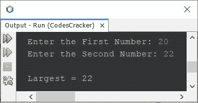
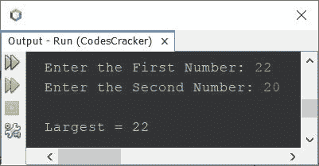
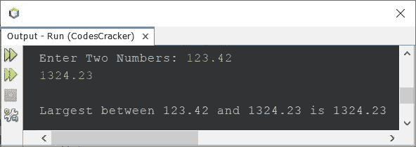
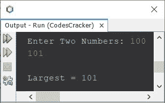

# Java 程序：寻找两个数中最大的一个

> 原文：<https://codescracker.com/java/program/java-program-find-largest-of-two-numbers.htm>

本文涵盖了一些 Java 程序，这些程序用于查找和打印两个给定数字之间的最大值。以下是完成这项工作的几种方法:

*   使用**找出两个数字中最大的一个，如果...否则**
*   使用条件运算符查找两个数中的最大值
*   使用用户定义的函数查找两个数字中的最大值

## 使用 if-else 的两个数中最大的一个

问题是，*写一个 Java 程序来找出两个数之间的最大值。这两个数字必须在程序运行时由用户在 接收。*下面给出的程序是它的答案:

```
import java.util.Scanner;

public class CodesCracker
{
   public static void main(String[] args)
   {
      int numberOne, numberTwo, largest;
      Scanner scan = new Scanner(System.in);

      System.out.print("Enter the First Number: ");
      numberOne = scan.nextInt();
      System.out.print("Enter the Second Number: ");
      numberTwo = scan.nextInt();

      if(numberOne>numberTwo)
         largest = numberOne;
      else
         largest = numberTwo;

      System.out.println("\nLargest = " +largest);
   }
}
```

下面给出的快照显示了上述 Java 程序的示例运行，用户输入 **20** 和 **22** 为两个数字:



这是另一个带有用户输入 **22** 和 **20** 的示例运行。即， **22** 为第一个， **20** 为第二个数字:



但上述程序的问题是，如果用户输入相同的数字，或一个实数(包含小数点)。因此，我修改了上面的程序并创建了一个新程序来消除这两个问题。程序如下:

```
import java.util.Scanner;

public class CodesCracker
{
   public static void main(String[] args)
   {
      float a, b;
      Scanner scan = new Scanner(System.in);

      System.out.print("Enter Two Numbers: ");
      a = scan.nextFloat();
      b = scan.nextFloat();

      if(a>b)
         System.out.println("\nLargest between "+a+" and "+b+" is "+a);
      else if(b>a)
         System.out.println("\nLargest between "+a+" and "+b+" is "+b);
      else
         System.out.println("\nBoth Numbers are same.");

   }
}
```

以下是用户输入的第一个数字 **123.42** 和第二个数字 **1324.23** 的运行示例:



## 使用条件运算符的两个数中的最大值

使用条件运算符，程序变得更短。也就是说，条件运算符有助于使用单个语句找到两个数字中的最大值，如下面给出的程序所示:

```
import java.util.Scanner;

public class CodesCracker
{
   public static void main(String[] args)
   {
      int a, b, big;
      Scanner scan = new Scanner(System.in);

      System.out.print("Enter Two Numbers: ");
      a = scan.nextInt();
      b = scan.nextInt();

      big = (a>b) ? a : b;
      System.out.println("\nLargest = " +big);
   }
}
```

下面是用户输入 100 和 101**作为两个数字的示例运行:**



## 使用函数的两个数中最大的一个

这个程序使用了一个名为 **LargestOfTwo()** 的用户自定义函数，它采用两个数字作为它的两个参数，并返回两个参数中最大的一个 。

```
import java.util.Scanner;

public class CodesCracker
{
   public static void main(String[] args)
   {
      Scanner scan = new Scanner(System.in);

      System.out.print("Enter Two Numbers: ");
      int x = scan.nextInt();
      int y = scan.nextInt();

      System.out.println("\nLargest = " +LargestOfTwo(x, y));
   }
   public static int LargestOfTwo(int a, int b)
   {
      return (a>b) ? a:b;
   }
}
```

这个程序产生与前一个程序相同的输出。

#### 其他语言的相同程序

*   [C 找出两个数中最大的一个](/c/program/c-program-find-greatest-of-two-numbers.htm)
*   [C++ 寻找两个数中最大的一个](/cpp/program/cpp-program-find-greatest-of-two-numbers.htm)
*   [Python 找到两个数中最大的一个](/python/program/python-program-find-largest-of-two-numbers.htm)

[Java 在线测试](/exam/showtest.php?subid=1)

* * *

* * *