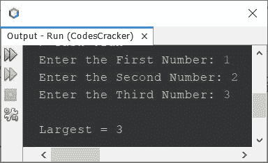
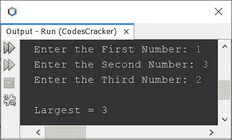
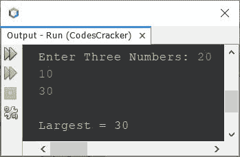

# Java 程序寻找三个数中最大的一个

> 原文：<https://codescracker.com/java/program/java-program-find-largest-of-three-numbers.htm>

本文涵盖了 Java 中的多个程序，这些程序查找并打印用户在程序运行时输入的三个数字中最大的一个。以下是本文涵盖的程序列表:

*   使用**找出三个数字中最大的一个，如果...否则**
*   使用嵌套的 **if 找到三个数字中最大的一个...否则**
*   使用条件运算符(**)找出三个数中最大的一个？:**

## 使用 if else 找到三个数中最大的一个

问题是，*写一个 Java 程序，找出三个给定数字中最大的一个。*下面给出的节目是它的 回答:

```
import java.util.Scanner;

public class CodesCracker
{
   public static void main(String[] args)
   {
      int a, b, c, large;
      Scanner scan = new Scanner(System.in);

      System.out.print("Enter the First Number: ");
      a = scan.nextInt();
      System.out.print("Enter the Second Number: ");
      b = scan.nextInt();
      System.out.print("Enter the Third Number: ");
      c = scan.nextInt();

      if(a>b && a>c)
         large = a;
      else if(b>a && b>c)
         large = b;
      else
         large = c;

      System.out.println("\nLargest = " +large);
   }
}
```

下面给出的快照显示了上述程序的示例运行，用户输入第一个 **1** 、 **2** 和 **3** ，第二个 和第三个数字，以找到并打印这三个数字中最大的一个:



下面是另一个运行示例，用户输入了三个数字 **1** 、 **3** 和 **2** :



## 使用嵌套的 if else 查找三个数中最大的一个

这个程序是通过实现在三个给定数字中寻找最大数字背后的实际逻辑来创建的，使用嵌套的 **if...否则**

```
import java.util.Scanner;

public class CodesCracker
{
   public static void main(String[] args)
   {
      int a, b, c, large;
      Scanner scan = new Scanner(System.in);

      System.out.print("Enter Three Numbers: ");
      a = scan.nextInt();
      b = scan.nextInt();
      c = scan.nextInt();

      if(a>b)
      {
         if(b>c)
            large = a;
         else
         {
            if(c>a)
               large = c;
            else
               large = a;
         }
      }
      else
      {
         if(b>c)
            large = b;
         else
            large = c;
      }

      System.out.println("\nLargest = " +large);
   }
}
```

下面是它的示例运行，用户输入了三个数字 **20** 、 **10** 和 **30** :



## 使用条件运算符找出三个数中最大的一个

这是本文最后一个程序，用条件运算符或者三元运算符创建的，也就是**？:**。我已经 使用了前面的程序，来包装 **if...else** 变成条件运算符:

```
import java.util.Scanner;

public class CodesCracker
{
   public static void main(String[] args)
   {
      Scanner scan = new Scanner(System.in);

      System.out.print("Enter Three Numbers: ");
      int a = scan.nextInt();
      int b = scan.nextInt();
      int c = scan.nextInt();

      int large = (a>b) ? ((b>c)?a:(c>a)?c:a) : (b>c)?b:c;

      System.out.println("\nLargest = " +large);
   }
}
```

在下面的语句中，从上面的程序:

```
int large = (a>b) ? ((b>c)?a:(c>a)?c:a) : (b>c)?b:c;
```

首先对代码(条件) **a > b** 进行评估。如果此代码评估为**真**，则以下代码:

```
((b>c)?a:(c>a)?c:a)
```

将得到评估，否则下面的代码:

```
(b>c)?b:c
```

会被评估。让我们假设条件 **a > b** 评估为**真**。因此，下面的代码:

```
((b>c)?a:(c>a)?c:a)
```

将会以条件 **b > c** 被评估的方式被评估。如果该条件评估为**真**， ，则

```
a
```

得到评估，否则:

```
(c>a)?c:a)
```

接受评估。这个过程一直持续到整个表达式只剩下一个变量，即 a、b 或 c。让我们用下面的例子来演示这个语句。

#### 如何使用条件运算符计算三个数中最大的一个

例如，如果 **a=20** ， **b=10** ， **c=30** 。然后声明:

```
int large = (a>b) ? ((b>c)?a:(c>a)?c:a) : (b>c)?b:c;
```

被评估为，首先代码 **a > b** 或 **20 > 10** 被评估为**真**，因此代码 **((b > c)？答:(c > a)？c:a)** 得到评估。

即代码 **(b > c)** 或 **(10 > 30)** 评估为**假**，因此代码 **(c > a)？一个**被评估。

也就是说，代码 **c > a** 或 **30 > 20** 评估为**真**，因此代码 **c** 得到评估。 也就是说，没有更多的代码要执行，因为最后一个变量是 **c** ，因此 **c** 的值，也就是 **30** 会将 初始化为**大**。就是这样。

#### 其他语言的相同程序

*   [C 找出三个数中最大的一个](/c/program/c-program-find-greatest-of-three-numbers.htm)
*   [C++ 寻找三个数中最大的一个](/cpp/program/cpp-program-find-greatest-of-three-numbers.htm)
*   [Python 找到三个数字中最大的一个](/python/program/python-program-find-largest-of-three-numbers.htm)

[Java 在线测试](/exam/showtest.php?subid=1)

* * *

* * *