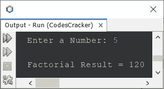
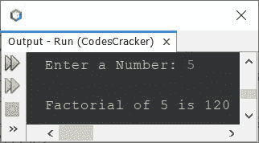

# Java 程序来寻找一个数字的阶乘

> 原文：<https://codescracker.com/java/program/java-program-find-factorial.htm>

本文介绍了一个用 Java 编写的程序，它可以查找并打印一个数的阶乘。一个数**n**T6】的阶乘计算为 **n * (n-1) * (n-2) *...* 1** 。比如 5 的阶乘是 **5*4*3*2*1** 或者 120。

## 使用 for 循环在 Java 中查找阶乘

问题是，*写一个 Java 程序求一个数的阶乘。用户必须在 程序运行时收到该号码。*这个问题的答案，是下面这个程序给出的:

```
import java.util.Scanner;

public class CodesCracker
{
   public static void main(String[] args)
   {
      int num, i, fact=1;
      Scanner s = new Scanner(System.in);

      System.out.print("Enter a Number: ");
      num = s.nextInt();

      for(i=num; i>=1; i--)
      {
         fact = fact*i;
      }

      System.out.println("\nFactorial Result = " +fact);
   }
}
```

具有用户输入 **5** 的上述 Java 程序的示例运行显示在下面给出的快照中:



上面的程序也可以这样创建:

```
import java.util.Scanner;

public class CodesCracker
{
   public static void main(String[] args)
   {
      int fact=1;
      Scanner s = new Scanner(System.in);

      System.out.print("Enter a Number: ");
      int num = s.nextInt();

      for(int i=num; i>=1; i--)
         fact = fact*i;

      System.out.println("\nFactorial of " +num+ " is " +fact);
   }
}
```

下面是它的示例运行，与前一个程序的示例运行具有相同的用户输入:



## 使用 while 循环在 Java 中查找阶乘

这个程序做的工作和前面的一样，但是使用 **while** 循环创建，而不是用**代替**

```
import java.util.Scanner;

public class CodesCracker
{
   public static void main(String[] args)
   {
      int fact=1;
      Scanner s = new Scanner(System.in);

      System.out.print("Enter a Number: ");
      int num = s.nextInt();

      int i = num;
      while(i>=1)
      {
         fact = fact*i;
         i--;
      }

      System.out.println("\nFactorial of " +num+ " is " +fact);
   }
}
```

上面的程序产生与前面的程序相同的输出。在上面的程序中，下面两条语句:

```
fact = fact*i;
i--;
```

也可以替换为下面给出的一条语句:

```
fact = fact*i--;
```

在上面的语句中， **i -** 表示使用了 **i** 的当前值，然后递增，因为使用了后置的 递增(-)运算符。

## 用函数在 Java 中求阶乘

这个程序是使用一个名为 **factorial()** 的用户定义函数创建的，该函数接受一个参数并返回其参数的 阶乘结果。

```
import java.util.Scanner;

public class CodesCracker
{
   public static void main(String[] args)
   {
      Scanner s = new Scanner(System.in);

      System.out.print("Enter a Number: ");
      int num = s.nextInt();

      System.out.println("\nFactorial of " +num+ " is " +factorial(num));
   }

   public static int factorial(int n)
   {
      int fact = 1;
      for(int i=n; i>=1; i--)
         fact = fact*i;
      return fact;
   }
}
```

## 使用递归在 Java 中寻找阶乘

这是我创建的另一个 Java 程序，用递归或递归函数来求一个数的阶乘。递归函数是一个函数，其中函数从它的定义内部调用它自己。

```
import java.util.Scanner;

public class CodesCracker
{
   public static void main(String[] args)
   {
      Scanner s = new Scanner(System.in);

      System.out.print("Enter a Number: ");
      int num = s.nextInt();

      System.out.println("\nFactorial of " +num+ " is " +factorial(num));
   }

   public static int factorial(int n)
   {
      if(n>=1)
         return (n * factorial(n-1));
      else
         return 1;
   }
}
```

同样，这个 Java 程序产生的输出与前面的程序相同。

#### 其他语言的相同程序

*   [C 求数字](/c/program/c-program-find-factorial.htm)的阶乘
*   [C++ 求数字](/cpp/program/cpp-program-find-factorial.htm)的阶乘
*   [Python 求数字的阶乘](/python/program/python-program-find-factorial-of-number.htm)

[Java 在线测试](/exam/showtest.php?subid=1)

* * *

* * *