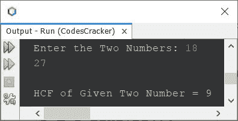
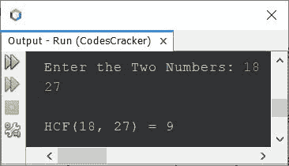
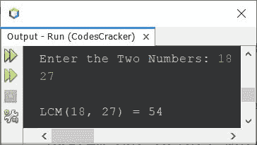
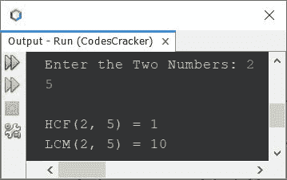

# Java 程序求 HCF 和 LCM 的两个数

> 原文：<https://codescracker.com/java/program/java-program-find-hcf-lcm.htm>

本文涵盖了一些 Java 程序，这些程序在程序运行时查找用户输入的两个数字的 HCF (GCD)和 LCM。

如果你不知道，两个数的 HCF 和 LCF 是如何计算的？
参考， [如何找到 LCM](/nonprog/find-lcm.htm) 和[如何找到 HCF](/nonprog/find-hcf.htm) 。现在让我们继续， 用 Java 创建程序。

**注-** HCF 代表最常见的<u>因子</u>，LCM 代表最不常见的<u>倍数</u>。

## 在 Java 中查找两个数的 HCF 的程序

问题是，*写一个 Java 程序，求并打印两个数的 HCF。用户必须在 运行时收到这两个号码。*下面给出的程序是它的答案:

```
import java.util.Scanner;

public class CodesCracker
{
   public static void main(String[] args)
   {
      int a, b, gcd;
      Scanner s = new Scanner(System.in);

      System.out.print("Enter the Two Numbers: ");
      a = s.nextInt();
      b = s.nextInt();

      gcd = a;

      while(true)
      {
         if((a%gcd==0) && (b%gcd==0))
            break;
         else
            gcd--;
      }

      System.out.println("\nHCF of Given Two Number = " +gcd);
   }
}
```

下面给出的快照显示了上述 Java 程序在查找和打印两个给定数字的 HCF 或 GCD 时的示例运行，用户输入 **18** 和 **27**



也就是说，

*   **18 的因子是** 1，2，3，6， <u>9</u> ，18
*   27 的**因子是** 1，3， <u>9</u> ，27

因为 **9** 是 18 和 27 之间的最高公因数。因此 HCF 是 9。

在上面的程序中，我假设一个数字是两个数字的 **gcd** (HCF)。然后使用了一个循环，总是评估为 是**真**，直到我们得到一个数字，除了这两个数字。

上面的程序也可以这样创建。因为，HCF 处理最高公因数。因此，我们需要初始化较小的数字为 **gcd** 初始。

```
import java.util.Scanner;

public class CodesCracker
{
   public static void main(String[] args)
   {
      int a, b, hcf;
      Scanner s = new Scanner(System.in);

      System.out.print("Enter the Two Numbers: ");
      a = s.nextInt();
      b = s.nextInt();

      if(a<b)
         hcf = a;
      else
         hcf = b;

      while(true)
      {
         if((a%hcf==0) && (b%hcf==0))
            break;
         else
            hcf--;
      }

      System.out.println("\nHCF(" +a+ ", " +b+ ") = " +hcf);
   }
}
```

下面是它的示例运行，用户输入与前一个程序的示例运行相同:



### 用 for 循环求两个数的 HCF

以上程序可以用**代替**而**循环的方式创建。这个程序还使用了条件 运算符来缩短程序。**

```
import java.util.Scanner;

public class CodesCracker
{
   public static void main(String[] args)
   {
      int hcf, a, b;
      Scanner s = new Scanner(System.in);

      System.out.print("Enter the Two Numbers: ");
      a = s.nextInt();
      b = s.nextInt();

      for(hcf=(a<b)?a:b; true; hcf--)
      {
         if((a%hcf==0) && (b%hcf==0))
            break;
      }

      System.out.println("\nHCF(" +a+ ", " +b+ ") = " +hcf);
   }
}
```

您将获得与上一个程序相同的输出。

## 在 Java 中查找两个数的 LCM 的程序

LCM 处理多重，最不常见的多重。这个程序查找并打印用户输入的两个给定数字的 LCM。

```
import java.util.Scanner;

public class CodesCracker
{
   public static void main(String[] args)
   {
      int a, b, hcf, lcm;
      Scanner s = new Scanner(System.in);

      System.out.print("Enter the Two Numbers: ");
      a = s.nextInt();
      b = s.nextInt();

      if(a>b)
         lcm = a;
      else
         lcm = b;

      while(true)
      {
         if((lcm%a==0) && (lcm%b==0))
            break;
         else
            lcm++;
      }

      System.out.println("\nLCM(" +a+ ", " +b+ ") = " +lcm);
   }
}
```

下面是它的运行示例，用户输入与前面的程序相同:



也就是说，

*   **18 的倍数是** 18，36， <u>54</u> ，...
*   **27 的倍数是** 27、 <u>54</u> ，...

因为 54 是 18 和 27 的最小公倍数。因此 LCM 为 54。

## 在 Java 中求两个数的 HCF 和 LCM

这个程序基本上是组合版本，因为它打印任意两个给定数字的 LCM 和 HCF (GCD)。

```
import java.util.Scanner;

public class CodesCracker
{
   public static void main(String[] args)
   {
      int x;
      Scanner s = new Scanner(System.in);

      System.out.print("Enter the Two Numbers: ");
      int a = s.nextInt();
      int b = s.nextInt();

      int numOne = a;
      int numTwo = b;

      while(b!=0)
      {
         x = b;
         b = a%b;
         a = x;
      }

      int hcf = a;
      int lcm = (numOne*numTwo)/hcf;

      System.out.println("\nHCF(" +numOne+ ", " +numTwo+ ") = " +hcf);
      System.out.println("LCM(" +numOne+ ", " +numTwo+ ") = " +lcm);
   }
}
```

用户输入 **2** 和 **5** 的样本运行显示在下面给出的快照中:



#### 其他语言的相同程序

*   [C 查找 HCF LCM](/c/program/c-program-find-hcf-lcm.htm)
*   [C++查找 HCF LCM](/cpp/program/cpp-program-find-hcf-lcm.htm)
*   [Python 查找 HCF LCM](/python/program/python-program-find-hcf-lcm.htm)

[Java 在线测试](/exam/showtest.php?subid=1)

* * *

* * *