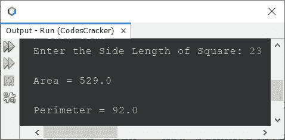

# 计算正方形面积和周长的 Java 程序

> 原文：<https://codescracker.com/java/program/java-program-calculate-area-perimeter.htm>

本文介绍了一个 Java 程序，它根据用户在程序运行时输入的边长来计算正方形的面积和周长。

**注-** 正方形的面积用公式 **s*s** 或**s<sup>2</sup>T7】计算。其中 **s** 为 边长。**

**注-** 正方形的周长用公式 **4*s** 计算。

## 在 Java 中求正方形的面积

问题是，*用 Java 写一个程序，求并打印一个正方形的面积。*以下节目是它的回答:

```
import java.util.Scanner;

public class CodesCracker
{
   public static void main(String[] args)
   {
      float side, area;
      Scanner s = new Scanner(System.in);

      System.out.print("Enter the Side Length of Square: ");
      side = s.nextFloat();

      area = 4*side;
      System.out.println("\nArea = " +area);
   }
}
```

下面给出的快照显示了上述 Java 程序的示例运行，用户输入 **10** 作为一个正方形的边长，我们希望使用该程序查看该正方形的 区域:


## 在 Java 中寻找正方形的周长

问题是，*用 Java 写一个程序，求并打印一个正方形的周长。*下面给出的程序是它的答案:

```
import java.util.Scanner;

public class CodesCracker
{
   public static void main(String[] args)
   {
      float s, perimeter;
      Scanner scan = new Scanner(System.in);

      System.out.print("Enter the Side Length of Square: ");
      s = scan.nextFloat();

      perimeter = 4*s;
      System.out.println("\nPerimeter = " +perimeter);
   }
}
```

使用与前一个程序相同的用户输入，即 **10** ，上述程序的示例运行如下:


## 用 Java 单程序计算正方形的面积和周长

在结合了上面给出的两个程序之后，创建了这个程序，它计算并打印一个正方形的面积和周长值，这个正方形的边长是由用户在运行时输入的。

```
import java.util.Scanner;

public class CodesCracker
{
   public static void main(String[] args)
   {
      Scanner scan = new Scanner(System.in);

      System.out.print("Enter the Side Length of Square: ");
      float s = scan.nextFloat();

      float a = s*s;
      float p = 4*s;
      System.out.println("\nArea = " +a);
      System.out.println("\nPerimeter = " +p);
   }
}
```

用户输入 **23** 作为正方形边长的上述程序的示例运行如以下快照所示:



**注-**Java 中[矩形程序的面积和周长](/java/program/java-program-area-perimeter-rectangle.htm)、 参见其单独的文章。

#### 其他语言的相同程序

*   [计算 C 中正方形的面积&周长](/c/program/c-program-calculate-area-perimeter.htm)
*   [用 C++计算面积&周长](/cpp/program/cpp-program-calculate-area-perimeter.htm)
*   [用 Python 计算正方形的面积](/python/program/python-program-calculate-area-of-square.htm)
*   [用 Python 计算正方形的周长](/python/program/python-program-calculate-perimeter-of-square.htm)

[Java 在线测试](/exam/showtest.php?subid=1)

* * *

* * *