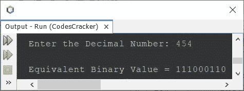

# Java 程序：将十进制转换为二进制

> 原文：<https://codescracker.com/java/program/java-program-convert-decimal-to-binary.htm>

这篇文章涵盖了多个 Java 程序对十进制数到二进制数的转换。以下是本文涵盖的程序列表:

*   用数组实现 Java 中十进制到二进制的转换
*   Java 中十进制到二进制的转换，完全使用 **while** 循环
*   Java 中十进制到二进制的转换，完全使用**进行**循环
*   Java 中不使用数组的十进制到二进制转换

**注-** 如果你不知道十进制到二进制的转换是如何发生的，那么参考 [十进制到二进制的转换](/computer-fundamental/decimal-to-binary.htm)。

## 使用数组将 Java 中的十进制转换为二进制

问题是，*写一个 Java 程序把十进制数转换成二进制数。用户必须在程序运行时在 收到十进制数。*下面给出的程序是这个问题的答案:

```
import java.util.Scanner;

public class CodesCracker
{
   public static void main(String[] args)
   {
      int decimal, i=0;
      int[] binary = new int[20];

      Scanner scan = new Scanner(System.in);

      System.out.print("Enter the Decimal Number: ");
      decimal = scan.nextInt();

      while(decimal != 0)
      {
         binary[i] = decimal%2;
         i++;
         decimal = decimal/2;
      }

      System.out.print("\nEquivalent Binary Value = ");
      for(i=(i-1); i>=0; i--)
         System.out.print(binary[i]);
   }
}
```

下面给出的快照显示了上述程序的示例运行，用户输入 **454** 作为要转换的十进制数， 打印其等效的二进制值:



## Java 中的十进制到二进制——完全使用 while 循环

因为之前的程序使用了**而**和**用于**循环。因此，让我们修改程序，只使用**而** 循环，做同样的工作，将十进制数转换成二进制数，其他的改动也很少。

```
import java.util.Scanner;

public class CodesCracker
{
   public static void main(String[] args)
   {
      Scanner scan = new Scanner(System.in);

      System.out.print("Enter the Decimal Number: ");
      int decimal = scan.nextInt();

      int i=0;
      int[] binary = new int[20];
      while(decimal != 0)
      {
         binary[i] = decimal%2;
         i++;
         decimal /= 2;
      }

      System.out.print("\nEquivalent Binary Value = ");
      i = (i-1);
      while(i>=0)
      {
         System.out.print(binary[i]);
         i--;
      }
   }
}
```

您将获得与上一个程序相同的输出。

## Java 中的十进制到二进制——完全使用 for 循环

这个程序类似于以前的程序。唯一不同的是，循环。也就是说，这个程序用**代替**循环，用 代替**，同时用**做与前一个程序相同的工作。

```
import java.util.Scanner;

public class CodesCracker
{
   public static void main(String[] args)
   {
      Scanner scan = new Scanner(System.in);

      System.out.print("Enter the Decimal Number: ");
      int decimal = scan.nextInt();

      int i;
      int[] binary = new int[20];
      for(i=0; decimal!=0; decimal/=2)
         binary[i++] = decimal%2;

      System.out.print("\nEquivalent Binary Value = ");
      for(i=(i-1); i>=0; i--)
         System.out.print(binary[i]);
   }
}
```

在上面的程序中，语句:

```
binary[i++] = decimal%2;
```

与相同:

```
binary[i] = decimal%2;
i++;
```

即变量 **i** 后的 **++** ，使用 **i** 的当前值，然后递增 1。

## Java 中不使用数组的十进制到二进制转换

这是本文的最后一个程序，创建用来将十进制数转换为二进制数，不使用数组。

```
import java.util.Scanner;

public class CodesCracker
{
   public static void main(String[] args)
   {
      int decimal, binary=0, m=1, rem;
      Scanner scan = new Scanner(System.in);

      System.out.print("Enter the Decimal Number: ");
      decimal = scan.nextInt();

      while(decimal>0)
      {
         rem = decimal%2;
         binary = binary + (rem*m);
         m *= 10;
         decimal /= 2;
      }

      System.out.print("\nEquivalent Binary Value = " +binary);
   }
}
```

#### 其他语言的相同程序

*   [C 十进制到二进制的转换](/c/program/c-program-convert-decimal-to-binary.htm)
*   [C++ 十进制到二进制的转换](/cpp/program/cpp-program-convert-decimal-to-binary.htm)
*   [Python 十进制到二进制的转换](/python/program/python-program-convert-decimal-to-binary.htm)

[Java 在线测试](/exam/showtest.php?subid=1)

* * *

* * *