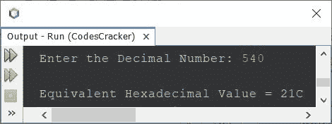

# 将十进制转换为十六进制的 Java 程序

> 原文：<https://codescracker.com/java/program/java-program-convert-decimal-to-hexadecimal.htm>

这篇文章讲述了一个 Java 程序，它将用户在程序运行时输入的十进制数转换成相应的十六进制值。

如果你不知道十进制到十六进制的转换是如何发生的，那么参考[十进制到十六进制的转换](/computer-fundamental/decimal-to-hexadecimal.htm)。

## Java 中十进制到十六进制的转换

问题是，*写一个 Java 程序把十进制转换成十六进制。用户 必须在运行时收到十进制数。*下面给出的程序是它的答案:

```
import java.util.Scanner;

public class CodesCracker
{
   public static void main(String[] args)
   { 
      int decimal, rem, i=0;
      char[] hexadecimal = new char[20];

      Scanner scan = new Scanner(System.in);

      System.out.print("Enter the Decimal Number: ");
      decimal = scan.nextInt();

      while(decimal!=0)
      {
         rem = decimal%16;
         if(rem<10)
            rem = rem+48;
         else
            rem = rem+55;
         hexadecimal[i] = (char)rem;
         i++;
         decimal = decimal/16;
      }

      System.out.print("\nEquivalent Hexadecimal Value = ");
      for(i=(i-1); i>=0; i--)
         System.out.print(hexadecimal[i]);
   }
}
```

下面给出的快照显示了上述程序的示例运行，用户输入的 **540** 作为要转换的十进制数， 打印其等效的十六进制值:



上面的程序也可以这样创建:

```
import java.util.Scanner;

public class CodesCracker
{
   public static void main(String[] args)
   { 
      int decimal, rem;
      String hexadecimal="";
      char[] hexDigit = {'0','1','2','3','4','5','6','7','8','9','A','B','C','D','E','F'};

      Scanner scan = new Scanner(System.in);

      System.out.print("Enter the Decimal Number: ");
      decimal = scan.nextInt();

      while(decimal>0)
      {
         rem = decimal%16;
         hexadecimal = hexDigit[rem] + hexadecimal;
         decimal = decimal/16;
      }

      System.out.print("\nEquivalent Hexadecimal Value = " +hexadecimal);
   }
}
```

这个程序产生与前一个程序相同的输出。

#### 其他语言的相同程序

*   [C 十进制到十六进制转换](/c/program/c-program-convert-decimal-to-hexadecimal.htm)
*   [C++十进制到十六进制的转换](/cpp/program/cpp-program-convert-decimal-to-hexadecimal.htm)
*   [Python 十进制到十六进制的转换](/python/program/python-program-convert-decimal-to-hexadecimal.htm)

[Java 在线测试](/exam/showtest.php?subid=1)

* * *

* * *