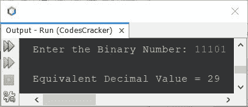

# 将二进制转换成十进制的 Java 程序

> 原文：<https://codescracker.com/java/program/java-program-convert-binary-to-decimal.htm>

本文介绍了一个用 Java 编写的将二进制数转换成十进制数的程序。即用户在程序运行时输入的二进制数，被转换成等价的十进制值。

**注-** 如果你不知道二进制到十进制的转换是如何发生的，那么参考 [二进制到十进制的转换](/computer-fundamental/binary-to-decimal.htm)。现在让我们移动并创建程序。

## 使用 while 循环将 Java 中的二进制转换为十进制

问题是，*写一个 Java 程序，把二进制转换成十进制。用户必须在运行时收到二进制数。* 下面给出的程序是它的答案:

```
import java.util.Scanner;

public class CodesCracker
{
   public static void main(String[] args)
   {
      int binnum, decnum=0, i=1, rem;
      Scanner scan = new Scanner(System.in);

      System.out.print("Enter the Binary Number: ");
      binnum = scan.nextInt();

      while(binnum!=0)
      {
         rem = binnum%10;
         decnum = decnum + (rem*i);
         i = i*2;
         binnum = binnum/10;
      }

      System.out.println("\nEquivalent Decimal Value = " +decnum);
   }
}
```

下面给出的快照显示了上述 Java 程序的示例运行，将二进制数转换为十进制数，用户输入 **11101** :



## 使用 for 循环在 Java 中将二进制转换为十进制

这和之前的程序是一样的，但是使用**来创建**循环，而不是在时使用**。**

```
import java.util.Scanner;

public class CodesCracker
{
   public static void main(String[] args)
   {
      int binnum, decnum=0, i=1, rem;
      Scanner scan = new Scanner(System.in);

      System.out.print("Enter the Binary Number: ");
      binnum = scan.nextInt();

      for(i=1; binnum!=0; binnum /= 10)
      {
         rem = binnum%10;
         decnum = decnum + (rem*i);
         i *= 2;
      }

      System.out.println("\nEquivalent Decimal Value = " +decnum);
   }
}
```

您将获得与上一个程序相同的输出。要增加限制，可以用 **long** 代替 **int** data type。 **int** 的范围是**2147483647**，而 **long** 的范围是**9223372036854775807**。

#### 其他语言的相同程序

*   [C 二进制到十进制的转换](/c/program/c-program-convert-binary-to-decimal.htm)
*   [C++二进制到十进制的转换](/cpp/program/cpp-program-convert-binary-to-decimal.htm)
*   [Python 二进制到十进制的转换](/python/program/python-program-convert-binary-to-decimal.htm)

[Java 在线测试](/exam/showtest.php?subid=1)

* * *

* * *