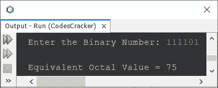

# Java 程序：将二进制转换为八进制

> 原文：<https://codescracker.com/java/program/java-program-convert-binary-to-octal.htm>

本文介绍了一个 Java 程序，它将用户在程序运行时输入的二进制数转换成等价的八进制数。

**注-** 如果你不知道二进制到八进制的转换是如何发生的，那么参考 [二进制到八进制的转换](/computer-fundamental/binary-to-octal.htm)。现在让我们继续这个项目。

## 使用 while 循环将 Java 中的二进制转换为八进制

问题是，*写一个 Java 程序把二进制数转换成八进制数。用户 必须在运行时收到二进制数。*这个问题的答案，是下面给出的程序:

```
import java.util.Scanner;

public class CodesCracker
{
   public static void main(String[] args)
   {
      int binnum, octDigit=0, i=0, m=1, c=1, rem;
      int[] octnum = new int[20];

      Scanner scan = new Scanner(System.in);

      System.out.print("Enter the Binary Number: ");
      binnum = scan.nextInt();

      while(binnum!=0)
      {
         rem = binnum%10;
         octDigit = octDigit + (rem*m);
         if(c%3==0)
         {
            octnum[i] = octDigit;
            m = 1;
            c = 1;
            octDigit = 0;
            i++;
         }
         else
         {
            m = m*2;
            c++;
         }
         binnum = binnum/10;
      }

      if(c!=1)
         octnum[i] = octDigit;

      System.out.print("\nEquivalent Octal Value = ");
      for(i=1; i>=0; i--)
         System.out.print(octnum[i]);
   }
}
```

用户输入 **111101** 作为二进制数来转换并打印其等价的八进制 值，上面程序的示例运行如下面给出的快照所示:



## 使用 for 循环将 Java 中的二进制转换为八进制

现在让我创建一个相同的程序，用**代替**循环，而不是用**代替**。为了使这个程序尽可能地与以前的程序相似， ，那么替换下面的代码:

```
while(binnum!=0)
```

使用下面给出的代码:

```
for( ; binnum!=0 ; )
```

就是这样。但这不是一个好的做法。我建议您对所有三个语句都使用 **for** 循环。这是 程序，也有一些其他的修改。

```
import java.util.Scanner;

public class CodesCracker
{
   public static void main(String[] args)
   {
      int octDigit, i=0, m=1, c=1;
      int[] octnum = new int[20];

      Scanner scan = new Scanner(System.in);

      System.out.print("Enter the Binary Number: ");
      int binnum = scan.nextInt();

      for(octDigit=0; binnum!=0; binnum /= 10)
      {
         octDigit = octDigit + ((binnum%10)*m);
         if(c%3==0)
         {
            octnum[i] = octDigit;
            m = 1;
            c = 1;
            octDigit = 0;
            i++;
         }
         else
         {
            m *= 2;
            c++;
         }
      }

      if(c!=1)
         octnum[i] = octDigit;

      System.out.print("\nEquivalent Octal Value = ");
      for(i=1; i>=0; i--)
         System.out.print(octnum[i]);
   }
}
```

#### 其他语言的相同程序

*   [C 二进制到八进制的转换](/c/program/c-program-convert-binary-to-octal.htm)
*   [C++二进制到八进制的转换](/cpp/program/cpp-program-convert-binary-to-octal.htm)
*   [Python 二进制到八进制的转换](/python/program/python-program-convert-binary-to-octal.htm)

[Java 在线测试](/exam/showtest.php?subid=1)

* * *

* * *