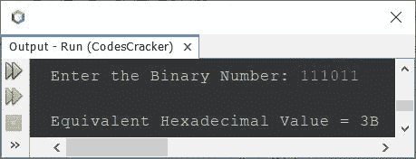

# Java 程序：将二进制转换为十六进制

> 原文：<https://codescracker.com/java/program/java-program-convert-binary-to-hexadecimal.htm>

本文介绍了一个 Java 程序，该程序将用户在程序运行时输入的二进制数转换为等效的十六进制数。

**注-** 如果你不知道二进制到十六进制的转换是如何发生的，那么参考 [二进制到十六进制的转换](/computer-fundamental/binary-to-hexadecimal.htm)。现在让我们继续创建程序。

## 使用 while 循环将 Java 中的二进制转换为十六进制

问题是，*写一个 Java 程序，把给定的二进制数转换成等价的十六进制值。用户必须在运行时收到二进制数 。*下面给出的程序是它的答案:

```
import java.util.Scanner;

public class CodesCracker
{
   public static void main(String[] args)
   {
      int binnum, hexDigit=0, m=1, c=1, rem, i=0;
      char[] hexnum = new char[20];

      Scanner scan = new Scanner(System.in);

      System.out.print("Enter the Binary Number: ");
      binnum = scan.nextInt();

      while(binnum!=0)
      {
         rem = binnum%10;
         hexDigit = hexDigit + (rem*m);
         if(c%4==0)
         {
            if(hexDigit<10)
               hexnum[i] = (char)(hexDigit+48);
            else
               hexnum[i] = (char)(hexDigit+55);
            m = 1;
            c = 1;
            hexDigit = 0;
            i++;
         }
         else
         {
            m = m*2;
            c++;
         }
         binnum = binnum/10;
      }

      if(c!=1)
         hexnum[i] = (char)(hexDigit+48);
      if(c==1)
         i--;

      System.out.print("\nEquivalent Hexadecimal Value = ");
      for(i=1; i>=0; i--)
         System.out.print(hexnum[i]);
   }
}
```

下面给出的快照显示了上述程序的示例运行，将用户输入 **111011** 作为二进制数来转换 ，并打印其等效的十六进制值:



在上述程序的语句中:

```
hexnum[i] = (char)(hexDigit+48);
```

**(char)** 用于对 **(hexDigit+48)** 进行类型转换，以避免在将 **int** 类型变量的值初始化为 **char** 类型变量时发生 *loosy 转换*。

## 使用 for 循环将 Java 中的二进制转换为十六进制

这个程序做的工作和前一个程序一样。唯一的区别是它的方法。该程序用**代替**循环，用 代替**而用**。

```
import java.util.Scanner;

public class CodesCracker
{
   public static void main(String[] args)
   {
      int hexDigit, m=1, c=1, i=0;
      char[] hexnum = new char[20];

      Scanner scan = new Scanner(System.in);

      System.out.print("Enter the Binary Number: ");
      int binnum = scan.nextInt();

      for(hexDigit=0; binnum!=0; binnum /= 10)
      {
         hexDigit = hexDigit + ((binnum%10)*m);
         if(c%4==0)
         {
            if(hexDigit<10)
               hexnum[i] = (char)(hexDigit+48);
            else
               hexnum[i] = (char)(hexDigit+55);
            m = 1;
            c = 1;
            hexDigit = 0;
            i++;
         }
         else
         {
            m = m*2;
            c++;
         }
      }

      if(c!=1)
         hexnum[i] = (char)(hexDigit+48);
      if(c==1)
         i--;

      System.out.print("\nEquivalent Hexadecimal Value = ");
      for(i=1; i>=0; i--)
         System.out.print(hexnum[i]);
   }
}
```

#### 其他语言的相同程序

*   [C 二进制到十六进制的转换](/c/program/c-program-convert-binary-to-hexadecimal.htm)
*   [C++二进制到十六进制的转换](/cpp/program/cpp-program-convert-binary-to-hexadecimal.htm)
*   [Python 二进制到十六进制的转换](/python/program/python-program-convert-binary-to-hexadecimal.htm)

[Java 在线测试](/exam/showtest.php?subid=1)

* * *

* * *