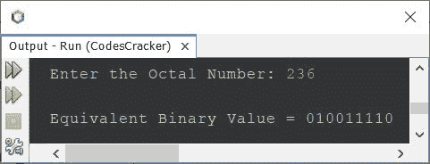

# Java 程序：将八进制转换为二进制

> 原文：<https://codescracker.com/java/program/java-program-convert-octal-to-binary.htm>

本文介绍了一个 Java 程序，它将用户在程序运行时输入的八进制数转换成等价的二进制值。

如果你不知道八进制到二进制的转换是如何发生的，那么参考[八进制到二进制](/computer-fundamental/octal-to-binary.htm)。现在让我们创建程序。

## Java 中的八进制到二进制

问题是，*写一个 Java 程序把八进制数转换成二进制数。用户 必须在运行时接收八进制值。*这个问题的答案，是下面给出的程序:

```
import java.util.Scanner;

public class CodesCracker
{
   public static void main(String[] args)
   {
      int i;
      String binary="";

      Scanner s = new Scanner(System.in);

      System.out.print("Enter the Octal Number: ");
      String octal = s.nextLine();

      for(i=0; i<octal.length(); i++)
      {
         char ch = octal.charAt(i);
         switch(ch)
         {
            case '0': binary = binary + "000";
               break;
            case '1': binary = binary + "001";
               break;
            case '2': binary = binary + "010";
               break;
            case '3': binary = binary + "011";
               break;
            case '4': binary = binary + "100";
               break;
            case '5': binary = binary + "101";
               break;
            case '6': binary = binary + "110";
               break;
            case '7': binary = binary + "111";
               break;
            default: System.out.println("\nInvalid Octal Digit!");
               return;
         }
      }

      System.out.println("\nEquivalent Binary Value = " +binary);
   }
}
```

使用用户输入的 **236** 作为八进制数来转换和打印其等价的二进制值 的上述程序的示例运行如下面给出的快照所示:



这是这个程序的另一个版本，做的工作和之前的程序一样。但是在内部，代码是不同的:

```
import java.util.Scanner;

public class CodesCracker
{
   public static void main(String[] args)
   {
      int octal, rev=0, rem;
      String binary="";

      Scanner s = new Scanner(System.in);

      System.out.print("Enter the Octal Number: ");
      octal = s.nextInt();

      while(octal!=0)
      {
         rem = octal%10;
         rev = (rev*10) + rem;
         octal = octal/10;
      }

      octal = rev;

      while(octal!=0)
      {
         rem = octal%10;
         switch(rem)
         {
            case 0:
               binary = binary + "000";
               break;
            case 1:
               binary = binary + "001";
               break;
            case 2:
               binary = binary + "010";
               break;
            case 3:
               binary = binary + "011";
               break;
            case 4:
               binary = binary + "100";
               break;
            case 5:
               binary = binary + "101";
               break;
            case 6:
               binary = binary + "110";
               break;
            case 7:
               binary = binary + "111";
               break;
            default:
               System.out.println("\nInvalid Octal Digit!");
               return;
         }
         octal = octal/10;
      }

      System.out.println("\nEquivalent Binary Value = " +binary);
   }
}
```

#### 其他语言的相同程序

*   [C 八进制到二进制的转换](/c/program/c-program-convert-octal-to-binary.htm)
*   [C++ 八进制到二进制的转换](/cpp/program/cpp-program-convert-octal-to-binary.htm)
*   [Python 八进制到二进制的转换](/python/program/python-program-convert-octal-to-binary.htm)

[Java 在线测试](/exam/showtest.php?subid=1)

* * *

* * *