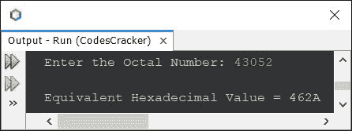

# Java 程序：将八进制转换为十六进制

> 原文：<https://codescracker.com/java/program/java-program-convert-octal-to-hexadecimal.htm>

本文介绍了一个用 Java 编写的程序，该程序将八进制数转换成等价的十六进制数。程序创建时使用和不使用内置函数。

## 使用 Java 中的函数将八进制转换为十六进制

问题是，*写一个 Java 程序，用内置函数把八进制转换成十六进制。*下面 给出的程序就是它的答案。我使用了 Java 的一些内置函数来以快捷的方式完成这项工作。

```
import java.util.Scanner;

public class CodesCracker
{
   public static void main(String[] args)
   {
      String octnum, hexnum;
      int decnum;
      Scanner scan = new Scanner(System.in);

      System.out.print("Enter the Octal Number: ");
      octnum = scan.nextLine();

      decnum = Integer.parseInt(octnum, 8);
      hexnum = Integer.toHexString(decnum).toUpperCase();

      System.out.println("\nEquivalent Hexadecimal Value = " +hexnum);
   }
}
```

下面给出的快照显示了上述程序的示例运行，将用户输入的 **43052** 作为八进制数来转换 并打印其等效的十六进制值:



在上面的程序中，使用下面的语句:

```
decnum = Integer.parseInt(octnum, 8);
```

存储在 **octnum** 中的八进制值被转换成等价的十进制值，然后被初始化为 **decnum** 。而 使用的说法是:

```
hexnum = Integer.toHexString(decnum).toUpperCase();
```

使用 **toUpperCase()** 将存储在 **decnum** 中的十进制值转换为等效的十六进制值，并将十六进制字符 大写(如果可用)，并初始化为 **hexnum** 。最后使用最后一条语句， 在输出屏幕上打印出给定八进制数的等价十六进制值。就是这样。

可以参考 Java 中的 中的[八进制转十进制和 Java 中的](/java/program/java-program-convert-octal-to-decimal.htm)[十进制转十六进制](/java/program/java-program-convert-decimal-to-hexadecimal.htm)到 结合实现手工或用户自定义代码将八进制转换为十六进制。自己试试。如果出现任何错误 或出错，那么考虑下面给出的程序。

## 不使用 Java 中的函数将八进制转换为十六进制

这个程序是使用基于用户的代码创建的。在这个程序中，我将输入的八进制值转换成十进制，然后十进制值转换成十六进制。

```
import java.util.Scanner;

public class CodesCracker
{
   public static void main(String[] args)
   {
      int octal, decimal=0, i=0, rem;
      char[] hexadecimal = new char[20];
      Scanner s = new Scanner(System.in);

      System.out.print("Enter the Octal Number: ");
      octal = s.nextInt();

      // converting octal to decimal
      while(octal!=0)
      {
         rem = octal%10;
         decimal = (int) (decimal + (rem*Math.pow(8, i)));
         i++;
         octal = octal/10;
      }

      // converting decimal to hexadecimal
      while(decimal!=0)
      {
         rem = decimal%16;
         if(rem<10)
            rem = rem+48;
         else
            rem = rem+55;
         hexadecimal[i] = (char)rem;
         i++;
         decimal = decimal/16;
      }

      // printing the equivalent hexadecimal value
      System.out.print("\nEquivalent Hexadecimal Value = ");
      for(i=(i-1); i>=0; i--)
         System.out.print(hexadecimal[i]);
   }
}
```

因为这个程序和前面的程序做同样的工作，所以你当然会得到同样的输出。

#### 其他语言的相同程序

*   [C 八进制到十六进制的转换](/c/program/c-program-convert-octal-to-hexadecimal.htm)
*   [C++ 八进制到十六进制的转换](/cpp/program/cpp-program-convert-octal-to-hexadecimal.htm)
*   [Python 八进制到十六进制的转换](/python/program/python-program-convert-octal-to-hexadecimal.htm)

[Java 在线测试](/exam/showtest.php?subid=1)

* * *

* * *