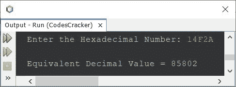

# Java 程序：将十六进制转换成十进制

> 原文：<https://codescracker.com/java/program/java-program-convert-hexadecimal-to-decimal.htm>

本文介绍了一个 Java 程序，它将用户在程序运行时输入的十六进制数转换成等价的十进制数。

如果你不知道十六进制到十进制的转换是如何发生的，那么参考[十六进制到十进制的转换](/computer-fundamental/hexadecimal-to-decimal.htm)。现在让我们继续，并创建 的转换程序。

## Java 中十六进制到十进制的转换

问题是，*写一个 Java 程序把十六进制数转换成十进制数。*下面给出的程序是它的答案:

```
import java.util.Scanner;
import java.lang.Math;

public class CodesCracker
{
   public static void main(String[] args)
   {
      int decimal=0, i=0, len, rem;
      String hexadecimal;

      Scanner s = new Scanner(System.in);

      System.out.print("Enter the Hexadecimal Number: ");
      hexadecimal = s.nextLine();

      len = hexadecimal.length();

      len--;
      while(len>=0)
      {
         rem = hexadecimal.charAt(len);
         if(rem>=48 && rem<=57)
            rem = rem-48;
         else if(rem>=65 && rem<=70)
            rem = rem-55;
         else if(rem>=97 && rem<=102)
            rem = rem-87;
         else
         {
            System.out.println("\nInvalid Hexadecimal Digit!");
            return;
         }
         decimal = (int) (decimal + (rem*Math.pow(16, i)));
         i++;
         len--;
      }

      System.out.println("\nEquivalent Decimal Value = " +decimal);
   }
}
```

使用用户输入 **14F2A** 作为十六进制数来转换并打印其等效十进制值的示例运行，在下面给出的快照中显示为 :



**A-Z** 的 ASCII 值为 **65-90** ，而 **a-z** 的 ASCII 值为 **97-122** 。

即**‘A’**的 ASCII 值为 **65** ，**‘B’**为 **66** ，以此类推。因此，从上面的程序中， 下面的代码块:

```
if(rem>=48 && rem<=57)
   rem = rem-48;
else if(rem>=65 && rem<=70)
   rem = rem-55;
else if(rem>=97 && rem<=102)
   rem = rem-87;
```

也可以替换为或写成下面给出的代码块:

```
if(rem>='0' && rem<='9')
   rem = rem-48;
else if(rem>='A' && rem<='F')
   rem = rem-55;
else if(rem>='a' && rem<='f')
rem = rem-87;
```

并且如果你不想使用 **Math.pow()** 方法，那么替换下面的语句:

```
decimal = (int) (decimal + (rem*Math.pow(16, i)));
```

下面给出了代码块:

```
int m=1;
for(int k=1; k<=i; k++)
   m *= 16;
decimal = (int) (decimal + (rem*m));
```

#### 其他语言的相同程序

*   [C 十六进制到十进制](/c/program/c-program-convert-hexadecimal-to-decimal.htm)
*   [C++十六进制到十进制](/cpp/program/cpp-program-convert-hexadecimal-to-decimal.htm)
*   [Python 十六进制转十进制](/python/program/python-program-convert-hexadecimal-to-decimal.htm)

[Java 在线测试](/exam/showtest.php?subid=1)

* * *

* * *