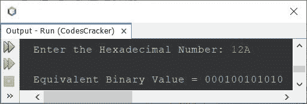

# Java 程序：将十六进制转换为二进制

> 原文：<https://codescracker.com/java/program/java-program-convert-hexadecimal-to-binary.htm>

本文介绍了一个 Java 程序，它可以将用户在程序运行时输入的任何十六进制数转换成等价的二进制值。

如果你不知道十六进制到二进制的转换是如何发生的，那么参考[十六进制到二进制的转换](/computer-fundamental/hexadecimal-to-binary.htm)。现在让我们继续这个项目。

## Java 中十六进制到二进制的转换

问题是，*写一个 Java 程序把十六进制数转换成二进制数。用户必须在运行时收到十六进制数 。*下面给出的程序是它的答案:

```
import java.util.Scanner;

public class CodesCracker
{
   public static void main(String[] args)
   { 
      int i=0, len;
      String hexadecimal;

      Scanner s = new Scanner(System.in);

      System.out.print("Enter the Hexadecimal Number: ");
      hexadecimal = s.nextLine();

      len = hexadecimal.length();
      char[] hexDigit = hexadecimal.toCharArray();

      System.out.print("\nEquivalent Binary Value = ");
      while(i<len)
      {
         switch(hexDigit[i])
         {
            case '0':
               System.out.print("0000");
               break;
            case '1':
               System.out.print("0001");
               break;
            case '2':
               System.out.print("0010");
               break;
            case '3':
               System.out.print("0011");
               break;
            case '4':
               System.out.print("0100");
               break;
            case '5':
               System.out.print("0101");
               break;
            case '6':
               System.out.print("0110");
               break;
            case '7':
               System.out.print("0111");
               break;
            case '8':
               System.out.print("1000");
               break;
            case '9':
               System.out.print("1001");
               break;
            case 'a':
            case 'A':
               System.out.print("1010");
               break;
            case 'b':
            case 'B':
               System.out.print("1011");
               break;
            case 'c':
            case 'C':
               System.out.print("1100");
               break;
            case 'd':
            case 'D':
               System.out.print("1101");
               break;
            case 'e':
            case 'E':
               System.out.print("1110");
               break;
            case 'f':
            case 'F':
               System.out.print("1111");
               break;
            default:
               System.out.println("\nInvalid Hexadecimal Digit!");
               return;
         }
         i++;
      }
   }
}
```

用户输入 **12A** 作为十六进制数来转换和打印其等效的二进制 值，上面程序的示例运行如下面给出的快照所示:



**注意-****toCharArray()**方法将字符串转换成字符数组。和上面的 程序中使用的 **length()** 方法一样，使用`hexadecimal.length()`查找存储在**十六进制**变量中的字符串长度。

因为在前面的程序中，我已经直接检查了十六进制数字，并一个接一个地打印了等价的二进制值。因此，让我们修改一下上面的程序，先把二进制值存储在一个变量中比如说 **binary** ，然后用单个 **System.out.print()** 或 **System.out.println()** 语句打印 等价的二进制值。

```
import java.util.Scanner;

public class CodesCracker
{
   public static void main(String[] args)
   {
      int i=0, len;
      String hexadecimal, binary="";

      Scanner s = new Scanner(System.in);

      System.out.print("Enter the Hexadecimal Number: ");
      hexadecimal = s.nextLine();

      len = hexadecimal.length();
      char[] hexDigit = hexadecimal.toCharArray();

      while(i<len)
      {
         switch(hexDigit[i])
         {
            case '0':
               binary += "0000";
               break;
            case '1':
               binary += "0001";
               break;
            case '2':
               binary += "0010";
               break;
            case '3':
               binary += "0011";
               break;
            case '4':
               binary += "0100";
               break;
            case '5':
               binary += "0101";
               break;
            case '6':
               binary += "0110";
               break;
            case '7':
               binary += "0111";
               break;
            case '8':
               binary += "1000";
               break;
            case '9':
               binary += "1001";
               break;
            case 'a':
            case 'A':
               binary += "1010";
               break;
            case 'b':
            case 'B':
               binary += "1011";
               break;
            case 'c':
            case 'C':
               binary += "1100";
               break;
            case 'd':
            case 'D':
               binary += "1101";
               break;
            case 'e':
            case 'E':
               binary += "1110";
               break;
            case 'f':
            case 'F':
               binary += "1111";
               break;
            default:
               System.out.println("\nInvalid Hexadecimal Digit!");
               return;
         }
         i++;
      }

      System.out.println("\nEquivalent Binary Value = " +binary);
   }
}
```

这个程序产生与前一个程序相同的输出。在上面的程序中，语句:

```
binary += "0000";
```

与相同:

```
binary = binary + "0000";
```

#### 其他语言的相同程序

*   [C 十六进制到二进制](/c/program/c-program-convert-hexadecimal-to-binary.htm)
*   [C++十六进制到二进制](/cpp/program/cpp-program-convert-hexadecimal-to-binary.htm)
*   [Python 十六进制转二进制](/python/program/python-program-convert-hexadecimal-to-binary.htm)

[Java 在线测试](/exam/showtest.php?subid=1)

* * *

* * *