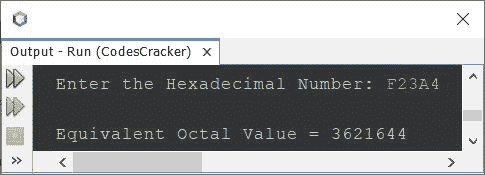

# Java 程序：将十六进制转换为八进制

> 原文：<https://codescracker.com/java/program/java-program-convert-hexadecimal-to-octal.htm>

这篇文章讲述了一个 Java 程序，它将给定的十六进制数转换成八进制数。可以参考[十六进制到八进制](/computer-fundamental/hexadecimal-to-octal.htm)，了解 转换涉及的步骤。

## Java 中十六进制到八进制的转换

问题是，*写一个 Java 程序把十六进制数转换成八进制。该十六进制数必须在程序运行时由 用户接收。*这个问题的答案，是下面给出的程序:

```
import java.util.Scanner;
import java.lang.Math;

public class CodesCracker
{
   public static void main(String[] args)
   {
      int decimal=0, rem, i=0, len;
      String hexadecimal;
      int[] octal = new int[20];

      Scanner s = new Scanner(System.in);

      System.out.print("Enter the Hexadecimal Number: ");
      hexadecimal = s.nextLine();

      len = hexadecimal.length();
      len--;

      while(len>=0)
      {
         rem = hexadecimal.charAt(len);
         if(rem>=48 && rem<=57)
            rem = rem-48;
         else if(rem>=65 && rem<=70)
            rem = rem-55;
         else if(rem>=97 && rem<=102)
            rem = rem-87;
         else
         {
            System.out.println("\nInvalid Hexadecimal Digit!");
            return;
         }
         decimal = (int) (decimal + (rem*Math.pow(16, i)));
         i++;
         len--;
      }

      i=0;
      while(decimal!=0)
      {
         octal[i] = decimal%8;
         i++;
         decimal = decimal/8;
      }

      System.out.print("\nEquivalent Octal Value = ");
      for(i=(i-1); i>=0; i--)
         System.out.print(octal[i]);
   }
}
```

用户输入 **F23A4** 作为十六进制数来转换并打印其等价的八进制 值，上面程序的示例运行如下面给出的快照所示:



上面的程序也可以像下面给出的程序一样创建。这个程序没有使用 **Math.pow()** 方法。我在这个程序中的循环中使用了 而不是循环中的**。此外，该程序直接使用字符进行比较，而不是使用其 ASCII 值的 :**

```
import java.util.Scanner;

public class CodesCracker
{
   public static void main(String[] args)
   {
      int decimal=0, rem, i=0;
      int[] octal = new int[20];

      Scanner s = new Scanner(System.in);

      System.out.print("Enter the Hexadecimal Number: ");
      String hexadecimal = s.nextLine();

      int len = hexadecimal.length();

      for(len=(len-1); len>=0; len--)
      {
         rem = hexadecimal.charAt(len);
         if(rem>='0' && rem<='9')
            rem = rem-48;
         else if(rem>='A' && rem<='F')
            rem = rem-55;
         else if(rem>='a' && rem<='f')
            rem = rem-87;
         else
         {
            System.out.println("\nInvalid Hexadecimal Digit!");
            return;
         }
         int m=1;
         for(int k=1; k<=i; k++)
            m *= 16;
         decimal = (int) (decimal + (rem*m));
         i++;
      }

      for(i=0; decimal!=0; decimal /= 8)
         octal[i++] = decimal%8;

      System.out.print("\nEquivalent Octal Value = ");
      for(i=(i-1); i>=0; i--)
         System.out.print(octal[i]);
   }
}
```

#### 其他语言的相同程序

*   [C 十六进制转八进制](/c/program/c-program-convert-hexadecimal-to-octal.htm)
*   [C++ 十六进制转八进制](/cpp/program/cpp-program-convert-hexadecimal-to-octal.htm)
*   [Python 十六进制转八进制](/python/program/python-program-convert-hexadecimal-to-octal.htm)

[Java 在线测试](/exam/showtest.php?subid=1)

* * *

* * *