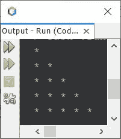
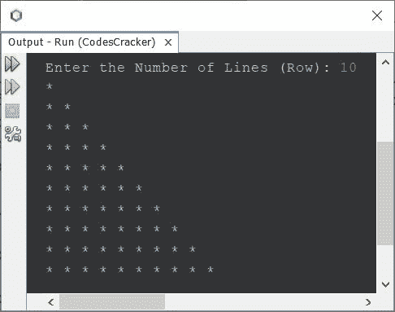
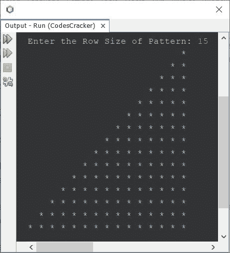
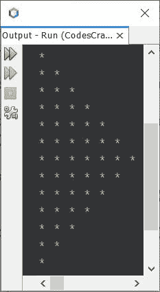
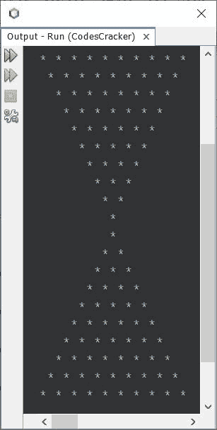

# Java 程序：打印星形图案，星形图案(*)

> 原文：<https://codescracker.com/java/program/java-print-star-pattern.htm>

本文旨在介绍大量在 Java 中使用星号(*)的图案程序。本文涵盖了所有使用 star 的著名图案程序。本文包含了超过 15 个使用 star 的图案程序。

## 用 Java 打印星形图案-1 号图案

问题是，*写一个 Java 程序打印星形图案。*下面给出的程序是它的答案:

```
public class CodesCracker
{
   public static void main(String[] args)
   {
      int i, j;
      for(i=0; i<5; i++)
      {
         for(j=0; j<=i; j++)
         {
            System.out.print("* ");
         }
         System.out.print("\n");
      }
   }
}
```

下面给出的快照显示了上面的 Java 程序在打印星号(*)图案时产生的示例输出:



上述程序的预演如下:

*   直接从执行循环的**开始**
*   也就是说， **i=0** 并且条件 **i < 5** 或 **0 < 5** 评估为**真**
*   因此程序流进入循环内部
*   在循环内部，还有另一个**用于**循环
*   因此开始执行循环的内部**。即 **j=0** ，条件 **j < =i** 或 **0 < =0** 求值为**真****
*   因此程序流进入这个循环
*   并使用语句:
    `System.out.print("* ");`
    打印一个单个的 ***** 后跟一个单个的空白
*   现在使用 **j++** (内部循环的第三条语句)来增加 **j** 的值
*   现在 **j=1** 。并且条件 **j < =i** 或 **1 < =0** 这次评估为**假**
*   因此，这次程序流不会进入内部循环
*   而外部循环的最后一条语句，也就是:
    `System.out.print("\n");`
    被执行。这会在输出屏幕上插入一个新行。以便从下一行开始打印下一个 *****
*   因为外部循环的所有语句都被执行。因此，是时候增加它的变量了，即 **i**
*   因此 **i=1** ，并且条件 **i < 5** 或 **1 < 5** 再次评估为**真**
*   因此，程序流再次进入循环
*   这个过程继续进行，直到条件评估为**假**
*   这样，图案就被打印出来了

上述程序也可以创建为:

```
public class CodesCracker
{
   public static void main(String[] args)
   {
      for(int i=0; i<5; i++)
      {
         for(int j=0; j<=i; j++)
            System.out.print("* ");
         System.out.print("\n");
      }
   }
}
```

您将得到上一个程序的精确输出。由于上面给出的程序，打印的星星图案的行数或列数有限。因此，让我们修改程序并创建一个新程序，允许用户定义星形模式的行大小:

```
import java.util.Scanner;

public class CodesCracker
{
   public static void main(String[] args)
   {
      int row, i, j;
      Scanner s = new Scanner(System.in);

      System.out.print("Enter the Number of Lines (Row): ");
      row = s.nextInt();

      for(i=0; i<row; i++)
      {
         for(j=0; j<=i; j++)
            System.out.print("* ");
         System.out.print("\n");
      }
   }
}
```

用户输入 **10** 作为扩展图形的行数/行数的上述程序的示例运行在下面的 快照中给出:



您可以使用相同的，允许用户定义行/线的大小，以扩大模式，在任何程序在这里给定。

## 用 Java 打印星形图案-2 号图案

```
public class CodesCracker
{
   public static void main(String[] args)
   {
      int row=5, i, j, space, spaceLimit;
      spaceLimit = (row*2) - 2;

      for(i=0; i<row; i++)
      {
         for(space=0; space<spaceLimit; space++)
            System.out.print(" ");
         for(j=0; j<=i; j++)
            System.out.print("* ");
         System.out.print("\n");
         spaceLimit = spaceLimit-2;
      }
   }
}
```

上述程序的输出是:

```
        * 
      * * 
    * * * 
  * * * * 
* * * * * 
```

**注-** 要增加大小，只需将**行**的值从 5 增加到更多，比如 8、10、11 等。

同样上述程序也可以用这种方式创建，以允许用户定义图案的大小:

```
import java.util.Scanner;

public class CodesCracker
{
   public static void main(String[] args)
   {
      int row, i, j, space, spaceLimit;
      Scanner s = new Scanner(System.in);

      System.out.print("Enter the Row Size of Pattern: ");
      row = s.nextInt();

      spaceLimit = (row*2) - 2;
      for(i=0; i<row; i++)
      {
         for(space=0; space<spaceLimit; space++)
            System.out.print(" ");
         for(j=0; j<=i; j++)
            System.out.print("* ");
         System.out.print("\n");
         spaceLimit = spaceLimit-2;
      }
   }
}
```

具有用户输入 **15** 的上述程序的示例运行显示在下面给出的快照中:



您也可以在其他程序中应用同样的方法，在程序运行时打印用户指定尺寸的图案。

## 用 Java 打印星形图案-3 号图案

```
public class CodesCracker
{
   public static void main(String[] args)
   {
      int row=5, i, j;

      for(i=0; i<row; i++)
      {
         for(j=i; j<row; j++)
            System.out.print("* ");
         System.out.print("\n");
      }
   }
}
```

#### 模式 3 程序的输出

```
* * * * * 
* * * * 
* * * 
* * 
* 
```

## 用 Java 打印星形图案-4 号图案

```
public class CodesCracker
{
   public static void main(String[] args)
   {
      int row=5, i, j, space, spaceLimit=0;

      for(i=0; i<row; i++)
      {
         for(space=0; space<spaceLimit; space++)
            System.out.print(" ");
         for(j=i; j<row; j++)
            System.out.print("* ");
         System.out.print("\n");
         spaceLimit = spaceLimit + 2;
      }
   }
}
```

#### 模式 4 程序的输出

```
* * * * * 
  * * * * 
    * * * 
      * * 
        * 
```

## 用 Java 打印星形图案-5 号图案

```
public class CodesCracker
{
   public static void main(String[] args)
   {
      int i, j, row=10;
      for(i=0; i<row; i++)
      {
         for(j=0; j<=i; j++)
         {
            if(i==0 || i==1)
               System.out.print("* ");
            else if(i==(row-1))
               System.out.print("* ");
            else
            {
               if(j==0 || j==i)
                  System.out.print("* ");
               else
                  System.out.print("  ");
            }
         }
         System.out.print("\n");
      }
   }
}
```

#### 5 号花样程序的输出

```
* 
* * 
*   * 
*     * 
*       * 
*         * 
*           * 
*             * 
*               * 
* * * * * * * * * * 
```

## 用 Java 打印星形图案-6 号图案

```
public class CodesCracker
{
   public static void main(String[] args)
   {
      int i, j, row=10, space, spaceLimit;
      spaceLimit = (row*2) - 2;
      for(i=0; i<row; i++)
      {
         for(space=0; space<spaceLimit; space++)
            System.out.print(" ");
         for(j=0; j<=i; j++)
         {
            if(i==0 || i==1)
               System.out.print("* ");
            else if(i==(row-1))
               System.out.print("* ");
            else
            {
               if(j==0 || j==i)
                  System.out.print("* ");
               else
                  System.out.print("  ");
            }
         }
         System.out.print("\n");
         spaceLimit = spaceLimit - 2;
      }
   }
}
```

#### 6 号花样程序的输出

```
                  * 
                * * 
              *   * 
            *     * 
          *       * 
        *         * 
      *           * 
    *             * 
  *               * 
* * * * * * * * * * 
```

## 用 Java 打印星形图案-7 号图案

```
public class CodesCracker
{
   public static void main(String[] args)
   {
      int i, j, row=10;
      for(i=0; i<row; i++)
      {
         for(j=i; j<row; j++)
         {
            if(i==0 || i==(row-1) || i==(row-2))
               System.out.print("* ");
            else
            {
               if(j==i || j==(row-1))
                  System.out.print("* ");
               else
                  System.out.print("  ");
            }
         }
         System.out.print("\n");
      }
   }
}
```

#### 7 号花样程序的输出

```
* * * * * * * * * * 
*               * 
*             * 
*           * 
*         * 
*       * 
*     * 
*   * 
* * 
* 
```

## 用 Java 打印星形图案-8 号图案

```
public class CodesCracker
{
   public static void main(String[] args)
   {
      int i, j, row=10, space, spaceLimit=0;
      for(i=0; i<row; i++)
      {
         for(space=0; space<spaceLimit; space++)
            System.out.print(" ");
         for(j=i; j<row; j++)
         {
            if(i==0 || i==(row-1) || i==(row-2))
               System.out.print("* ");
            else
            {
               if(j==i || j==(row-1))
                  System.out.print("* ");
               else
                  System.out.print("  ");
            }
         }
         System.out.print("\n");
         spaceLimit += 2;
      }
   }
}
```

#### 8 号花样程序的输出

```
* * * * * * * * * * 
  *               * 
    *             * 
      *           * 
        *         * 
          *       * 
            *     * 
              *   * 
                * * 
                  * 
```

## 用 Java 打印星形图案-9 号图案

```
public class CodesCracker
{
   public static void main(String[] args)
   {
      int i, j, row=10, space;

      for(i=0; i<row; i++)
      {
         for(space=i; space<row; space++)
            System.out.print(" ");
         for(j=0; j<=i; j++)
            System.out.print("* ");
         System.out.print("\n");
      }
   }
}
```

#### 9 号花样程序输出

```
          * 
         * * 
        * * * 
       * * * * 
      * * * * * 
     * * * * * * 
    * * * * * * * 
   * * * * * * * * 
  * * * * * * * * * 
 * * * * * * * * * * 
```

## 用 Java 打印星形图案-10 号图案

```
public class CodesCracker
{
   public static void main(String[] args)
   {
      int i, j, row=10, space;

      for(i=0; i<row; i++)
      {
         for(space=i; space<row; space++)
            System.out.print(" ");
         for(j=0; j<=i; j++)
         {
            if(i==0 || i==1)
               System.out.print("* ");
            else if(i==(row-1))
               System.out.print("* ");
            else
            {
               if(j==0 || j==i)
                  System.out.print("* ");
               else
                  System.out.print("  ");
            }
         }
         System.out.print("\n");
      }
   }
}
```

#### 10 号花样程序输出

```
          * 
         * * 
        *   * 
       *     * 
      *       * 
     *         * 
    *           * 
   *             * 
  *               * 
 * * * * * * * * * *
```

## 用 Java 打印星形图案-11 号图案

```
public class CodesCracker
{
   public static void main(String[] args)
   {
      int i, j, row=10, space;

      for(i=0; i<row; i++)
      {
         for(space=0; space<i; space++)
            System.out.print(" ");
         for(j=i; j<row; j++)
            System.out.print("* ");
         System.out.print("\n");
      }
   }
}
```

#### 11 号花样程序的输出

```
* * * * * * * * * * 
 * * * * * * * * * 
  * * * * * * * * 
   * * * * * * * 
    * * * * * * 
     * * * * * 
      * * * * 
       * * * 
        * * 
         * 
```

## 用 Java 打印星形图案-12 号图案

```
public class CodesCracker
{
   public static void main(String[] args)
   {
      int i, j, row=10, space;

      for(i=0; i<row; i++)
      {
         for(space=0; space<i; space++)
            System.out.print(" ");
         for(j=i; j<row; j++)
         {
            if(i==0 || i==(row-1) || i==(row-2))
               System.out.print("* ");
            else
            {
               if(j==i || j==(row-1))
                  System.out.print("* ");
               else
                  System.out.print("  ");
            }
         }
         System.out.print("\n");
      }
   }
}
```

#### 12 号花样程序的输出

```
* * * * * * * * * * 
 *               * 
  *             * 
   *           * 
    *         * 
     *       * 
      *     * 
       *   * 
        * * 
         * 
```

## 用 Java 打印星形图案-13 号图案

```
public class CodesCracker
{
   public static void main(String[] args)
   {
      int i, j, row=7;
      for(i=0; i<row; i++)
      {
         for(j=i; j>=0; j--)
            System.out.print("* ");
         System.out.print("\n");
      }
      for(i=0; i<(row-1); i++)
      {
         for(j=(row-1); j>i; j--)
            System.out.print("* ");
         System.out.print("\n");
      }
   }
}
```

#### 13 号花样程序的输出

```
* 
* * 
* * * 
* * * * 
* * * * * 
* * * * * * 
* * * * * * * 
* * * * * * 
* * * * * 
* * * * 
* * * 
* * 
* 
```

上述程序也可以写成下面的程序。这个程序显示了 row 的实际用法。也就是说，在上面的程序中，**行**的值被给定为 7，但是模式扩展到 13 行。因此，我们需要修改该程序:

```
public class CodesCracker
{
   public static void main(String[] args)
   {
      int i, j, row=13, decider;
      if(row%2==0)
         decider = row/2;
      else
         decider = (row/2) + 1;

      for(i=0; i<row; i++)
      {
         if(i<decider)
         {
            for(j=i; j>=0; j--)
               System.out.print("* ");
         }
         else
         {
            for(j=i; j<row; j++)
               System.out.print("* ");
         }
         System.out.print("\n");
      }
   }
}
```

它将产生与下面给出的快照相同的输出:



**注-** 你可以对这里给出的任何程序进行大量修改，以完善你的概念。因为，同一个 程序可以用多种方式创建。

## 用 Java 打印星形图案-14 号图案

```
public class CodesCracker
{
   public static void main(String[] args)
   {
      int i, j, row=13, decider;
      if(row%2==0)
         decider = row/2;
      else
         decider = (row/2) + 1;

      for(i=0; i<row; i++)
      {
         if(i<decider)
         {
            for(j=i; j>=0; j--)
            {
               if(i==0 || i==1)
                  System.out.print("* ");
               else if(j==i || j==0)
                  System.out.print("* ");
               else
                  System.out.print("  ");
            }
         }
         else
         {
            for(j=i; j<row; j++)
            {
               if(i==(row-1) || i==(row-2))
                  System.out.print("* ");
               else if(j==i || j==(row-1))
                  System.out.print("* ");
               else
                  System.out.print("  ");
            }
         }
         System.out.print("\n");
      }
   }
}
```

#### 14 号花样程序的输出

```
* 
* * 
*   * 
*     * 
*       * 
*         * 
*           * 
*         * 
*       * 
*     * 
*   * 
* * 
* 
```

## 用 Java 打印星形图案-15 号图案

```
public class CodesCracker
{
   public static void main(String[] args)
   {
      int i, j, row=7, space, spaceLimit;
      spaceLimit = (row*2) - 2;

      for(i=0; i<row; i++)
      {
         for(space=0; space<spaceLimit; space++)
            System.out.print(" ");
         for(j=0; j<=i; j++)
            System.out.print("* ");
         System.out.print("\n");
         spaceLimit -= 2;
      }
      spaceLimit = 0;
      for(i=0; i<(row-1); i++)
      {
         for(space=i; space<=spaceLimit; space++)
            System.out.print("  ");
         for(j=(row-1); j>i; j--)
            System.out.print("* ");
         System.out.print("\n");
         spaceLimit += 2;
      }
   }
}
```

#### 15 号花样程序的输出

```
            * 
          * * 
        * * * 
      * * * * 
    * * * * * 
  * * * * * * 
* * * * * * * 
  * * * * * * 
    * * * * * 
      * * * * 
        * * * 
          * * 
            * 
```

## 用 Java 打印星形图案-16 号图案

```
public class CodesCracker
{
   public static void main(String[] args)
   {
      int i, j, row=7, space, spaceLimit;
      spaceLimit = (row*2) - 2;

      for(i=0; i<row; i++)
      {
         for(space=0; space<spaceLimit; space++)
            System.out.print(" ");
         for(j=0; j<=i; j++)
         {
            if(i==0 || i==1)
               System.out.print("* ");
            else
            {
               if(j==0 || j==i)
                  System.out.print("* ");
               else
                  System.out.print("  ");
            }
         }
         System.out.print("\n");
         spaceLimit -= 2;
      }
      spaceLimit = 0;
      for(i=0; i<(row-1); i++)
      {
         for(space=i; space<=spaceLimit; space++)
            System.out.print("  ");
         for(j=(row-1); j>i; j--)
         {
            if(i==(row-2) || i==(row-3))
               System.out.print("* ");
            else
            {
               if(j==(row-1) || j==(i+1))
                  System.out.print("* ");
               else
                  System.out.print("  ");
            }
         }
         System.out.print("\n");
         spaceLimit += 2;
      }
   }
}
```

#### 16 号花样程序的输出

```
            * 
          * * 
        *   * 
      *     * 
    *       * 
  *         * 
*           * 
  *         * 
    *       * 
      *     * 
        *   * 
          * * 
            * 
```

## 用 Java 打印星形图案-17 号图案

从上面给出的任何模式中，您还可以组合任意两个来创建另一个模式，如下面给出的程序及其示例输出所示:

```
public class CodesCracker
{
   public static void main(String[] args)
   {
      int i, j, row=10, space;

      for(i=0; i<row; i++)
      {
         for(space=0; space<i; space++)
            System.out.print(" ");
         for(j=i; j<row; j++)
            System.out.print("* ");
         System.out.print("\n");
      }
      for(i=0; i<row; i++)
      {
         for(space=(i+1); space<row; space++)
            System.out.print(" ");
         for(j=0; j<=i; j++)
            System.out.print("* ");
         System.out.print("\n");
      }
   }
}
```

#### 17 号花样程序的输出



## 用 Java 打印星形图案-18 号图案

这是另一个也是最后一个星星图案，我将为这篇文章创建。

```
public class CodesCracker
{
   public static void main(String[] args)
   {
      int i, j, k=1, row=5;
      for(i=0; i<row; i++)
      {
         for(j=0; j<k; j++)
            System.out.print("* ");

         k += 2;
         System.out.print("\n");
      }
   }
}
```

#### 18 号花样程序的输出

```
* 
* * * 
* * * * * 
* * * * * * * 
* * * * * * * * * 
```

注意- 你可以尝试很多花样。这些程序只是演示，向你展示如何用 Java 编写代码 ，来设计不同的——不同的星形图案。您仍然可以在头脑中设计模式，并在编程世界中实现这个 模式。自己动手。当然，它会增强你的逻辑。

[Java 在线测试](/exam/showtest.php?subid=1)

* * *

* * *