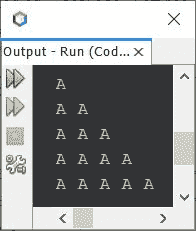
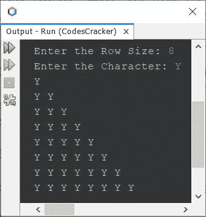

# 打印字母字符图案的 Java 程序

> 原文：<https://codescracker.com/java/program/java-print-alphabet-pattern.htm>

本文介绍了用 Java 编写的打印字母字符图案的程序。所有著名的模式程序，可以创建使用字母表，这里涵盖了。

## Java 中的字母模式-模式 1

问题是，*写一个 Java 程序打印字母表*的图案。这个问题的答案是下面 给出的程序。这个程序打印字母表的直角三角形。

```
public class CodesCracker
{
   public static void main(String[] args)
   {
      int i, j, row=5;
      char ch='A';

      for(i=0; i<row; i++)
      {
         for(j=0; j<=i; j++)
            System.out.print(ch+ " ");
         System.out.print("\n");
      }
   }
}
```

下面给出的快照显示了上面的 Java 程序在打印字母图案时产生的示例输出:



要允许用户定义三角形的大小，或图案的行大小，使用下面给出的程序。该程序还接收字符以形成图案:

```
import java.util.Scanner;

public class CodesCracker
{
   public static void main(String[] args)
   {
      int i, j, row;
      char ch;
      Scanner s = new Scanner(System.in);

      System.out.print("Enter the Row Size: ");
      row = s.nextInt();
      System.out.print("Enter the Character: ");
      ch = s.next().charAt(0);

      for(i=0; i<row; i++)
      {
         for(j=0; j<=i; j++)
            System.out.print(ch+ " ");
         System.out.print("\n");
      }
   }
}
```

以用户输入的 **8** 为行大小，以 **Y** 为字符形成图案的上述程序的示例运行如下:



也就是说，不是手动或直接初始化**行**和**通道**的值，而是使用用户 输入完成初始化。

您也可以尝试使用字母以外的字符，如 **#、@、-、。，/，}** 等。

## Java 中的字母模式-模式 2

上面的程序也可以用一种方式创建，每次打印下一个字符，同时形成图案:

```
public class CodesCracker
{
   public static void main(String[] args)
   {
      int row=5;
      char ch='A';

      for(int i=0; i<row; i++)
      {
         for(int j=0; j<=i; j++)
         {
            System.out.print(ch+ " ");
            ch++;
         }
         System.out.print("\n");
      }
   }
}
```

#### 先前字母模式程序的输出

```
A 
B C 
D E F 
G H I J 
K L M N O 
```

## Java 中的字母模式-模式 3

此外，程序也可以这样创建，每一行都以“A”开头，其余部分与以前的程序相似。即第一行 **A** 、第二行 **A B** 、第三行**Ab**等。

```
public class CodesCracker
{
   public static void main(String[] args)
   {
      int row=5;

      for(int i=0; i<row; i++)
      {
         char ch='A';
         for(int j=0; j<=i; j++)
         {
            System.out.print(ch+ " ");
            ch++;
         }
         System.out.print("\n");
      }
   }
}
```

#### 先前字母模式程序的输出

```
A 
A B 
A B C 
A B C D 
A B C D E 
```

## Java 中的字母模式-模式 4

该程序还可以修改打印相同的直角三角形的字母字符，其中字母的形式不同。也就是说，每行增加字母表，但不增加列。即 **A** 在 第一排， **B B** 在第二排， **C C C** 在第三排，以此类推。

```
public class CodesCracker
{
   public static void main(String[] args)
   {
      int row=5;
      char ch='A';

      for(int i=0; i<row; i++)
      {
         for(int j=0; j<=i; j++)
            System.out.print(ch+ " ");

         System.out.print("\n");
         ch++;
      }
   }
}
```

#### 先前字母模式程序的输出

```
A 
B B 
C C C 
D D D D 
E E E E E 
```

## Java 中的字母模式-模式 5

现在让我改变模式的方向，以了解在 Java 中创建字母字符模式的不同方式。

```
public class CodesCracker
{
   public static void main(String[] args)
   {
      int row=5, sLimit;
      sLimit = (row*2) - 2;
      char ch = 'A';

      for(int i=0; i<row; i++)
      {
         for(int space=0; space<sLimit; space++)
            System.out.print(" ");
         for(int j=0; j<=i; j++)
            System.out.print(ch+ " ");
         System.out.print("\n");
         sLimit = sLimit-2;
      }
   }
}
```

#### 先前字母模式程序的输出

```
        A 
      A A 
    A A A 
  A A A A 
A A A A A 
```

**注意-** 你可以像以前的程序一样尝试打印出相同形状不同外观的字母 图案。

## Java 中的字母模式-模式 6

```
public class CodesCracker
{
   public static void main(String[] args)
   {
      int row=5;
      char ch='A';

      for(int i=0; i<row; i++)
      {
         for(int j=i; j<row; j++)
            System.out.print(ch+ " ");

         System.out.print("\n");
      }
   }
}
```

#### 先前字母模式程序的输出

```
A A A A A 
A A A A 
A A A 
A A 
A 
```

## Java 中的字母模式-模式 7

```
public class CodesCracker
{
   public static void main(String[] args)
   {
      int row=5, sLimit=0;
      char ch='A';

      for(int i=0; i<row; i++)
      {
         for(int space=0; space<sLimit; space++)
            System.out.print(" ");

         for(int j=i; j<row; j++)
            System.out.print(ch+ " ");

         System.out.print("\n");
         sLimit += 2;
      }
   }
}
```

#### 先前字母模式程序的输出

```
A A A A A 
  A A A A 
    A A A 
      A A 
        A
```

## Java 中的字母模式-模式 8

使用这个程序创建的图案看起来像一个等边三角形的字母表。

```
public class CodesCracker
{
   public static void main(String[] args)
   {
      int row=5;
      char ch='A';

      for(int i=0; i<row; i++)
      {
         for(int space=i; space<row; space++)
            System.out.print(" ");

         for(int j=0; j<=i; j++)
            System.out.print(ch+ " ");

         System.out.print("\n");
      }
   }
}
```

#### 先前字母模式程序的输出

```
     A 
    A A 
   A A A 
  A A A A 
 A A A A A 
```

## Java 中的字母模式-模式 9

```
public class CodesCracker
{
   public static void main(String[] args)
   {
      int row=5;
      char ch='A';

      for(int i=0; i<row; i++)
      {
         for(int space=0; space<i; space++)
            System.out.print(" ");

         for(int j=i; j<row; j++)
            System.out.print(ch+ " ");

         System.out.print("\n");
      }
   }
}
```

#### 先前字母模式程序的输出

```
A A A A A 
 A A A A 
  A A A 
   A A 
    A 
```

**注-** 更多图案，参见 Java 中的[星形图案程序](/java/program/java-print-star-pattern.htm)。 你需要做的唯一改变，就是用字母表来改变星星。

[Java 在线测试](/exam/showtest.php?subid=1)

* * *

* * *