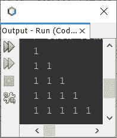

# Java 程序：打印数字模式

> 原文：<https://codescracker.com/java/program/java-print-number-pattern.htm>

这篇文章涵盖了 Java 中用来打印数字模式的所有著名程序。这里创建了几乎超过 7 个使用数字的图案程序。

## Java 中的数字图案程序-模式 1

*问题是，写一个 Java 程序来打印数字的模式。*以下节目是它的回答:

```
public class CodesCracker
{
   public static void main(String[] args)
   {
      int row=10, num=1;

      for(int i=0; i<row; i++)
      {
         for(int j=0; j<=i; j++)
            System.out.print(num+ " ");
         System.out.print("\n");
      }
   }
}
```

下面给出的快照显示了上述 Java 程序在打印数字模式时的示例输出:



### 基于用户输入打印数字模式

先前的程序也可以以允许用户在形成图案时定义图案的尺寸以及要使用的数量的方式来创建:

```
import java.util.Scanner;

public class CodesCracker
{
   public static void main(String[] args)
   {
      int row, num;
      Scanner s = new Scanner(System.in);

      System.out.print("Enter the Row Size of Pattern: ");
      row = s.nextInt();
      System.out.print("Enter the Number to Form Pattern: ");
      num = s.nextInt();

      for(int i=0; i<row; i++)
      {
         for(int j=0; j<=i; j++)
            System.out.print(num+ " ");
         System.out.print("\n");
      }
   }
}
```

以用户输入的 **5** 作为行大小，以 **4** 作为数字，上述程序的示例运行如下面的 所示:


**注-** 在下面给出的其他程序中，你可以使用相同的过程根据用户输入打印数字模式。

## Java 中的数字图案程序-模式 2

下面给出的程序打印自然数的直角三角形。即第一排的 **1** ，第二排的 **2 3** ，第三排的 **4 5 6** ，以此类推:

```
public class CodesCracker
{
   public static void main(String[] args)
   {
      int r=10, num=1;

      for(int i=0; i<r; i++)
      {
         for(int j=0; j<=i; j++)
         {
            System.out.print(num+ " ");
            num++;
         }
         System.out.print("\n");
      }
   }
}
```

#### 先前数字图案程序的输出

```
1 
2 3 
4 5 6 
7 8 9 10 
11 12 13 14 15 
16 17 18 19 20 21 
22 23 24 25 26 27 28 
29 30 31 32 33 34 35 36 
37 38 39 40 41 42 43 44 45 
46 47 48 49 50 51 52 53 54 55 
```

## Java 中的数字图案程序-模式 3

现在这个程序打印数字模式，其中每一行包含自然数。即第一排 **1** ，第二排 **1 2** ，第三排 **1 2 3** ，以此类推。

```
public class CodesCracker
{
   public static void main(String[] args)
   {
      int r=10;

      for(int i=0; i<r; i++)
      {
         int num=1;
         for(int j=0; j<=i; j++)
         {
            System.out.print(num+ " ");
            num++;
         }
         System.out.print("\n");
      }
   }
}
```

#### 先前数字图案程序的输出

```
1 
1 2 
1 2 3 
1 2 3 4 
1 2 3 4 5 
1 2 3 4 5 6 
1 2 3 4 5 6 7 
1 2 3 4 5 6 7 8 
1 2 3 4 5 6 7 8 9 
1 2 3 4 5 6 7 8 9 10 
```

## Java 中的数字图案程序——模式 4

这个程序也打印与前一个相同的图案，但是这一次， **1** 在第一行， **2 2** 在第二行， 3 3 3 在第三行，以此类推。

```
public class CodesCracker
{
   public static void main(String[] args)
   {
      int r=9, num=1;

      for(int i=0; i<r; i++)
      {
         for(int j=0; j<=i; j++)
            System.out.print(num+ " ");

         System.out.print("\n");
         num++;
      }
   }
}
```

#### 先前数字图案程序的输出

```
1 
2 2 
3 3 3 
4 4 4 4 
5 5 5 5 5 
6 6 6 6 6 6 
7 7 7 7 7 7 7 
8 8 8 8 8 8 8 8 
9 9 9 9 9 9 9 9 9 
```

## Java 中的数字图案程序-模式 5

现在让我用 Java 创建一些其他的数字图案程序。

```
public class CodesCracker
{
   public static void main(String[] args)
   {
      int r=10, spaceLimit, num=1;
      spaceLimit = (r*2) - 2;

      for(int i=0; i<r; i++)
      {
         for(int space=0; space<spaceLimit; space++)
            System.out.print(" ");
         for(int j=0; j<=i; j++)
            System.out.print(num+ " ");
         System.out.print("\n");
         spaceLimit = spaceLimit-2;
      }
   }
}
```

#### 先前数字图案程序的输出

```
                  1 
                1 1 
              1 1 1 
            1 1 1 1 
          1 1 1 1 1 
        1 1 1 1 1 1 
      1 1 1 1 1 1 1 
    1 1 1 1 1 1 1 1 
  1 1 1 1 1 1 1 1 1 
1 1 1 1 1 1 1 1 1 1 
```

## Java 中的数字图案程序-模式 6

```
public class CodesCracker
{
   public static void main(String[] args)
   {
      int r=10, num=1;

      for(int i=0; i<r; i++)
      {
         for(int j=i; j<r; j++)
            System.out.print(num+ " ");

         System.out.print("\n");
      }
   }
}
```

#### 先前数字图案程序的输出

```
1 1 1 1 1 1 1 1 1 1 
1 1 1 1 1 1 1 1 1 
1 1 1 1 1 1 1 1 
1 1 1 1 1 1 1 
1 1 1 1 1 1 
1 1 1 1 1 
1 1 1 1 
1 1 1 
1 1 
1 
```

## Java 中的数字图案程序——模式 7

```
public class CodesCracker
{
   public static void main(String[] args)
   {
      int r=10, limit=0, num=1;

      for(int i=0; i<r; i++)
      {
         for(int s=0; s<limit; s++)
            System.out.print(" ");

         for(int j=i; j<r; j++)
            System.out.print(num+ " ");

         System.out.print("\n");
         limit += 2;
      }
   }
}
```

#### 先前数字图案程序的输出

```
1 1 1 1 1 1 1 1 1 1 
  1 1 1 1 1 1 1 1 1 
    1 1 1 1 1 1 1 1 
      1 1 1 1 1 1 1 
        1 1 1 1 1 1 
          1 1 1 1 1 
            1 1 1 1 
              1 1 1 
                1 1 
                  1 
```

## Java 中的数字图案程序-模式 8

这个程序用来打印等边三角形，使用一个 **1** ，一个数字。

```
public class CodesCracker
{
   public static void main(String[] args)
   {
      int r=10, num=1;

      for(int i=0; i<r; i++)
      {
         for(int s=i; s<r; s++)
            System.out.print(" ");

         for(int j=0; j<=i; j++)
            System.out.print(num+ " ");

         System.out.print("\n");
      }
   }
}
```

#### 先前数字图案程序的输出

```
          1 
         1 1 
        1 1 1 
       1 1 1 1 
      1 1 1 1 1 
     1 1 1 1 1 1 
    1 1 1 1 1 1 1 
   1 1 1 1 1 1 1 1 
  1 1 1 1 1 1 1 1 1 
 1 1 1 1 1 1 1 1 1 1 
```

## Java 中的数字图案程序——模式 9

```
public class CodesCracker
{
   public static void main(String[] args)
   {
      int r=10, num=1;

      for(int i=0; i<r; i++)
      {
         for(int s=0; s<i; s++)
            System.out.print(" ");

         for(int j=i; j<r; j++)
            System.out.print(num+ " ");

         System.out.print("\n");
      }
   }
}
```

#### 先前数字图案程序的输出

```
1 1 1 1 1 1 1 1 1 1 
 1 1 1 1 1 1 1 1 1 
  1 1 1 1 1 1 1 1 
   1 1 1 1 1 1 1 
    1 1 1 1 1 1 
     1 1 1 1 1 
      1 1 1 1 
       1 1 1 
        1 1 
         1 
```

**注-** 更多图案，参见 Java 中的[星形图案程序](/java/program/java-print-star-pattern.htm)。 你需要做的唯一改变，就是改变星诺的编号。

[Java 在线测试](/exam/showtest.php?subid=1)

* * *

* * *