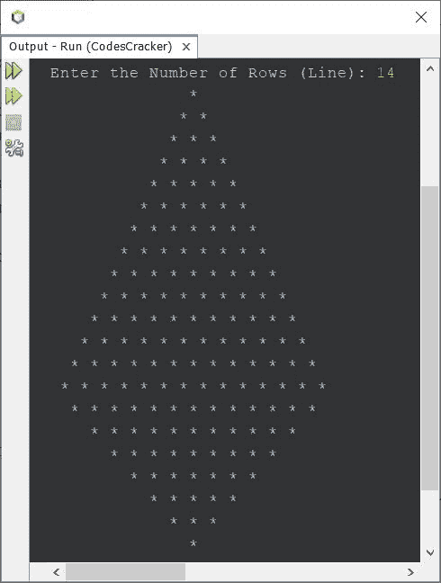

# Java 程序：打印星形金字塔图案

> 原文：<https://codescracker.com/java/program/java-program-print-star-pyramid-patterns.htm>

本文介绍了一些在 Java 编程中打印星形(*)金字塔图案的程序。下面是本文涉及的程序列表:

*   星星的金字塔图案
*   倒金字塔形的星星图案
*   恒星的半金字塔模式
*   恒星的倒半金字塔模式
*   完整或完整的星星金字塔图案

## Java 中星形(*)的金字塔模式

问题是，*写一个 Java 程序打印星星的金字塔图案(*)* 。这个问题的答案是下面给出的程序 :

```
public class CodesCracker
{
   public static void main(String[] args)
   {
      int row=9, i, space, j;
      for(i=0; i<row; i++)
      {
         for(space=i; space<row; space++)
            System.out.print(" ");
         for(j=0; j<(i+1); j++)
            System.out.print("* ");
         System.out.print("\n");
      }
   }
}
```

上面的 Java 程序产生的输出是:


### 打印给定大小的星形金字塔的 Java 代码

让我们修改上面的程序，允许用户在程序运行时定义金字塔的大小:

```
import java.util.Scanner;

public class CodesCracker
{
   public static void main(String[] args)
   {
      int row, i, space, j;
      Scanner s = new Scanner(System.in);

      System.out.print("Enter the Number of Rows (Line): ");
      row = s.nextInt();

      for(i=0; i<row; i++)
      {
         for(space=i; space<row; space++)
            System.out.print(" ");
         for(j=0; j<(i+1); j++)
            System.out.print("* ");
         System.out.print("\n");
      }
   }
}
```

下面给出的快照显示了上述 Java 程序的示例运行，用户输入 **12** 作为行数或行数，以 打印给定尺寸的金字塔图案:


## 爪哇倒金字塔形的星星图案

要打印倒金字塔形状的星星，请使用下面给出的程序。要增加或减少模式的行大小，只需增加/减少**行**变量的值。

```
public class CodesCracker
{
   public static void main(String[] args)
   {
      int i, j, row=9, space;

      for(i=0; i<row; i++)
      {
         for(space=0; space<i; space++)
            System.out.print(" ");
         for(j=i; j<row; j++)
            System.out.print("* ");
         System.out.print("\n");
      }
   }
}
```

下面是它的示例输出:


## 爪哇星星的半金字塔图案

这个程序用 Java 打印半金字塔的星星图案。

```
public class CodesCracker
{
   public static void main(String[] args)
   {
      int row=9, i, j;
      for(i=0; i<row; i++)
      {
         for(j=0; j<=i; j++)
            System.out.print("* ");
         System.out.print("\n");
      }
   }
}
```

#### 前一个程序的输出-半金字塔程序


## 爪哇倒半金字塔形的星星图案

这是另一个程序，打印倒半金字塔形的星星。

```
public class CodesCracker
{
   public static void main(String[] args)
   {
      int row=9, i, j;
      for(i=0; i<row; i++)
      {
         for(j=i; j<row; j++)
            System.out.print("* ");
         System.out.print("\n");
      }
   }
}
```

#### 前一个程序的输出-倒半金字塔程序


## Java 中星号(*)的完整金字塔模式

这是我认为我们需要的程序，当我们想用星星打印完整的金字塔图案时。因此，我创造了金字塔，它提供了金字塔几乎真实的样子。

```
import java.util.Scanner;

public class CodesCracker
{
   public static void main(String[] args)
   {
      int i, row, space, j;
      Scanner s = new Scanner(System.in);

      System.out.print("Enter the Number of Rows (Line): ");
      row = s.nextInt();

      for(i=0; i<row; i++)
      {
         for(space=i; space<row; space++)
            System.out.print(" ");
         for(j=0; j<(i+1); j++)
            System.out.print("* ");
         System.out.print("\n");
      }
      for(i=row; i>0; i=(i-2))
      {
         for(space=row; space>=(i-1); space--)
            System.out.print(" ");
         for(j=(i-1); j>0; j--)
            System.out.print("* ");
         System.out.print("\n");
      }
   }
}
```

下面是它的示例运行，用户输入 **14** 作为形成完整星形金字塔的行数:



#### 其他语言的相同程序

*   [C 打印开始金字塔图案](/c/program/c-program-print-star-pyramid-patterns.htm)
*   [C++ 打印星形金字塔图案](/cpp/program/cpp-program-print-star-pyramid-patterns.htm)
*   [蟒蛇印花星形金字塔图案](/python/program/python-program-print-star-pyramid-patterns.htm)

[Java 在线测试](/exam/showtest.php?subid=1)

* * *

* * *