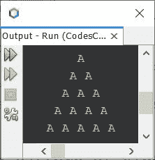
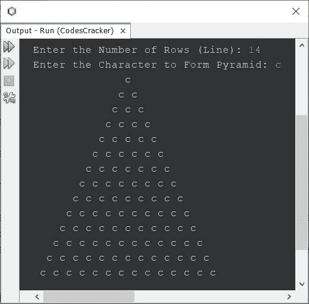
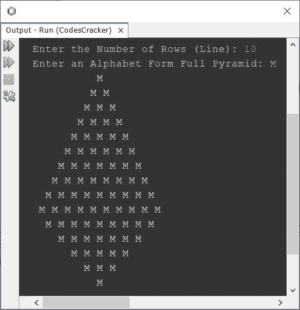

# Java 程序：打印字母金字塔图案

> 原文：<https://codescracker.com/java/program/java-print-alphabet-pyramid-pattern.htm>

这篇文章介绍了 Java 中字母表的金字塔模式。本文将介绍 Java 中三种最著名的字母表金字塔模式。

## Java 中字母的金字塔模式

问题是，*写一个 Java 程序打印字母字符*的金字塔图案。下面给出的节目是它的 回答:

```
public class CodesCracker
{
   public static void main(String[] args)
   {
      int i, space, j;
      char alphabet = 'A';
      for(i=0; i<5; i++)
      {
         for(space=i; space<5; space++)
            System.out.print(" ");
         for(j=0; j<(i+1); j++)
            System.out.print(alphabet+ " ");
         System.out.print("\n");
      }
   }
}
```

下面给出的快照显示了上述程序使用字母字符打印金字塔图案时产生的示例输出:



现在下面给出的程序是前一个程序的修改版本。这个程序允许用户定义金字塔的大小，以及形成金字塔的字符。

```
import java.util.Scanner;

public class CodesCracker
{
   public static void main(String[] args)
   {
      Scanner s = new Scanner(System.in);

      System.out.print("Enter the Number of Rows (Line): ");
      int row = s.nextInt();
      System.out.print("Enter the Character to Form Pyramid: ");
      char ch = s.next().charAt(0);

      for(int i=0; i<row; i++)
      {
         for(int space=i; space<row; space++)
            System.out.print(" ");
         for(int j=0; j<(i+1); j++)
            System.out.print(ch+ " ");
         System.out.print("\n");
      }
   }
}
```

带有用户输入 **c** 的上述程序的示例运行显示在下面给出的快照中:



## 用 Java 打印完整的字母表金字塔

使用这个程序创建的字母金字塔看起来像真正的金字塔。因此，我称之为字母表的完整金字塔。

```
import java.util.Scanner;

public class CodesCracker
{
   public static void main(String[] args)
   {
      int i, row, s, j;
      char alphabet;
      Scanner s = new Scanner(System.in);

      System.out.print("Enter the Number of Rows (Line): ");
      row = s.nextInt();
      System.out.print("Enter an Alphabet Form Full Pyramid: ");
      alphabet = s.next().charAt(0);

      for(i=0; i<row; i++)
      {
         for(s=i; s<row; s++)
            System.out.print(" ");
         for(j=0; j<(i+1); j++)
            System.out.print(alphabet+ " ");
         System.out.print("\n");
      }
      for(i=row; i>0; i=(i-2))
      {
         for(s=row; s>=(i-1); s--)
            System.out.print(" ");
         for(j=(i-1); j>0; j--)
            System.out.print(alphabet+ " ");
         System.out.print("\n");
      }
   }
}
```

下面是它的示例运行，使用用户输入的 **10** 作为行大小，使用 **M** 作为字母，使用这个 字母形成一个完整的金字塔:



**注-** 更多使用字母表的金字塔图案，参见 [Java 中的](/java/program/java-program-print-star-pyramid-patterns.htm)星星金字塔图案。唯一要做的改变， 是用想要的字母字符替换星号。

[Java 在线测试](/exam/showtest.php?subid=1)

* * *

* * *