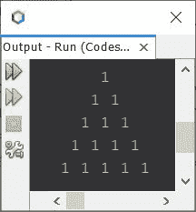
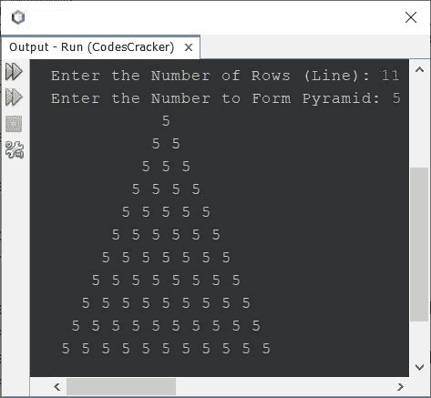
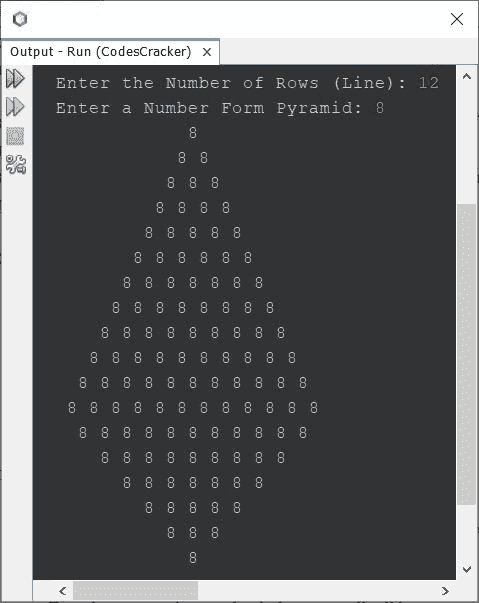

# Java 程序：打印数字金字塔图案

> 原文：<https://codescracker.com/java/program/java-print-number-pyramid-pattern.htm>

创建这篇文章是为了介绍一个用 Java 编写的程序，它打印数字的金字塔模式。

## Java 中数字的金字塔模式

问题是，*写一个 Java 程序打印数字金字塔。*以下节目是它的回答:

```
public class CodesCracker
{
   public static void main(String[] args)
   {
      int i, space, j, num=1;
      for(i=0; i<5; i++)
      {
         for(space=i; space<5; space++)
            System.out.print(" ");
         for(j=0; j<(i+1); j++)
            System.out.print(num+ " ");
         System.out.print("\n");
      }
   }
}
```

下面给出的快照显示了上述 Java 程序产生的示例输出:



现在让我们修改上面的程序，允许用户定义金字塔的大小，连同数字，以形成相同的金字塔，给定的大小，给定的数字:

```
import java.util.Scanner;

public class CodesCracker
{
   public static void main(String[] args)
   {
      int tot, i, space, j, num;
      Scanner s = new Scanner(System.in);

      System.out.print("Enter the Number of Rows (Line): ");
      tot = s.nextInt();
      System.out.print("Enter the Number to Form Pyramid: ");
      num = s.nextInt();

      for(i=0; i<tot; i++)
      {
         for(space=i; space<tot; space++)
            System.out.print(" ");
         for(j=0; j<(i+1); j++)
            System.out.print(num+ " ");
         System.out.print("\n");
      }
   }
}
```

用户输入 **11** 作为行数，输入 **5** 作为数字，形成 11 行或 11 行 的金字塔，上面程序的示例运行如下面给出的快照所示:



## Java 中数字的全金字塔模式

这是本文的最后一个程序，创建它是为了使用给定的数字打印完整的金字塔图案。使用该程序打印的金字塔提供了金字塔的实际外观。

```
import java.util.Scanner;

public class CodesCracker
{
   public static void main(String[] args)
   {
      int i, row, k, j, num;
      Scanner s = new Scanner(System.in);

      System.out.print("Enter the Number of Rows (Line): ");
      row = s.nextInt();
      System.out.print("Enter a Number Form Pyramid: ");
      num = s.nextInt();

      for(i=0; i<row; i++)
      {
         for(k=i; k<row; k++)
            System.out.print(" ");
         for(j=0; j<(i+1); j++)
            System.out.print(num+ " ");
         System.out.print("\n");
      }
      for(i=row; i>0; i=(i-2))
      {
         for(k=row; k>=(i-1); k--)
            System.out.print(" ");
         for(j=(i-1); j>0; j--)
            System.out.print(num+ " ");
         System.out.print("\n");
      }
   }
}
```

下面给出的快照显示了上述程序的示例运行，其中用户输入 **12** 作为行数， **8** 作为数字，以形成完整的金字塔:



**注-** 更多金字塔图案使用数字，参见 [Java 中的](/java/program/java-program-print-star-pyramid-patterns.htm)星星金字塔图案。唯一要做的改变 是用想要的数字替换星号。

[Java 在线测试](/exam/showtest.php?subid=1)

* * *

* * *