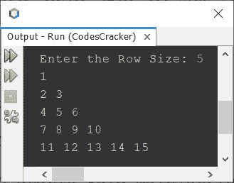

# Java 程序：打印弗洛伊德三角形

> 原文：<https://codescracker.com/java/program/java-program-print-floyd-triangle.htm>

这篇文章讲述了一个用 Java 打印弗洛伊德三角形的程序。用自然数构成的直角三角形可以称为弗洛伊德三角形。例如:

```
1 
2 3 
4 5 6 
7 8 9 10 
11 12 13 14 15 
```

是弗洛伊德的 5 行或线的三角形。

## 用 for 循环在 Java 中打印弗洛伊德三角形

问题是，*写一个 Java 程序打印弗洛伊德三角形。*下面给出的程序是它的答案:

```
public class CodesCracker
{
   public static void main(String[] args)
   {
      int row=10, i, j, num=1;
      for(i=0; i<row; i++)
      {
         for(j=0; j<=i; j++)
         {
            System.out.print(num+ " ");
            num++;
         }

         System.out.print("\n");
      }
   }
}
```

下面给出的快照显示了上面的 Java 程序在打印 10 行弗洛伊德三角形时产生的示例输出:


## 使用 while 循环在 Java 中打印弗洛伊德三角形

现在让我使用 **while** 循环创建一个相同的程序，向您展示如何使用 **while** 编写或替换 相同的程序。

```
public class CodesCracker
{
   public static void main(String[] args)
   {
      int row=10, i=0, j, num=1;
      while(i<row)
      {
         j=0;
         while(j<=i)
         {
            System.out.print(num+ " ");
            num++;
            j++;
         }

         System.out.print("\n");
         i++;
      }
   }
}
```

上面的程序也可以这样创建:

```
public class CodesCracker
{
   public static void main(String[] args)
   {
      int row=10, i=0, j, num=1;
      while(i++ < row)
      {
         j=0;
         while(j++ <= i)
            System.out.print(num++ + " ");
         System.out.print("\n");
      }
   }
}
```

您仍然会得到与上一个程序相同的输出。但是程序变得比以前更短。变量后的 **++** 运算符 ，表示该运算符为后增量运算符。后递增运算符，首先使用变量的当前 值，然后在使用后将其值递增 1。

## 用 Java 打印给定大小的弗洛伊德三角形

这里还有一个关于弗洛伊德三角的节目。该程序允许用户定义弗洛伊德三角形的大小或行大小:

```
import java.util.Scanner;

public class CodesCracker
{
   public static void main(String[] args)
   {
      int num=1;
      Scanner s = new Scanner(System.in);

      System.out.print("Enter the Row Size: ");
      int row = s.nextInt();

      for(int i=0; i<row; i++)
      {
         for(int j=0; j<=i; j++)
         {
            System.out.print(num+ " ");
            num++;
         }

         System.out.print("\n");
      }
   }
}
```

使用用户输入 **5** 作为弗洛伊德三角形的行大小的上述程序的示例运行显示在下面给出的 的快照中:



#### 其他语言的相同程序

*   [C 打印弗洛伊德的三角形](/c/program/c-program-print-floyd-triangle.htm)
*   [C++打印弗洛伊德三角形](/cpp/program/cpp-program-print-floyd-triangle.htm)
*   [Python 打印弗洛伊德的三角形](/python/program/python-program-print-floyd-triangle.htm)

[Java 在线测试](/exam/showtest.php?subid=1)

* * *

* * *