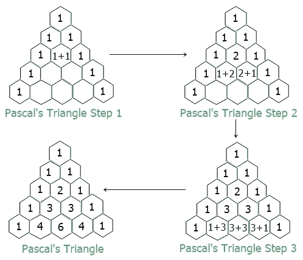
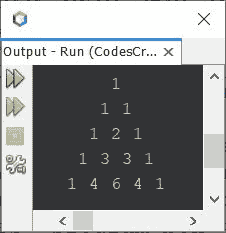
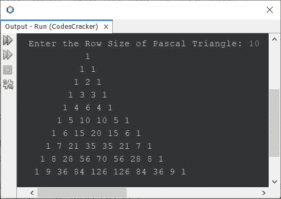

# Java 程序：打印帕斯卡三角形

> 原文：<https://codescracker.com/java/program/java-program-print-pascal-triangle.htm>

这篇文章讲述了一个用 Java 打印帕斯卡三角形的程序。如果你不知道帕斯卡三角形是什么，那么你可以参考[帕斯卡三角形](/nonprog/pascal-triangle.htm)。但是现在，下图显示了 关于帕斯卡三角形的一切:



现在让我们继续创建一个程序。

## 用 Java 打印帕斯卡的三角形

问题是，*写一个 Java 程序打印帕斯卡三角形。*这个问题的答案，是下面给出的程序:

```
public class CodesCracker
{
   public static void main(String[] args)
   {
      int row=5, i, j, space, num;
      for(i=0; i<row; i++)
      {
         for(space=row; space>i; space--)
         {
            System.out.print(" ");
         }
         num=1;
         for(j=0; j<=i; j++)
         {
            System.out.print(num+ " ");
            num = num*(i-j)/(j+1);
         }
         System.out.print("\n");
      }
   }
}
```

下面给出的快照显示了上面的程序在打印一个 5 行或 5 列的帕斯卡三角形时产生的示例输出:



同样的程序也可以创建为:

```
public class CodesCracker
{
   public static void main(String[] args)
   {
      int row=5, i, j, x=1, y=0;
      int[] arr = new int[row];
      int[] arrTemp = new int[row];
      arr[0] = 1;
      arr[1] = 1;

      for(i=0; i<row; i++)
      {
         for(j=(row-1); j>i; j--)
            System.out.print(" ");
         for(j=0; j<=i; j++)
         {
            if(i==0)
               System.out.print("1");
            else
            {
               if(j==0 || j==i)
                  System.out.print("1 ");
               else
               {
                  arrTemp[x] = arr[y] + arr[y+1];
                  System.out.print(arrTemp[x]+ " ");
                  x++;
                  y++;
               }
            }
         }
         System.out.print("\n");
         arrTemp[x] = 1;
         if(i>1)
         {
            y=0;
            arr[y]=1;
            for(x=1, y=1; y<=i; x++, y++)
               arr[y] = arrTemp[x];
            x=1;
            y=0;
         }
      }
   }
}
```

由于**行**的值是 5，在这个程序中也是如此，因此您将得到上一个程序的精确输出。

## 用 Java 打印给定大小的帕斯卡三角形

这是本文的最后一个程序，允许用户在程序运行时定义帕斯卡三角形的大小。

```
import java.util.Scanner;

public class CodesCracker
{
   public static void main(String[] args)
   {
      int num;
      Scanner s = new Scanner(System.in);

      System.out.print("Enter the Row Size of Pascal Triangle: ");
      int row = s.nextInt();

      for(int i=0; i<row; i++)
      {
         for(int space=row; space>i; space--)
            System.out.print(" ");
         num=1;
         for(int j=0; j<=i; j++)
         {
            System.out.print(num+ " ");
            num = num*(i-j)/(j+1);
         }
         System.out.print("\n");
      }
   }
}
```

以下是其示例运行，用户输入 **10** 作为帕斯卡三角形的行大小:



#### 其他语言的相同程序

*   [C 打印帕斯卡三角形](/c/program/c-program-print-pascal-triangle.htm)
*   [C++打印帕斯卡三角形](/cpp/program/cpp-program-print-pascal-triangle.htm)

[Java 在线测试](/exam/showtest.php?subid=1)

* * *

* * *