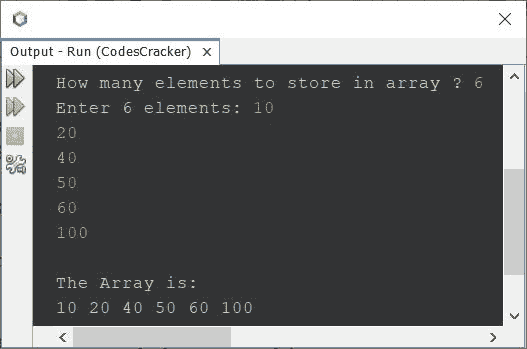

# Java 一维数组程序

> 原文：<https://codescracker.com/java/program/java-program-one-dimensional-array.htm>

本文介绍了一个简单的 Java 一维数组程序。下面给出的程序，允许用户定义数组的大小，以及它的元素。

要在 Java 中打印一维数组，您只需要对循环使用一个**，如下面的程序所示。**

```
import java.util.Scanner;

public class CodesCracker
{
   public static void main(String[] args)
   {
      int n, i;
      Scanner scan = new Scanner(System.in);

      System.out.print("How many elements to store in array ? ");
      n = scan.nextInt();

      int[] arr = new int[n];

      System.out.print("Enter " +n+ " elements: ");
      for(i=0; i<n; i++)
         arr[i] = scan.nextInt();

      System.out.println("\nThe Array is: ");
      for(i=0; i<n; i++)
         System.out.print(arr[i]+ " ");
   }
}
```

下面给出的快照显示了上述程序的示例运行，用户输入的 **6** 为大小， 10，20，40，50，60，100 为数组的六个元素:



具体可以参考 Java 中的[一维数组。](/java/java-one-dimensional-arrays.htm)

#### 其他语言的相同程序

*   [C 1D 阵列程序](/c/program/c-program-one-dimensional-array.htm)
*   [C++ 1D 数组程序](/cpp/program/cpp-program-one-dimensional-array.htm)
*   [Python 1D 数组程序](/python/program/python-program-one-dimensional-array.htm)

[Java 在线测试](/exam/showtest.php?subid=1)

* * *

* * *