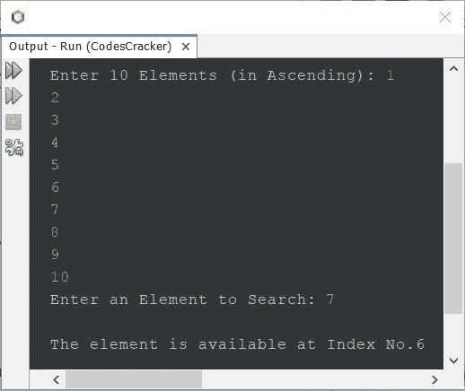
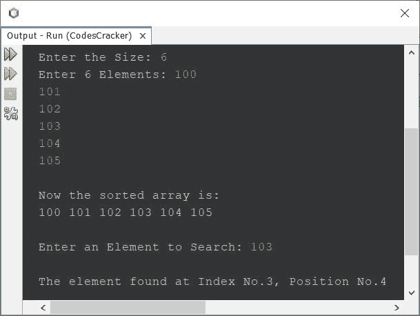

# Java 程序：-二分搜索法

> 原文：<https://codescracker.com/java/program/java-program-binary-search.htm>

本文旨在介绍一个执行二分搜索法的 Java 程序。也就是说，程序使用二分搜索法技术搜索元素。

如果你不知道二分搜索法是如何工作的？
再参考[二分搜索法逻辑与算法](/computer-fundamental/binary-search.htm)。现在让我们继续，T4 用 Java 为二分搜索法创建一个程序。

## Java 中的二分搜索法-基本版

问题是，*写一个 Java 程序来执行基于 10 个元素的二分搜索法。所有的 10 个元素和使用二分搜索法搜索的 元素，必须由用户在程序运行时接收。*下面给出的程序是这个 问题的答案:

```
import java.util.Scanner;

public class CodesCracker
{
   public static void main(String[] args)
   {
      int size=10, i, search, first, last, middle;
      int[] arr = new int[size];
      Scanner scan = new Scanner(System.in);

      System.out.print("Enter 10 Elements (in Ascending): ");
      for(i=0; i<size; i++)
      {
         arr[i] = scan.nextInt();
      }
      System.out.print("Enter an Element to Search: ");
      search = scan.nextInt();

      first = 0;
      last = size-1;
      middle = (first+last)/2;

      while(first<=last)
      {
         if(arr[middle]<search)
         {
            first = middle+1;
         }
         else if(arr[middle]==search)
         {
            System.out.println("\nThe element is available at Index No." +middle);
            break;
         }
         else
         {
            last = middle-1;
         }
         middle = (first+last)/2;
      }

      if(first>last)
      {
         System.out.println("\nThe element is not available in given array");
      }
   }
}
```

下面给出的快照显示了上述 Java 程序在二分搜索法上的示例运行，用户输入 **1，2，3，4，5，6，7，8，9，10**T4 作为十个元素，而 **7** 作为要搜索的元素:



## Java 版二分搜索法-完整版

由于以前的程序有一些限制，如当用户以随机顺序输入元素时，程序会产生不正确的输出。此外，该程序只允许用户输入 10 个元素。因此我修改了这个程序，去掉了这些限制。这是前一个程序的修改版本。

```
import java.util.Scanner;

public class CodesCracker
{
   public static void main(String[] args)
   {
      int tot, i, search, first, last, middle, j, x;
      Scanner scan = new Scanner(System.in);

      System.out.print("Enter the Size: ");
      tot = scan.nextInt();

      int[] arr = new int[tot];

      System.out.print("Enter " +tot+" Elements: ");
      for(i=0; i<tot; i++)
         arr[i] = scan.nextInt();

      // following block of code, sorts the array
      for(i=0; i<(tot-1); i++)
      {
         for(j=0; j<(tot-i-1); j++)
         {
            if(arr[j]>arr[j+1])
            {
               x = arr[j];
               arr[j] = arr[j+1];
               arr[j+1] = x;
            }
         }
      }

      // following block of code, prints the sorted array
      System.out.println("\nNow the sorted array is:");
      for(i=0; i<tot; i++)
         System.out.print(arr[i]+ " ");

      // things are done, now let's do binary search
      System.out.print("\n\nEnter an Element to Search: ");
      search = scan.nextInt();

      first = 0;
      last = tot-1;
      middle = (first+last)/2;

      while(first<=last)
      {
         if(arr[middle]<search)
            first = middle+1;
         else if(arr[middle]==search)
         {
            System.out.println("\nThe element found at Index No." +middle+ ", Position No." +(middle+1));
            break;
         }
         else
            last = middle-1;

         middle = (first+last)/2;
      }

      if(first>last)
         System.out.println("\nThe element is not available in given array");
   }
}
```

用户输入 **6** 作为尺寸， **100，101，102，103，104，105** 作为其六个 元素， **103** 作为要搜索的元素，上面程序的示例运行如下:



## Java 中使用`for`循环的二分搜索法

要用 Java 创建一个执行二分搜索法的程序，完全使用**进行**循环，然后替换上面程序中的以下 代码块:

```
first = 0;
last = size-1;
middle = (first+last)/2;

while(first<=last)
{
   if(arr[middle]<elem)
      first = middle+1;
   else if(arr[middle]==elem)
   {
      System.out.println("\nThe element found at Index No." +middle+ ", Position No." +(middle+1));
      break;
   }
   else
      last = middle-1;

   middle = (first+last)/2;
}
```

使用下面给出的代码块:

```
first = 0;
last = size-1;

for(middle=(first+last)/2; first<=last; middle=(first+last)/2)
{
   if(arr[middle]<elem)
      first = middle+1;
   else if(arr[middle]==elem)
   {
      System.out.println("\nThe element found at Index No." +middle+ ", Position No." +(middle+1));
      break;
   }
   else
      last = middle-1;
}
```

此外，您可以将前两个语句放在循环的第一个语句**内，用逗号分隔。也就是说，**

```
for(first=0, last=(size-1), middle=(first+last)/2; first<=last; middle=(first+last)/2)
```

#### 其他语言的相同程序

*   [C 二分搜索法](/c/program/c-program-binary-search.htm)
*   [C++ 二分搜索法](/cpp/program/cpp-program-binary-search.htm)

[Java 在线测试](/exam/showtest.php?subid=1)

* * *

* * *