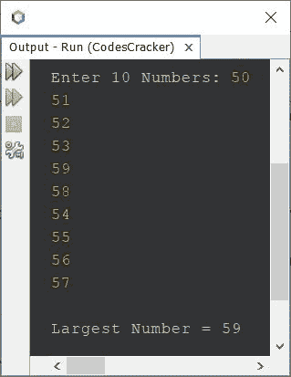
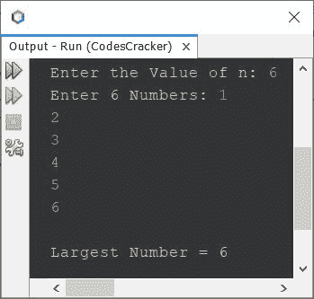

# Java 程序寻找数组中最大的数字

> 原文：<https://codescracker.com/java/program/java-program-find-largest-element-in-array.htm>

创建这篇文章是为了涵盖 Java 中的多个程序，这些程序在一个数组中查找用户在程序运行时输入的最大数字。

## Java 使用 for 循环查找数组中的最大数字

问题是，*写一个 Java 程序，在一个由 10 个数字组成的数组中找到并打印出最大的数字。*下面给出的程序 是它的答案:

```
import java.util.Scanner;

public class CodesCracker
{
   public static void main(String[] args)
   {
      int i, large;
      int[] arr = new int[10];
      Scanner scan = new Scanner(System.in);

      System.out.print("Enter 10 Numbers: ");
      for(i=0; i<10; i++)
         arr[i] = scan.nextInt();

      large = arr[0];
      for(i=1; i<10; i++)
      {
         if(large<arr[i])
            large = arr[i];
      }

      System.out.println("\nLargest Number = " +large);
   }
}
```

下面给出的快照显示了上述程序的示例运行，用户输入 **50、51、52、53、59、58、54、55、56、57** 作为十个数字，供数组查找并打印所有这十个数字中最大的一个:



上面的程序只适用于 10 个数字。因此，让我们修改程序并创建另一个程序，在一个由 **n** 个数字组成的数组中查找并打印最大的数字:

```
import java.util.Scanner;

public class CodesCracker
{
   public static void main(String[] args)
   {
      int n, i, large;
      Scanner scan = new Scanner(System.in);

      System.out.print("Enter the Value of n: ");
      n = scan.nextInt();
      int[] arr = new int[n];
      System.out.print("Enter " +n+ " Numbers: ");
      for(i=0; i<n; i++)
         arr[i] = scan.nextInt();

      large = arr[0];
      for(i=1; i<n; i++)
      {
         if(large<arr[i])
            large = arr[i];
      }

      System.out.println("\nLargest Number = " +large);
   }
}
```

使用用户输入的 **6** 作为 **n** 的大小或值，使用 **1、2、3、4、5、6** 作为六个元素或数字 运行的示例如下面给出的快照所示:



## Java 使用 while 循环查找数组中最大的数字

这是本文的最后一个程序，使用 **while** 循环创建，而不是用**代替**。

```
import java.util.Scanner;

public class CodesCracker
{
   public static void main(String[] args)
   {
      Scanner scan = new Scanner(System.in);

      System.out.print("Enter the Value of n: ");
      int n = scan.nextInt();
      int[] arr = new int[n];
      System.out.print("Enter " +n+ " Numbers: ");
      int i=0;
      while(i<n)
      {
         arr[i] = scan.nextInt();
         i++;
      }

      int large = arr[0];
      i = 1;
      while(i<n)
      {
         if(large<arr[i])
            large = arr[i];
         i++;
      }

      System.out.println("\nLargest Number = " +large);
   }
}
```

这个程序产生与前一个程序相同的输出。

#### 其他语言的相同程序

*   寻找数组中最大的元素
*   C++ 在数组中找到最大的元素

[Java 在线测试](/exam/showtest.php?subid=1)

* * *

* * *