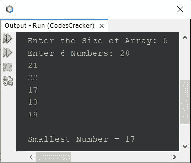

# Java 程序寻找数组中最小的数字

> 原文：<https://codescracker.com/java/program/java-program-find-smallest-element-in-array.htm>

本文介绍一个 Java 程序，该程序在运行时查找并打印用户输入的一组 **n** 数字 或元素中的最小数字。

## Java 使用 for 循环查找数组中最小的数字

问题是，*写一个 Java 程序，在一个由 **n** 数组成的数组中找出最小的数。*下面给出的节目 就是它的回答:

```
import java.util.Scanner;

public class CodesCracker
{
   public static void main(String[] args)
   {
      int tot, i, small;
      Scanner scan = new Scanner(System.in);

      System.out.print("Enter the Size of Array: ");
      tot = scan.nextInt();
      int[] arr = new int[tot];
      System.out.print("Enter " +tot+ " Numbers: ");
      for(i=0; i<tot; i++)
         arr[i] = scan.nextInt();

      small = arr[0];
      for(i=1; i<tot; i++)
      {
         if(small>arr[i])
            small = arr[i];
      }

      System.out.println("\nSmallest Number = " +small);
   }
}
```

下面给出的快照显示了上述程序的示例运行，使用用户输入的 **6** 作为大小， **20，21，22，17，18，19** 作为六个数字，查找并打印其中最小的数字:



## Java 使用 while 循环查找数组中最小的数字

使用 **while** 循环创建相同的程序，而不是使用 **for** 。然后替换下面的代码块，来自 上面的程序:

```
for(i=1; i<tot; i++)
{
   if(small>arr[i])
      small = arr[i];
}
```

下面给出了代码块:

```
i = 0;
while(i<tot)
{
   if(small>arr[i])
      small = arr[i];
   i++;
}
```

#### 其他语言的相同程序

*   在数组中找到最小的元素
*   C++在数组中找到最小的元素

[Java 在线测试](/exam/showtest.php?subid=1)

* * *

* * *