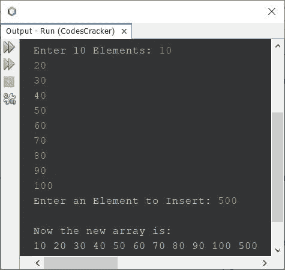
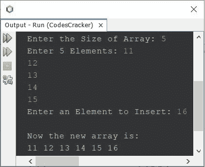
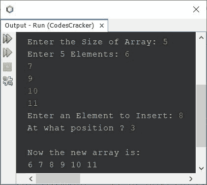

# Java 程序：在数组中插入元素

> 原文：<https://codescracker.com/java/program/java-program-insert-element-in-array.htm>

本文介绍了 Java 中的多个程序，这些程序在数组中插入一个元素，这个元素是用户在程序运行时输入的。以下是本文涵盖的程序列表:

*   在由 10 个元素组成的数组的末尾插入一个元素
*   在一组 **n** 元素的末尾插入一个元素
*   在数组中的给定位置插入一个元素

## 在 Java 中的数组末尾插入一个元素

问题是，*写一个 Java 程序，在一个数组的末尾插入一个元素。*下面给出的程序是它的答案:

```
import java.util.Scanner;

public class CodesCracker
{
   public static void main(String[] args)
   {
      int i, element;
      int[] arr = new int[11];
      Scanner scan = new Scanner(System.in);

      System.out.print("Enter 10 Elements: ");
      for(i=0; i<10; i++)
         arr[i] = scan.nextInt();

      System.out.print("Enter an Element to Insert: ");
      element = scan.nextInt();
      arr[i] = element;

      System.out.println("\nNow the new array is: ");
      for(i=0; i<11; i++)
         System.out.print(arr[i]+ " ");
   }
}
```

下面给出的快照显示了上述程序的运行示例，用户输入的 **10，20，30，40，50，60，70，80，90，100** 作为十个元素， **500** 作为新元素插入到数组的末尾:



#### 先前程序的修改版本

因为前面的程序只处理 10 个元素。因此，在修改该程序后，下面给出的程序允许用户定义数组的大小及其元素:

```
import java.util.Scanner;

public class CodesCracker
{
   public static void main(String[] args)
   {
      int i, element, n;
      Scanner scan = new Scanner(System.in);

      System.out.print("Enter the Size of Array: ");
      n = scan.nextInt();
      int[] arr = new int[n+1];
      System.out.print("Enter " +n+ " Elements: ");
      for(i=0; i<n; i++)
         arr[i] = scan.nextInt();

      System.out.print("Enter an Element to Insert: ");
      element = scan.nextInt();
      arr[i] = element;

      System.out.println("\nNow the new array is: ");
      for(i=0; i<(n+1); i++)
         System.out.print(arr[i]+ " ");
   }
}
```

使用用户输入的 **5** 作为大小， **11、12、13、14、15** 作为五个元素， **16** 作为新元素插入到 中的示例运行，如下面给出的快照所示:



## 在 Java 中的给定位置插入一个数组元素

这是本文的最后一个程序，创建它是为了在数组中的任意指定位置插入一个元素:

```
import java.util.Scanner;

public class CodesCracker
{
   public static void main(String[] args)
   {
      int i, tot;
      Scanner scan = new Scanner(System.in);

      System.out.print("Enter the Size of Array: ");
      int n = scan.nextInt();
      int[] arr = new int[n+1];
      System.out.print("Enter " +n+ " Elements: ");
      for(i=0; i<n; i++)
         arr[i] = scan.nextInt();

      System.out.print("Enter an Element to Insert: ");
      int element = scan.nextInt();
      System.out.print("At what position ? ");
      int pos = scan.nextInt();

      if(pos<n)
      {
         for(i=n; i>=pos; i--)
            arr[i] = arr[i-1];
         arr[i] = element;
         System.out.println("\nNow the new array is: ");
         for(i=0; i<(n+1); i++)
            System.out.print(arr[i]+ " ");
      }
      else
         System.out.println("\nInvalid Input!");
   }
}
```

使用用户输入的 **5** 作为尺寸， **6、7、9、10、11** 作为五个元素， **8** 作为要插入的新元素， 和 **3** 作为要插入元素的位置的示例运行如下:



#### 其他语言的相同程序

*   [C 在数组中插入元素](/c/program/c-program-insert-element-in-array.htm)
*   [C++ 在数组中插入元素](/cpp/program/cpp-program-insert-element-in-array.htm)

[Java 在线测试](/exam/showtest.php?subid=1)

* * *

* * *