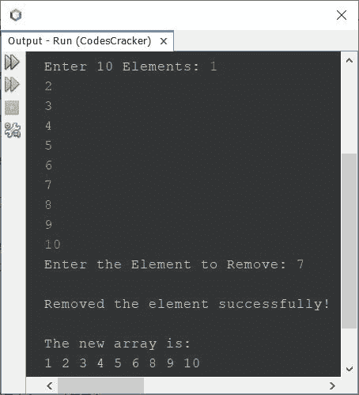
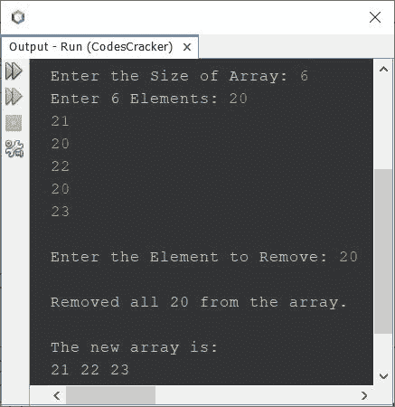

# Java 程序：从数组中删除元素

> 原文：<https://codescracker.com/java/program/java-program-delete-element-from-array.htm>

本文介绍了一个 Java 程序，它从数组中删除用户在程序运行时输入的元素。

## 在 Java - Basic 版本中从数组中删除元素

问题是，*写一个 Java 程序，从一个给定的数组中删除一个给定的元素。下面给出的程序是它的 答案。这个程序将元素从找到元素的索引向后移动一个索引。*

```
import java.util.Scanner;

public class CodesCracker
{
   public static void main(String[] args)
   {
      int i, j, size=10, element;
      int[] arr = new int[size];
      Scanner scan = new Scanner(System.in);

      System.out.print("Enter 10 Elements: ");
      for(i=0; i<size; i++)
         arr[i] = scan.nextInt();

      System.out.print("Enter the Element to Remove: ");
      element = scan.nextInt();

      for(i=0; i<size; i++)
      {
         if(element==arr[i])
         {
            for(j=i; j<(size-1); j++)
               arr[j] = arr[j+1];
            System.out.println("\nRemoved the element successfully!");
            break;
         }
      }

      System.out.println("\nThe new array is: ");
      for(i=0; i<(size-1); i++)
         System.out.print(arr[i]+ " ");
   }
}
```

下面给出的快照显示了上述程序的示例运行，其中用户输入 **1、2、3、4、5、6、7、8、9、10** 作为 十个元素，而 **7** 作为要删除或移除的元素:



## 在 Java 中从数组中删除元素-完整版

因为以前的程序不允许用户定义数组的大小。此外，当用户输入数组中不存在的元素或多次出现的元素时，程序也不正确。因此，我修改了那个程序，并创建了一个新程序。以下是先前程序的修改版本:

```
import java.util.Scanner;

public class CodesCracker
{
   public static void main(String[] args)
   {
      int i, j, size, element, count=0;
      Scanner scan = new Scanner(System.in);

      System.out.print("Enter the Size of Array: ");
      size = scan.nextInt();
      int[] arr = new int[size];

      System.out.print("Enter " +size+ " Elements: ");
      for(i=0; i<size; i++)
         arr[i] = scan.nextInt();

      System.out.print("\nEnter the Element to Remove: ");
      element = scan.nextInt();

      for(i=0; i<size; i++)
      {
         if(element==arr[i])
         {
            for(j=i; j<(size-1); j++)
               arr[j] = arr[j+1];
            size--;
            i--;
            count++;
         }
      }

      if(count==0)
         System.out.println("\nElement not found!");
      else if(count==1)
      {
         System.out.println("\nRemoved the element successfully!");
         System.out.println("\nThe new array is: ");
         for(i=0; i<size; i++)
            System.out.print(arr[i]+ " ");
      }
      else
      {
         System.out.println("\nRemoved all " +element+ " from the array.");
         System.out.println("\nThe new array is: ");
         for(i=0; i<size; i++)
            System.out.print(arr[i]+ " ");
      }
   }
}
```

下面是它的示例运行，其中用户输入 **6** 作为大小， **20，21，20，22，20，23** 作为六个元素， **20** 作为要删除的 元素:



在上面的程序中，下面的**块用于**循环:

```
for(i=0; i<size; i++)
{
   if(element==arr[i])
   {
      for(j=i; j<(size-1); j++)
         arr[j] = arr[j+1];
      size--;
      i--;
      count++;
   }
}
```

也可以使用 **while** 循环编写，如下所示:

```
i=0;
while(i<size)
{
   if(element==arr[i])
   {
      j=i;
      while(j<(size-1))
      {
         arr[j] = arr[j+1];
         j++;
      }
      size--;
      i--;
      count++;
   }
   i++;
}
```

#### 其他语言的相同程序

*   从数组中删除元素
*   从数组中删除元素

[Java 在线测试](/exam/showtest.php?subid=1)

* * *

* * *