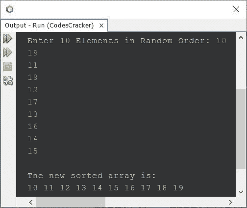
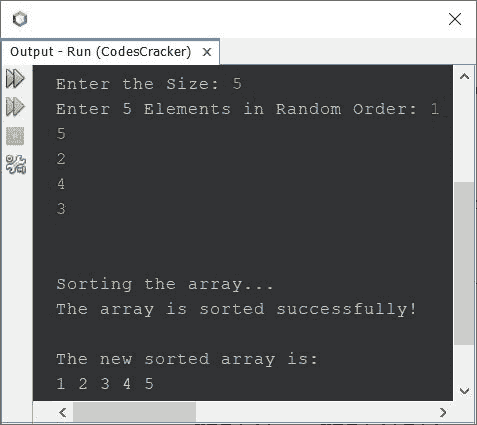
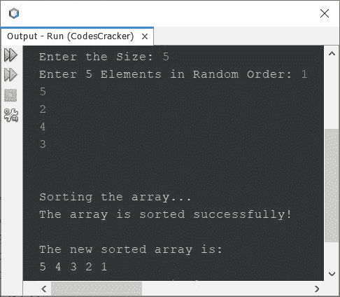
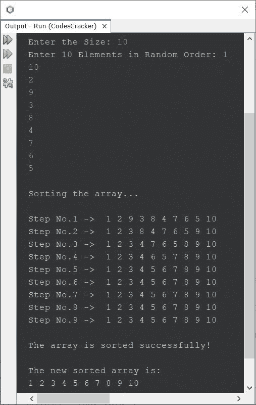
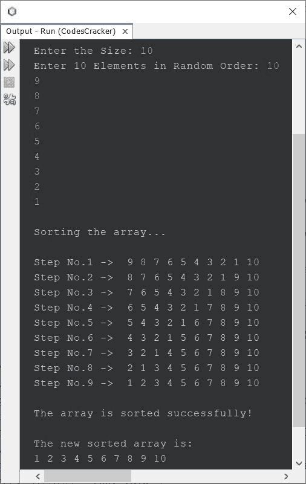

# Java 程序-冒泡排序

> 原文：<https://codescracker.com/java/program/java-program-bubble-sort.htm>

本文介绍了一个 Java 程序，它使用冒泡排序技术对数组进行排序。也就是说，本文包括了 Java 中的多个冒泡排序程序。本文中包含的冒泡排序程序列表:

*   Java 中的冒泡排序程序-基本版
*   Java 中的冒泡排序程序-完整版
*   Java 中的冒泡排序程序-降序排列
*   冒泡排序，每次排序后打印新数组

如果你不知道冒泡排序是如何工作的？
参考[冒泡排序逻辑](/computer-fundamental/bubble-sort.htm)。 现在让我们继续，用 Java 创建一个冒泡排序程序。

## Java 中的冒泡排序-基础版

问题是，*写一个 Java 程序，根据 10 个元素进行冒泡排序。这 10 个元素必须由用户 在程序运行时接收。*下面给出的程序就是它的答案。这个程序按升序排序。

```
import java.util.Scanner;

public class CodesCracker
{
   public static void main(String[] args)
   {
      int n=10, i, j, x;
      int[] array = new int[n];
      Scanner s = new Scanner(System.in);

      System.out.print("Enter 10 Elements in Random Order: ");
      for(i=0; i<n; i++)
      {
         array[i] = s.nextInt();
      }

      for(i=0; i<(n-1); i++)
      {
         for(j=0; j<(n-i-1); j++)
         {
            if(array[j]>array[j+1])
            {
               x = array[j];
               array[j] = array[j+1];
               array[j+1] = x;
            }
         }
      }

      System.out.println("\nThe new sorted array is:");
      for(i=0; i<n; i++)
         System.out.print(array[i]+ " ");
   }
}
```

下面给出的快照显示了上面的冒泡排序程序在 Java 中的示例运行，用户输入 **10，19，11，18，12，17，13，16，14，15** 作为随机顺序的十个元素。随机顺序意味着，所有元素既不是升序也不是降序:



## Java 中的冒泡排序-完整版

因为以前的程序只基于 10 个元素或数字运行。因此，我修改了程序，允许用户定义数组的大小，以及它的元素。

```
import java.util.Scanner;

public class CodesCracker
{
   public static void main(String[] args)
   {
      Scanner s = new Scanner(System.in);

      System.out.print("Enter the Size: ");
      int n = s.nextInt();

      int[] arr = new int[n];

      System.out.print("Enter " +n+" Elements in Random Order: ");
      for(int i=0; i<n; i++)
         arr[i] = s.nextInt();

      System.out.println("\n\nSorting the array...");
      for(int i=0; i<(n-1); i++)
      {
         for(int j=0; j<(n-i-1); j++)
         {
            if(arr[j]>arr[j+1])
            {
               int temp = arr[j];
               arr[j] = arr[j+1];
               arr[j+1] = temp;
            }
         }
      }
      System.out.println("The array is sorted successfully!");

      System.out.println("\nThe new sorted array is:");
      for(int i=0; i<n; i++)
         System.out.print(arr[i]+ " ");
   }
}
```

使用用户输入 **5** 作为大小， **1，5，2，4，3** 作为五个元素的示例运行显示在下面给出的快照中:



## Java 中的冒泡排序-降序

要对数组进行降序排序，使用冒泡排序技术，只需在排序循环中将大于 ( >)的**符号替换为小于** ( <)的 、 **if** 语句中的条件即可。也就是说，更换:

```
if(arr[j]>arr[j+1])
```

从上述程序中，使用:

```
if(arr[j]<arr[j+1])
```

只是一个符号，一个字符的问题。整个程序都变了。这是与前一个程序的示例运行具有相同用户输入的示例运行的快照:



## Java 中的冒泡排序——每次排序后打印数组

这是本文的最后一个程序，创建它是为了在每次使用冒泡排序技术排序后打印新数组。这个程序提供了冒泡排序实际执行的大概情况。

```
import java.util.Scanner;

public class CodesCracker
{
   public static void main(String[] args)
   {
      Scanner s = new Scanner(System.in);

      System.out.print("Enter the Size: ");
      int n = s.nextInt();

      int[] arr = new int[n];

      System.out.print("Enter " +n+" Elements in Random Order: ");
      for(int i=0; i<n; i++)
         arr[i] = s.nextInt();

      System.out.println("\nSorting the array...");
      for(int i=0; i<(n-1); i++)
      {
         for(int j=0; j<(n-i-1); j++)
         {
            if(arr[j]>arr[j+1])
            {
               int temp = arr[j];
               arr[j] = arr[j+1];
               arr[j+1] = temp;
            }
         }
         System.out.print("\nStep No." +(i+1)+ " ->  ");
         for(int j=0; j<n; j++)
            System.out.print(arr[j]+ " ");
      }
      System.out.println("\n\nThe array is sorted successfully!");

      System.out.println("\nThe new sorted array is:");
      for(int i=0; i<n; i++)
         System.out.print(arr[i]+ " ");
   }
}
```

下面是它的示例运行，使用用户输入的 **10** 作为大小， **1，10，2，9，3，8，4，7，6，5** 作为十个元素:



下面是另一个示例运行，使用相同的用户输入作为大小，使用 **10，9，8，7，6，5，4，3，2，1** 作为十个元素:



#### 其他语言的相同程序

*   [C 气泡排序](/c/program/c-program-bubble-sort.htm)
*   [C++冒泡排序](/cpp/program/cpp-program-bubble-sort.htm)

[Java 在线测试](/exam/showtest.php?subid=1)

* * *

* * *