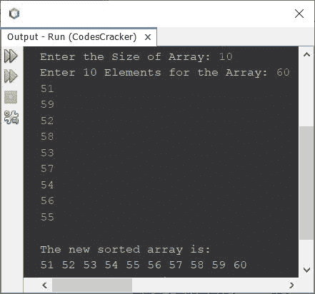

# Java 程序：用于选择排序

> 原文：<https://codescracker.com/java/program/java-program-selection-sort.htm>

本文介绍了一个用 Java 实现选择排序的程序。Java 中的选择排序代码是为升序和降序创建的。

**注意-** 在选择排序中，首先选择最小的元素并移动到第一个索引， 然后选择第二个最小的元素并移动到第二个索引，依此类推。

如果你不知道，选择排序是如何工作的？
然后参考 [选择排序算法和例子](/computer-fundamental/selection-sort.htm)。现在让我们创建程序。

## 用于选择升序排序的 Java 代码

问题是，*写一个 Java 程序，按升序进行选择排序。执行选择 排序的数组必须由用户在程序运行时接收。*下面给出的程序是它的答案:

```
import java.util.Scanner;

public class CodesCracker
{
   public static void main(String[] args)
   {
      int tot, i, j, count, small, index=0, x;
      Scanner scan = new Scanner(System.in);

      System.out.print("Enter the Size of Array: ");
      tot = scan.nextInt();
      int[] arr = new int[tot];

      System.out.print("Enter " +tot+ " Elements for the Array: ");
      for(i=0; i<tot; i++)
         arr[i] = scan.nextInt();

      for(i=0; i<(tot-1); i++)
      {
         count=0;
         small = arr[i];
         for(j=(i+1); j<tot; j++)
         {
            if(small>arr[j])
            {
               small = arr[j];
               count++;
               index = j;
            }
         }
         if(count!=0)
         {
            x = arr[i];
            arr[i] = small;
            arr[index] = x;
         }
      }

      System.out.println("\nThe new sorted array is: ");
      for(i=0; i<tot; i++)
         System.out.print(arr[i]+ " ");

   }
}
```

下面给出的快照显示了上述程序的示例运行，使用用户输入的 **10** 作为数组的大小， 60，51，59，52，58，53，57，54，56，55 作为其十个元素，使用选择排序 技术按升序对数组进行排序:



## 用于选择降序排序的 Java 代码

要在 Java 中执行选择排序，但以降序排序，您只需要从上面的程序中更改一个字符。即:
替换下面的代码，来自上面的程序:

```
if(small>arr[j])
```

使用下面给出的代码:

```
if(small<arr[j])
```

为了避免误解，将变量**小**的名称改为**大**。所有代码的其余部分， 与之前的程序相同。

你能相信吗，仅仅是一个字符的问题，整个程序就颠倒了:)。

#### 其他语言的相同程序

*   [C 选择排序](/c/program/c-program-selection-sort.htm)
*   [C++选择排序](/cpp/program/cpp-program-selection-sort.htm)

[Java 在线测试](/exam/showtest.php?subid=1)

* * *

* * *