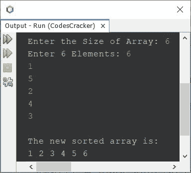

# Java 程序：插入排序

> 原文：<https://codescracker.com/java/program/java-program-Insertion-sort.htm>

本文介绍了一个使用插入排序技术对数组进行排序的 Java 程序。在下面给出的两个程序中，大小和数组都是由用户在程序运行时接收的。

**注-** 如果你不知道插入排序是如何执行的，那么参考 [插入排序算法和例子](/computer-fundamental/insertion-sort.htm)。现在让我们创建程序。

## 使用`for`循环在 Java 中插入排序

问题是，*编写一个 Java 程序，基于一个由 **n** 元素组成的数组执行插入排序。*下面 给出的程序就是它的答案。这个程序是在没有使用函数的情况下创建的。

```
import java.util.Scanner;

public class CodesCracker
{
   public static void main(String[] args)
   {
      int n, i, j, element;
      Scanner scan = new Scanner(System.in);

      System.out.print("Enter the Size of Array: ");
      n = scan.nextInt();
      int[] arr = new int[n];
      System.out.print("Enter " +n+ " Elements: ");
      for(i=0; i<n; i++)
         arr[i] = scan.nextInt();

      for(i=1; i<n; i++)
      {
         element = arr[i];

         for(j=(i-1); j>=0 && arr[j]>element; j--)
            arr[j+1] = arr[j];

         arr[j+1] = element;
      }

      System.out.println("\nThe new sorted array is: ");
      for(i=0; i<n; i++)
         System.out.print(arr[i]+ " ");
   }
}
```

下面给出的快照显示了上述程序的示例运行，其中用户输入的 **6** 为大小， **6，1，5，2，4，3** 为 六个元素:



## 使用`while`循环在 Java 中插入排序

这是与之前相同的程序，但是使用 **while** 循环创建，而不是用**代替**。

```
import java.util.Scanner;

public class CodesCracker
{
   public static void main(String[] args)
   {
      int n, i, j, element;
      Scanner scan = new Scanner(System.in);

      System.out.print("Enter the Size of Array: ");
      n = scan.nextInt();
      int[] arr = new int[n];
      System.out.print("Enter " +n+ " Elements: ");
      i=0;
      while(i<n)
      {
         arr[i] = scan.nextInt();
         i++;
      }

      i=1;
      while(i<n)
      {
         element = arr[i];

         j=i-1;
         while(j>=0 && arr[j]>element)
         {
            arr[j+1] = arr[j];
            j--;
         }

         arr[j+1] = element;
         i++;
      }

      System.out.println("\nThe new sorted array is: ");
      i=0;
      while(i<n)
      {
         System.out.print(arr[i]+ " ");
         i++;
      }
   }
}
```

#### 其他语言的相同程序

*   [C 插入排序](/c/program/c-program-Insertion-sort.htm)
*   [C++ 插入排序](/cpp/program/cpp-program-Insertion-sort.htm)

[Java 在线测试](/exam/showtest.php?subid=1)

* * *

* * *