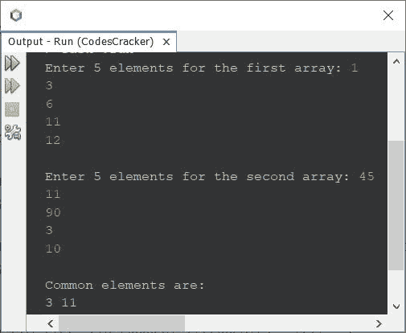
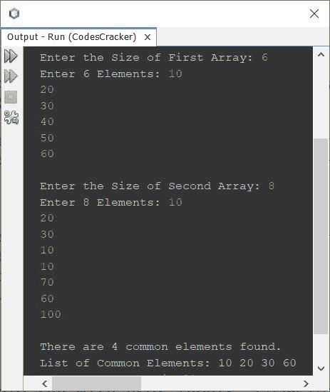

# 寻找两个数组间公共元素的 Java 程序

> 原文：<https://codescracker.com/java/program/java-find-common-elements-from-two-arrays.htm>

本文介绍了一个用 Java 编写的程序，它查找并打印两个给定数组之间的公共元素。

## 寻找两个数组之间的公共元素-基本版

问题是，*写一个 Java 程序，寻找并打印两个数组之间可用的公共元素。该数组必须是用户在程序运行时收到的 。*下面给出的程序是这个问题的答案:

```
import java.util.Scanner;

public class CodesCracker
{
   public static void main(String[] args)
   {
      int[] arrOne = new int[5];
      int[] arrTwo = new int[5];
      int i, j;
      Scanner s = new Scanner(System.in);

      System.out.print("Enter 5 elements for the first array: ");
      for(i=0; i<5; i++)
         arrOne[i] = s.nextInt();
      System.out.print("\nEnter 5 elements for the second array: ");
      for(i=0; i<5; i++)
         arrTwo[i] = s.nextInt();

      System.out.println("\nCommon elements are:");
      for(i=0; i<5; i++)
      {
         for(j=0; j<5; j++)
         {
            if(arrOne[i]==arrTwo[j])
               System.out.print(arrOne[i]+ " ");
         }
      }
   }
}
```

下面给出的快照显示了上述 Java 程序在用户输入下的示例运行，1，3，6，11，12 作为第一个数组的五个元素 ，45，11，90，3，10 作为第二个数组的五个元素:



## 寻找两个数组之间的公共元素-完整版

上面的程序有一些限制，比如如果用户想输入更多的元素怎么办？
两个数组中有哪些没有共同的元素？
如果一个单一的公共元素在两个数组中多次可用会怎样？
同样，上面给出的程序，实际上并不存储公共元素，而是在比较的时候 打印元素。

如果在两个数组中都没有发现公共元素，那么消息**公共元素是:**将显示 输出没有元素，看起来很奇怪。因此，请记住，让我修改上面的程序，删除所有的 限制:

```
import java.util.Scanner;

public class CodesCracker
{
   public static void main(String[] args)
   {
      int i, j, arrOneSize, arrTwoSize, arrCommonSize, k=0, x, check;
      Scanner s = new Scanner(System.in);

      System.out.print("Enter the Size of First Array: ");
      arrOneSize = s.nextInt();
      int[] arrOne = new int[arrOneSize];
      System.out.print("Enter " +arrOneSize+ " Elements: ");
      for(i=0; i<arrOneSize; i++)
         arrOne[i] = s.nextInt();

      System.out.print("\nEnter the Size of Second Array: ");
      arrTwoSize = s.nextInt();
      int[] arrTwo = new int[arrTwoSize];
      System.out.print("Enter " +arrTwoSize+ " Elements: ");
      for(i=0; i<arrTwoSize; i++)
         arrTwo[i] = s.nextInt();

      if(arrOneSize<arrTwoSize)
         arrCommonSize = arrOneSize;
      else
         arrCommonSize = arrTwoSize;
      int[] arrCommon = new int[arrCommonSize];

      for(i=0; i<arrOneSize; i++)
      {
         for(j=0; j<arrTwoSize; j++)
         {
            if(arrOne[i]==arrTwo[j])
            {
               check = 0;
               for(x=0; x<k; x++)
               {
                  if(arrCommon[x]==arrOne[i])
                  {
                     check = 1;
                     break;
                  }
               }
               if(check==0)
               {
                  arrCommon[k] = arrOne[i];
                  k++;
               }
            }
         }
      }

      if(k==0)
         System.out.println("\nNo common element.");
      else if(k==1)
      {
         System.out.println("\nThere is only one common element.");
         System.out.println("And the element is: " +arrCommon[0]);
      }
      else
      {
         System.out.println("\nThere are " +k+ " common elements found.");
         System.out.print("List of Common Elements: ");
         for(i=0; i<k; i++)
            System.out.print(arrCommon[i]+ " ");
      }
   }
}
```

下面是用户输入的运行示例， **6** 作为第一个数组的大小， **10，20，30，40，50，60** 作为它的六个元素。 然后 **8** 为第二个数组的大小， **10，20，30，10，10，70，60，100** 为其八个元素:



[Java 在线测试](/exam/showtest.php?subid=1)

* * *

* * *